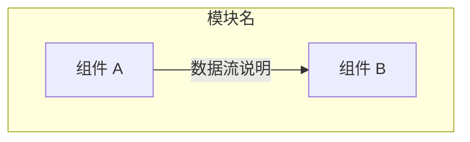
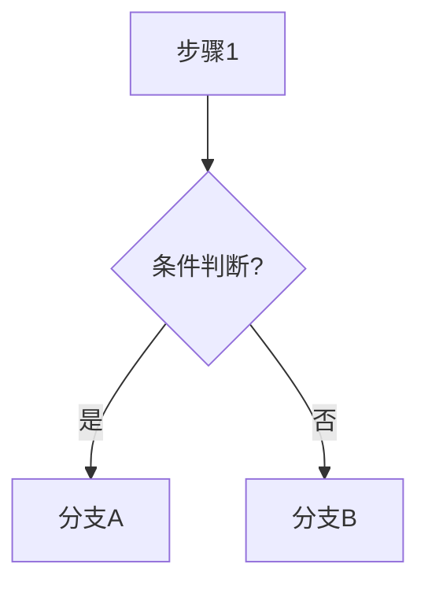
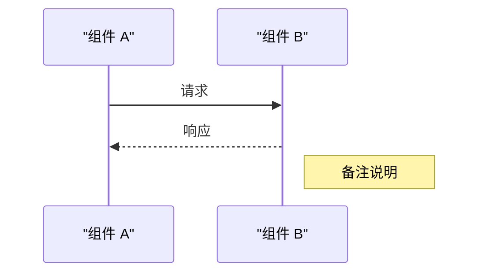
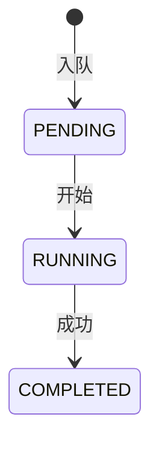

# 编写技术 Wiki — 项目级 Rules

## 适用场景

当用户要求为某个模块/子系统编写技术 Wiki 文档时，严格遵循以下流程。

## 流程

### Phase 1：代码探查（必须完成，不可跳过）

先用 codegraph 做广度探索，再 Read 关键文件。**不要直接 Read 所有文件而不先 codegraph。**

**广度探索：**
```
codegraph_files — 查看模块文件结构
codegraph_explore — 查询模块关键符号、理解整体架构
```

**定向读取：**
根据 codegraph 结果，Read 以下类型文件（如有）：
1. 入口文件（`index.ts` / `main.ts`）
2. 类型定义（`types.ts`）
3. 核心业务逻辑文件
4. 配置/常量文件
5. 关键回调/事件处理文件
6. 客户端文件（如果有浏览器端）

**评估要点（在探查阶段回答自己）：**
- 这个模块的输入/输出是什么？
- 有哪些关键的数据流路径？
- 配置项有哪些？默认值是什么？
- 错误处理/降级路径是什么？
- 有哪些已知的边缘情况和限制？
- 和外部系统（API、WebSocket、文件系统、数据库）如何交互？

> **示例**：对于模块分析，需要 Read 入口文件（服务生命周期）、核心业务逻辑文件（消息路由和流程）、数据处理文件（核心算法）、客户端/API 通信文件、类型定义等。

### Phase 2：组织大纲

根据探查结果规划 Wiki 结构。以下为参考大纲，AI 应根据模块特性增删章节，不强制照搬：

```
1. 概述            — 一句话定义模块职责 + 架构总览表（层次/技术栈/职责）
2. 系统架构         — Mermaid 架构图 + 组件描述
3. 核心流程详解      — 按功能拆分子章节，每个子章节含：
                      - 代码引用（文件:行号）
                      - 关键常量/配置
                      - 数据流描述
                      - 代码片段（关键路径，不是全文件）
4. 消息/协议定义     — 如有通信协议（WebSocket / IPC / HTTP），用表格列出所有消息类型
5. 并发控制 / 性能   — 如果有并发控制、限流、连接池等
6. 配置指南          — JSON/YAML 示例 + 参数表格（字段/默认值/说明）
7. 数据流            — 状态机图或时序图
8. 错误处理与容错     — 重试策略、降级路径、超时控制
9. 开发指南          — 项目文件结构树 + 构建/运行命令
10. 常见问题         — 至少 3 个 FAQ
```

### Phase 3：撰写

#### 语言要求

- 全文使用中文
- 技术术语保留英文原文（如 WebSocket、API、LLM、token）
- 文件名、变量名、代码片段保持原文大小写

#### 质量标准

**必须包含：**
- Mermaid 架构图（组件间箭头表示数据流方向）
- 至少一个 Mermaid 时序图（展示消息交互顺序）
- 配置示例（JSON/YAML 代码块）
- 参数对比表（字段名/默认值/说明三层）
- 每个文件至少一次 `文件:行号` 引用
- 关键数据流的代码片段（不是复制整个函数，是展示核心逻辑）
- 边缘情况说明（数据量界限、超时条件、空值处理）
- 错误处理路径图或说明

**质量标准检查表：**

| 检查项 | 要求 |
|--------|------|
| 代码引用 | 至少 5 个 `文件:行号` 引用 |
| 架构图 | Mermaid 架构图，箭头表示数据流 |
| 时序图 | 至少一个 Mermaid 时序图 |
| 配置示例 | 完整的 JSON/YAML 配置示例 |
| 表格 | 至少 3 个表格（消息类型、参数对比、文件结构等） |
| 代码片段 | 展示核心逻辑路径（不是完整函数） |
| 文件结构 | 列出模块下所有源文件及一句话说明 |
| 边缘情况 | 至少 2 个已知边界条件 |
| 错误路径 | 重试/降级/超时处理说明 |
| FAQ | 至少 3 个常见问题 |
| 构建命令 | 项目的实际构建命令（如 `hvigorw assembleHap` 等） |

**禁止项：**
- 不要复制整个文件内容（只截取关键代码片段）
- 不要写没有代码支持的模糊描述
- 不要遗漏错误处理路径的描述
- 不要忽略配置项和默认值
- 不要假设读者已经了解模块上下文

#### 代码引用格式

```
文件:行号
```

引用时精确到行号（可以是范围），例如：
- 单个引用：`handler.ts:152-175`
- 关联引用：`handler.ts:220-293`（`handleMessage` 完整函数）

#### 绘图规范 — Mermaid

**禁止使用 ASCII art 绘图。** 所有架构图、流程图、时序图必须使用 Mermaid 图表，通过在 Markdown 代码块中声明 ```` ```mermaid ```` 实现。

##### 1. 架构图 — `graph TB` / `graph LR`

组件间依赖关系用 `graph TB`（自上而下），水平排布用 `graph LR`（左到右）。



**规则：**
- 每个子图及所有节点标签必须用双引号包裹，避免括号/特殊字符导致解析失败
- 使用有意义的英文/拼音节点 ID（如 `YTF` 而非 `A`、`B`）
- subgraph 名称如果包含括号必须加引号：`subgraph "浏览器 (页面)"`
- 数据流方向用 `-->`（实线箭头）、`-.->`（虚线箭头）、`===`（粗线）区分
- 双向关系拆为两条语句：`A --> B` + `B --> A`

##### 2. 流程图 — `flowchart TD`

流程步骤和条件分支用 `flowchart TD`（方向可选 `TD`/`LR`）：



**规则：**
- 菱形节点 `{}` 表示条件判断，矩形节点 `[]` 表示操作步骤
- 条件分支标签加引号：`|"条件"|`
- 避免节点过多（≤12 个），复杂流程拆为多图
- 多行文本用 `<br/>` 分隔，不能用 `\n`

##### 3. 时序图 — `sequenceDiagram`

消息交互顺序用 `sequenceDiagram`：



**规则：**
- 参与者名称如果包含空格/括号，用引号包裹：`as "组件名 (功能)"`
- 消息文本中的 `--`、`()` 等特殊字符需加引号：`A->>B: "some --flag value"`
- 实线箭头 `->>` 表示主动调用，虚线 `-->>` 表示异步/被动返回
- 参与者 ≤ 8 个

##### 4. 状态图 — `stateDiagram-v2`

状态流转用 `stateDiagram-v2`：



##### 5. Mermaid 书写检查清单

- [ ] 中文标签全部在双引号内：`NODE["中文"]`
- [ ] subgraph 名称中的括号已转义：`subgraph "名称 (说明)"`
- [ ] 箭头标签中无裸 `--`：`|"command --flag"|`
- [ ] 无 `\n`（已用 `<br/>` 替代）
- [ ] 无 `A<-->B` 双向箭头（已拆两条）
- [ ] 参与者名称中的括号已加引号
- [ ] 流程图节点 ≤ 12 个，时序图参与者 ≤ 8 个

### Phase 4：已知问题的收录

**完成所有章节后，额外检查以下内容：**

1. **Git log 检查**：运行 `git log --oneline -20 <module-path>` 查看最近修改
   - 如果发现 bugfix 或性能优化提交，将其作为"历史问题"或"已知限制"收录到 Wiki
   - 引用 commit hash 和关键修改内容

2. **边缘情况补充**：在"常见问题"或"已知限制"中补充
   - 数据量边界（如字幕条数过少/过多时的行为）
   - 超时条件
   - 配置错误的表现

### Phase 5：自查

写完 Wiki 后，逐项对照质量标准检查表确认没有遗漏。特别检查：

- [ ] 每个引用都有文件:行号
- [ ] Mermaid 架构图准确反映了数据流方向
- [ ] Mermaid 图已对照书写检查清单验证语法
- [ ] 所有 Mermaid 图能在 VSCode 预览中正常渲染
- [ ] 配置参数有默认值说明
- [ ] 错误处理路径已覆盖
- [ ] 边缘情况已说明
- [ ] FAQ 有 > 3 个
- [ ] 所有代码片段语法正确
- [ ] 没有整文件复制

## 输出路径

Wiki 文件输出到项目根目录 `.wiki/` 下，文件名格式：`{module-name}.md`。

如果模块需要分两端描述（如服务端 + 客户端），作为单个文件输出，分章节覆盖两端。
