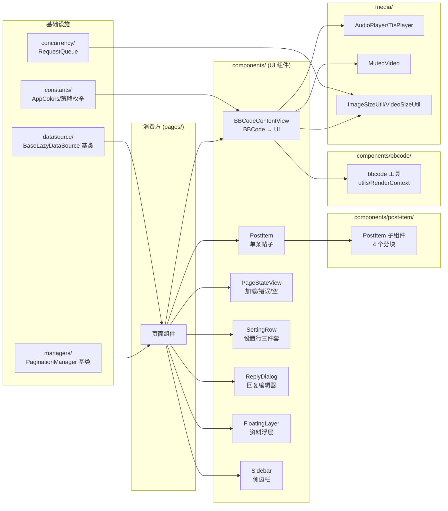
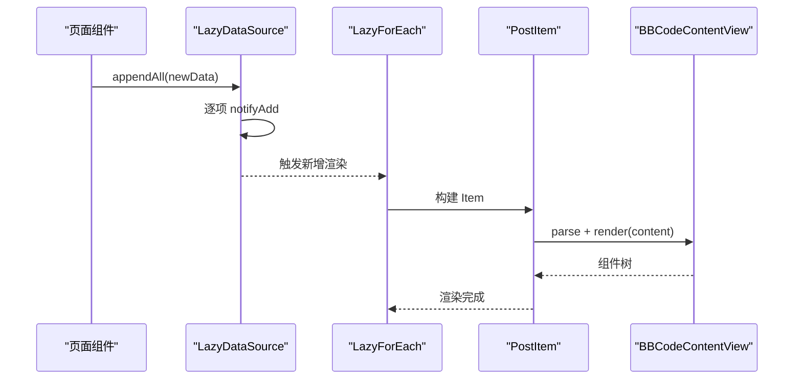

# 公共组件模块

## 概述

`common/` 目录是项目中最大的模块（49 个文件，含 12 个子目录），提供可复用的 UI 组件、媒体播放器、并发原语、分页管理器、数据源适配层、工具函数与常量定义。页面组件（`pages/`）与状态层（`store/`）通过 import 引入这些公共能力。

P0–P2 模块化重构后，`common/` 由原先的扁平结构重组为按职责划分的子目录：

| 子目录 | 职责 |
|--------|------|
| `components/` | UI 组件（含 `bbcode/`、`post-item/` 两个子分组） |
| `media/` | 音视频播放与尺寸预取 |
| `managers/` | 分页 / 网络监听 / 状态栏 / 回复业务管理器 |
| `datasource/` | `IDataSource` 懒加载适配层（基类 + 12 子类） |
| `concurrency/` | 并发原语（`RequestQueue` 固定并发队列、`Throttler` 令牌桶） |
| `utils/` | 通用工具函数（编解码、链接、网络、分享、过滤列表等） |
| `constants/` | 颜色 / 主题 / 策略枚举、`AppStorage` key 常量 |
| `infra/` | 持久化（`PreferencesStore`）与串行队列（`SerialQueue`） |
| `feedback/` | `ToastManager` 提示状态管理 |
| `cache/` | `LruCache` 泛型缓存 |
| `dialogs/` | 系统弹窗工具 |

### 架构图





## 文件索引

### components/（UI 组件）

| 文件 | 类型 | 职责 |
|------|------|------|
| `components/BBCodeContentView.ets` | 组件 | BBCode → ArkUI 渲染引擎（核心） |
| `components/PostItem.ets` | 组件 | 单条帖子内容渲染（编排 4 个子组件） |
| `components/PageStateView.ets` | 组件 | 页面三态：`LoadingStateView` / `ErrorStateView` / `EmptyStateView`（P0-3） |
| `components/SettingRow.ets` | 组件 | 设置行三件套：`SettingRow` / `SettingToggleRow` / `SettingPickerRow`（P0-4） |
| `components/ReplyDialog.ets` | 组件 | 回复编辑器弹窗 |
| `components/NavBar.ets` / `PanelNavBar.ets` | 组件 | 导航栏 / 面板级导航栏 |
| `components/Avatar.ets` / `ImageViewer.ets` | 组件 | 头像 / 图片全屏浏览（`Avatar` 已接入 `imageLoadStrategy`：被动模式下显示首字母 + 彩色背景占位） |
| `components/EmptyHint.ets` | 组件 | 空状态占位提示 |
| `components/Toast.ets` | 组件 | Toast 提示组件 |
| `components/AnonymousName.ets` | 组件 | 匿名用户名渲染 |
| `components/ProfileCardPopup.ets` | 组件 | 用户资料卡弹出层 |
| `components/FloatingLayerComponent.ets` | 组件 | 全局浮层容器（P2-4 从 `pages/` 迁入） |
| `components/SidebarComponent.ets` | 组件 | 侧边栏容器（P2-4 从 `pages/` 迁入） |

### components/post-item/（P2-2 从 PostItem 拆出的子组件）

| 文件 | 职责 |
|------|------|
| `post-item/PostItemHeader.ets` | 帖子顶部：头像、作者名、备注、楼主标记、楼层号 |
| `post-item/PostAttachments.ets` | 帖子附件区（视频/音频/图片），可折叠展开 |
| `post-item/PostComments.ets` | 评论区（过滤引用/回复引用后的干净文本） |
| `post-item/PostVoteBar.ets` | 投票/动作栏（点赞、踩、回复、编辑、分享、AI、朗读） |

### components/bbcode/（P2-2 从 BBCodeContentView 外迁的渲染工具）

| 文件 | 职责 |
|------|------|
| `bbcode/bbcode-utils.ets` | 内联节点判断、字号缩放、空白分组过滤、上下标计算等纯函数 |
| `bbcode/BBCodeRenderContext.ets` | `RenderContext`（引用上下文）、`splitQuoteChildren`、`NodeGroup` 分组 |

### media/（音视频）

| 文件 | 类型 | 职责 |
|------|------|------|
| `media/AudioPlayer.ets` | 组件 | BBCode 音频播放器（基于 `media.AVPlayer`） |
| `media/TtsPlayer.ets` | 组件 | TTS 语音播放 |
| `media/MutedVideo.ets` | 组件 | 视频播放（内置 Video + 全局静音切换 + 首帧送显随图片加载策略联动） |
| `media/ImageSizeUtil.ets` | 工具 | 图片尺寸预获取（受 `RequestQueue` 并发约束） |
| `media/VideoSizeUtil.ets` | 工具 | 视频宽高比预获取（受 `RequestQueue` 并发约束） |
| `media/EmotionResources.ets` | 数据 | NGA 表情映射表 |

### managers/（业务管理器）

| 文件 | 类型 | 职责 |
|------|------|------|
| `managers/PaginationManager.ets` | 基类 | 分页管理器抽象基类（P1-3） |
| `managers/ThreadPaginationManager.ets` | 管理器 | 帖子楼层分页（继承基类，按 `lou` 去重） |
| `managers/TopicPaginationManager.ets` | 管理器 | 主题列表分页（继承基类，按 `tid` 去重） |
| `managers/ReplyManager.ets` | 工具 | 回复文本预处理（BBcode 包装） |
| `managers/NetworkMonitor.ets` | 工具 | 全局网络状态监听器 |
| `managers/StatusBarManager.ets` | 工具 | 状态栏主题适配 |

### datasource/（懒加载适配层）

| 文件 | 类型 | 职责 |
|------|------|------|
| `datasource/BaseLazyDataSource.ets` | 基类 | 泛型 `IDataSource` 基类（P0-2），封装 `appendAll` / `prependAll` / `replaceAll` / `updateAt` 等共性逻辑 |
| `datasource/LazyDataSource.ets` | 数据 | 12 个业务子类（瘦身后仅 `extends BaseLazyDataSource<XxxInfo>`） |

### concurrency/（并发原语，P1-2）

| 文件 | 类型 | 职责 |
|------|------|------|
| `concurrency/RequestQueue.ets` | 工具 | 固定并发上限的请求调度队列，供 ImageSize/VideoSize 预取复用 |
| `concurrency/Throttler.ets` | 工具 | 基于 token-bucket 的请求限流器（从 `service/Throttle.ets` 迁入） |

### utils/（通用工具）

| 文件 | 类型 | 职责 |
|------|------|------|
| `utils/Utils.ets` | 工具 | `unescapeHtml`、`formatTime` 等通用函数 |
| `utils/CodecUtils.ets` | 工具 | 编解码纯函数（P1-5） |
| `utils/UrlUtils.ets` | 工具 | `extractHostname` / `buildUrl` 等 URL 工具（P1-5） |
| `utils/LinkUtils.ets` | 工具 | URL 链接处理 |
| `utils/NetworkUtil.ets` | 工具 | 网络类型检测（WiFi/移动数据） |
| `utils/ShareUtils.ets` | 工具 | 系统分享集成 |
| `utils/TimeoutUtils.ets` | 工具 | `Promise.race` 超时包装 |
| `utils/FilterListManager.ets` | 工具 | 过滤列表管理（P1-4 从 `store/` 迁入） |
| `utils/PostWarmup.ets` | 工具 | 帖子预热缓存 |

### constants/ / infra/ / feedback/ / cache/ / dialogs/

| 文件 | 类型 | 职责 |
|------|------|------|
| `constants/Constants.ets` | 常量 | 主题色、品牌图标色、主题/字号/域名选项、图片加载策略、断点等 |
| `constants/AppStorageKeys.ets` | 常量 | AppStorage key 常量集中注册（P2-4） |
| `infra/PreferencesStore.ets` | 基础设施 | 持久化封装（P1-4 从 `store/` 迁入） |
| `infra/SerialQueue.ets` | 基础设施 | 串行任务队列（P1-4 从 `store/` 迁入） |
| `feedback/ToastManager.ets` | 状态 | Toast 显示状态管理（P1-4 从 `store/` 迁入） |
| `cache/LruCache.ets` | 工具 | 泛型 LRU 缓存，可配 TTL |
| `dialogs/Dialogs.ets` | 工具 | 系统弹窗工具函数 |

根目录另有 `CookieUtils.ets`（Cookie 处理工具）。

## 主题色系统

`constants/Constants.ets:11-46` 定义了 `AppColors` 类，所有颜色通过 `$r('app.color.*')` 资源引用实现主题切换：

```typescript
// constants/Constants.ets:11-46 — 主题色定义
export class AppColors {
  static primary: Resource = $r('app.color.primary')
  static bg: Resource = $r('app.color.bg')
  static textPrimary: Resource = $r('app.color.text_primary')
  static textSecondary: Resource = $r('app.color.text_secondary')
  static separator: Resource = $r('app.color.separator')
  // ... 共 35 个颜色资源（含 quoteBorders 数组）
}
```

亮/暗色切换由资源限定词实现：`base/element/color.json`（亮色）与 `dark/element/color.json`（暗色）同名 key 对应不同色值，`setColorMode` 切换时自动生效。

### 主题元数据

`constants/Constants.ets:49-61` 定义的 `ThemeOption` 接口与 `THEME_OPTIONS` 列表。注意预览色用字符串字面量（不随主题变化），与 `AppColors` 的资源引用区分：

| 主题名 | label | 预览色 |
|--------|-------|--------|
| `system` | 跟随系统 | #8E8E93 |
| `light` | 原味主题 | #C08A4A（NGA 经典金） |
| `dark` | 暗色主题 | #D4A85A |

### 图片加载策略

`constants/Constants.ets:115-122` 的 `ImageLoadStrategy` 枚举：

| 策略常量 | 值 | 说明 |
|----------|----|------|
| `ImageLoadStrategy.ALWAYS` | '0' | 始终加载（主动式） |
| `ImageLoadStrategy.MANUAL` | '1' | 手动加载（被动式，点击后加载） |
| `ImageLoadStrategy.WIFI_ONLY` | '2' | 仅在 WiFi 下加载 |

> 注意：旧版 wiki 中的 `ON_CLICK` / `NEVER` 不存在，实际值为 `MANUAL` / `WIFI_ONLY`。

### 策略 × 媒体类型 行为矩阵

该策略由 `MediaSettings.imageLoadStrategy` 驱动，经统一入口 `NetworkUtil.shouldUsePassive(strategy)` 判定是否进入「被动加载」分支（ALWAYS→主动 / MANUAL→被动 / WIFI_ONLY 视当前网络），覆盖以下三类媒体组件：

| 媒体类型 | 组件 / 入口 | 始终加载 (ALWAYS) | 手动加载 (MANUAL) | 仅 WiFi + WiFi | 仅 WiFi + 蜂窝 |
|----------|-------------|-------------------|-------------------|----------------|----------------|
| 正文图片 | `BBCodeContentView`（IMAGE 节点） | 真实图 | 紧凑占位 + 点击 | 真实图 | 紧凑占位 + 点击 |
| 附件图片 | `PostAttachments` | 真实图 | 占位 + 点击 | 真实图 | 占位 + 点击 |
| 视频首帧 | `MutedVideo` | 显示首帧 | 黑屏占位 | 显示首帧 | 黑屏占位 |
| 头像 | `Avatar` | 真实头像 | 首字母 + 彩色背景占位 | 真实头像 | 首字母 + 彩色背景占位 |

> 三类媒体共用 `NetworkUtil.shouldUsePassive(strategy)` 作为统一判定入口，消除原先散落在各组件内的内联判断。头像接入后行为与正文图片一致：被动模式下不渲染 `Image`，自动落到首字母占位；主动模式下加载真实头像。点击行为（跳转主页 / 资料卡）不受策略影响。

## LazyDataSource 数据源适配

`datasource/BaseLazyDataSource.ets`（P0-2 新增）是泛型 `IDataSource` 基类，封装全部共性逻辑；`datasource/LazyDataSource.ets` 中的 12 个业务子类瘦身后仅 `extends BaseLazyDataSource<XxxInfo>` 即可复用：

| 子类 | 元素类型 | 用于 |
|------|----------|------|
| `PostInfoDataSource` | `PostInfo` | 帖子楼层列表 |
| `ThreadDataSource` | `object` | 主题列表 |
| `MessageThreadDataSource` | `MessageThreadInfo` | 私信会话列表 |
| `MessageArticleDataSource` | `MessageArticle` | 私信内容列表 |
| `NotificationDataSource` | `NotificationInfo` | 通知列表 |
| `BlacklistDataSource` | `BlacklistEntry` | 黑名单列表 |
| `CategoryDataSource` | `Category` | 论坛分类列表 |
| `HistoryItemDataSource` | `object` | 浏览历史 |
| `NotesDataSource` | `UserNoteEntry` | 用户备注 |
| `FilterKeywordDataSource` | `FilterKeyword` | 过滤关键词 |
| `SidebarDataSource` | `SidebarSection` | 侧边栏分区（额外含 `updateSection` / `indexOf`） |

`SidebarDataSource` 是唯一在共性逻辑之外追加自定义方法的子类（`datasource/LazyDataSource.ets:53-79`）。

```typescript
// datasource/BaseLazyDataSource.ets:71-77 — 增量追加
appendAll(list: T[]): void {
  const start: number = this.dataList.length
  for (let i = 0; i < list.length; i++) {
    this.dataList.push(list[i])
    this.notifyAdd(start + i)  // 逐项通知监听器
  }
}
```

## 并发原语（P1-2）

`concurrency/` 统一了项目内两类并发控制需求：

### RequestQueue — 固定并发队列

`concurrency/RequestQueue.ets` 封装「活跃计数 + 等待队列」调度模板：活跃数低于上限时立即执行，否则排队；任务结束调用 `done()` 释放槽位并唤醒队首。无 domain 维度、无时间间隔约束，专用于固定并发探测（图片/视频尺寸预取）。

```typescript
// concurrency/RequestQueue.ets:37-43 — 入队与即时执行
schedule(run: () => void): void {
  if (this.activeCount < this.maxConcurrent) {
    this.activeCount++;
    run();
  } else {
    this.requestQueue.push(run);
  }
}
```

`media/ImageSizeUtil.ets` 与 `media/VideoSizeUtil.ets` 各自 `new RequestQueue(MAX_CONCURRENT)`（`ImageSizeUtil.ets:18`、`VideoSizeUtil.ets:14`），通过 `queue.schedule(...)` + `queue.done()` 复用同一并发约束。

### Throttler — 令牌桶限流器

`concurrency/Throttler.ets`（P1-2 从 `service/Throttle.ets` 迁入）按 domain 分桶，同时约束并发数（默认 6）与最小派发间隔（默认 150ms）。`acquire(domain)` 返回 Promise，`release(domain)` 释放槽位。模块级单例 `ngaThrottler`（`Throttler.ets:149`）由 `NgaClient` 复用。

> RequestQueue 与 Throttler 职责不同：前者是固定并发探测，后者是带时间间隔的限流。

## 分页管理器（P1-3）

`managers/PaginationManager.ets` 是 `ThreadPaginationManager` / `TopicPaginationManager` 的抽象基类，封装三段共性：

1. `generation` 计数器（`nextGeneration` / `getGeneration`）：异步翻页时标记会话，响应到达后比对以丢弃过期结果。
2. `prefetchedPages` 缓存：预取页暂存，`hasPrefetchedPage` / `setPrefetchedRaw` / `getPrefetchedRaw` / `deletePrefetched` 原语。
3. `currentPage` / `totalPages` / `hasMore` 三元状态：子类在 `replaceWith` / `append` 完成后调用 `applyState(page, totalPages)` 统一收口。

> **@Observed 继承位置约束**：基类不装饰 `@Observed`。ArkUI 状态观测按具体类注册，`@Observed` 必须放在最终子类（`ThreadPaginationManager` / `TopicPaginationManager`）上，否则分页 UI 不会响应式更新。详见 [ADR 005](../架构决策/005-@Observed继承位置.md)。

基类不定义 `setPrefetchedPage` / `commitPrefetchedPage` 等签名各异的虚方法（ArkTS 不支持方法协变重写），而是暴露 `setPrefetchedRaw` / `getPrefetchedRaw` 原语（`PaginationManager.ets:80-97`）供子类复用，子类负责强类型数组与 `object[]` 的互转。

## 页面三态与设置行（P0-3 / P0-4）

### PageStateView

`components/PageStateView.ets` 拆出三个纯展示态组件，统一页面加载/错误/空三态：

| 组件 | 用途 | 关键入参 |
|------|------|----------|
| `LoadingStateView` | 加载中（28×28 LoadingProgress + 文案） | `tip: string` |
| `ErrorStateView` | 错误（文案 + 「重试」按钮） | `msg: string`、`onRetry: () => void` |
| `EmptyStateView` | 空（图标 + 文案） | `msg: string`、`icon: Resource` |

> 仅渲染内部内容，外层容器（居中布局、padding、动画过渡）由调用方包裹。`onRetry` 为普通箭头属性而非 `@Prop`，因 ArkTS 不允许 `@Prop` 传递函数引用。

### SettingRow

`components/SettingRow.ets` 统一 `SettingsPanel` / `ProfilePanel` 中重复出现的「图标 + 标签 + 尾部控件」行形态，按尾部控件拆为三个 struct：

| 组件 | 尾部控件 | 说明 |
|------|----------|------|
| `SettingRow` | 可选未读数 badge（红色数字）+ 箭头 | 普通点击行 |
| `SettingToggleRow` | Toggle 开关 | 自动签到 / 智感握姿 / 显示签名等 |
| `SettingPickerRow` | 当前值（灰色文字）+ 箭头 | 图片加载模式 / 楼层导航 / 预加载页数 |

行视觉基线：高度 44、左右 padding 16、垂直居中；左侧图标容器 29×29 圆角 6，内含 17×17 白色图标，背景色由 `iconColor` 指定。

## 回复系统

`components/ReplyDialog.ets` + `managers/ReplyManager.ets` 构成回复流程：

| 功能 | 文件 | 说明 |
|------|------|------|
| 编辑器 UI | `components/ReplyDialog.ets` | 文本输入、格式化按钮、表情选择 |
| 图片上传 | `components/ReplyDialog.ets:100-141` | 相册选择 → 文件读取 → 上传 → 插入 BBcode |
| 文本处理 | `managers/ReplyManager.ets` | 包裹 BBcode tag、插入 URL/艾特（`ReplyManagerClass.wrapSelectedText:208`、`insertUrl:218`） |

```typescript
// components/ReplyDialog.ets:82-98 — 格式化动作分发
private applyFormat(action: FormatAction): void {
  const tag: string = action.tag
  if (tag === 'url') {
    this.replyText = ReplyManagerClass.insertUrl(this.replyText, this.selStart, this.selEnd)
  } else if (tag === 'img') {
    this.handleImagePick()
  } else {
    this.replyText = ReplyManagerClass.wrapSelectedText(this.replyText, this.selStart, this.selEnd, tag)
  }
}
```

（上例省略了 `emoticon` / `at` 分支。）

## 分享集成

`utils/ShareUtils.ets` 使用 `@kit.ShareKit`（`systemShare`）实现系统分享面板：

- `shareThread(context, tid, threadTitle)`（`ShareUtils.ets:11`）：分享帖子链接
- `sharePost(context, post, threadTitle)`（`ShareUtils.ets:37`）：分享具体楼层（含作者 + 内容摘要，不超过 100 字）

## 工具类

| 工具 | 文件 | 说明 |
|------|------|------|
| `LruCache<K,V>` | `cache/LruCache.ets` | 泛型 LRU 缓存，可配 TTL |
| `NetworkMonitor` | `managers/NetworkMonitor.ets` | 全局网络状态监听器 |
| `isWifiConnected()` | `utils/NetworkUtil.ets` | 检测当前网络类型 |
| `shouldUsePassive(strategy)` | `utils/NetworkUtil.ets` | 媒体加载策略统一判定入口（ALWAYS→主动 / MANUAL→被动 / WIFI_ONLY 视 `isWifiConnected()`），供 `BBCodeContentView` / `PostAttachments` / `MutedVideo` / `Avatar` 四类媒体组件共用 |
| `StatusBarManager` | `managers/StatusBarManager.ets` | 状态栏主题适配 |
| `TimeoutUtils` | `utils/TimeoutUtils.ets` | `Promise.race` 超时包装 |
| `unescapeHtml()` / `formatTime()` | `utils/Utils.ets` | HTML 实体解码、时间格式化 |
| `ImageSizeUtil` | `media/ImageSizeUtil.ets` | 图片尺寸预获取 |
| `VideoSizeUtil` | `media/VideoSizeUtil.ets` | 视频宽高比预获取 |
| `extractHostname()` / `buildUrl()` | `utils/UrlUtils.ets` | URL 工具（P1-5） |
| `CodecUtils` | `utils/CodecUtils.ets` | 编解码纯函数（P1-5） |
| `FilterListManager` | `utils/FilterListManager.ets` | 过滤列表管理（P1-4 从 `store/` 迁入） |
| `PreferencesStore` | `infra/PreferencesStore.ets` | 持久化封装（P1-4 从 `store/` 迁入） |
| `SerialQueue` | `infra/SerialQueue.ets` | 串行任务队列（P1-4 从 `store/` 迁入） |

## 边缘情况

1. **Toast 显示冲突**：`feedback/ToastManager.ets` 的 `ToastManager.show` 清除上一个定时器后再显示新 Toast，保证同一时间只有一个 Toast，避免堆叠。
2. **音频播放器生命周期**：组件销毁时 `aboutToDisappear`（`media/AudioPlayer.ets:34-36`）调用 `releasePlayer` 释放 `AVPlayer` 资源，防止内存泄漏。
3. **图片加载失败**：`ImageSizeUtil` 尺寸获取失败时使用默认宽高比，不影响布局。
4. **视频元数据超时**：`VideoSizeUtil` 的 `fetchMetadata` 带超时控制，防止网络异常导致一直等待。
5. **PostItem 子组件复用泄漏**：`post-item/PostAttachments` / `PostVoteBar` 在 `aboutToReuse` 中重置 `attachsExpanded` / `menuExpanded`，避免列表复用泄漏上一条的展开状态。

## 错误处理

### 音频播放错误

`media/AudioPlayer.ets:110-113` 中 `AVPlayer` 的 `error` 回调将 `hasError` 置为 `true`、`isLoading` 置为 `false`，UI 切换为「加载失败」状态，用户可重新选择播放。`togglePlay` / `seek` 等方法在入口处通过 `this.hasError` 短路（如 `AudioPlayer.ets:118`、`:140`）。`aboutToDisappear` 时自动释放播放器资源。

### Toast 重复显示

`feedback/ToastManager.ets` 的 `ToastManager` 机制：显示新 Toast 时 `clearTimeout(this.timer)` 清除上一个定时器，2500ms 后自动隐藏，保证同一时间只有一个 Toast 显示。

### 图片尺寸预获取失败

`ImageSizeUtil` 的尺寸网络请求如果超时或返回非图片内容，使用默认比例（16:9）渲染占位，不影响页面布局。

### 过期响应丢弃

`managers/PaginationManager.ets` 的 `generation` 计数器（`nextGeneration:32-35` / `getGeneration:41-43`）在每次翻页前自增，异步响应到达后比对，过期响应直接丢弃，避免快速翻页时的数据错乱。

## 常见问题

**Q: 如何添加新的颜色资源？**
A: 在 `constants/Constants.ets` 的 `AppColors` 类中添加静态属性（如 `static myColor: Resource = $r('app.color.my_color')`），同时在 `resources/base/element/color.json` 和 `resources/dark/element/color.json` 中定义对应的色值（亮/暗同名 key）。

**Q: 列表滑动卡顿怎么优化？**
A: `LazyDataSource` 配合 `LazyForEach` 已实现按需渲染。如果仍卡顿，检查 `components/PostItem.ets` 及其 `post-item/` 4 个子组件的渲染复杂度，确认日志中无频繁的布局计算，并确保列表项使用了复用 ID；同时关注 `ImageSizeUtil` / `VideoSizeUtil` 的并发上限是否合理。

**Q: 为什么图片加载策略没有 NEVER 选项？**
A: 旧版 wiki 描述有误。`constants/Constants.ets:115-122` 的 `ImageLoadStrategy` 实际只有三项：`ALWAYS`（'0'）/ `MANUAL`（'1'，手动加载）/ `WIFI_ONLY`（'2'）。「从不加载」对应在 UI 层不调用加载逻辑，而非枚举值。

**Q: 为什么 PaginationManager 基类不加 @Observed？**
A: ArkUI 的状态观测按具体类注册，`@Observed` 必须装饰在最终子类（`ThreadPaginationManager` / `TopicPaginationManager`）上，基类装饰不会被子类继承生效。详见 [ADR 005](../架构决策/005-@Observed继承位置.md)。

**Q: 分享到微信/微博的内容格式不对？**
A: `utils/ShareUtils.ets` 使用系统 `ShareKit`，分享格式为纯文本。链接 + 摘要的组合由目标应用决定。如需自定义格式，需目标应用配合接入特定的分享协议。

## 关联文档

- [主页面与响应式布局](../页面模块/主页面与响应式布局.md)
- [主题列表与帖子详情](../页面模块/主题列表与帖子详情.md)
- [服务层 / API 通信](../服务层/API通信.md)
- [状态管理层 / Store 架构](../状态管理层/Store架构.md)
- [ADR 003 — barrel re-export 模式](../架构决策/003-barrel-re-export模式.md)（`LazyDataSource` 的 barrel 导出风格）
- [ADR 005 — @Observed 继承位置](../架构决策/005-@Observed继承位置.md)（`PaginationManager` 基类不装饰 `@Observed` 的理由）
