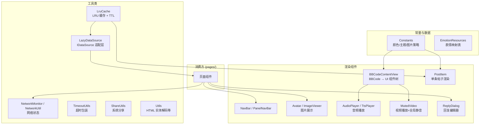
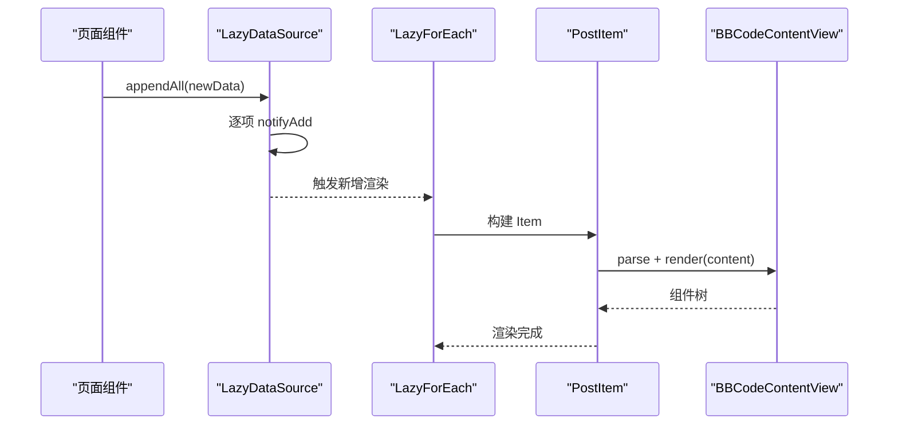

# 公共组件模块

## 概述

`common/` 目录是项目中最大的模块（31 个文件），提供可复用的 UI 组件、工具类和常量定义。页面组件通过 import 引入这些公共能力。





## 文件索引

| 文件 | 类型 | 职责 |
|------|------|------|
| `Constants.ets` | 常量 | 主题色、字体颜色、图片策略枚举、主题选项 |
| `AudioPlayer.ets` | 组件 | BBCode 音频播放器（基于 media.AVPlayer） |
| `Avatar.ets` | 组件 | 用户头像展示 |
| `BBCodeContentView.ets` | 组件 | BBCode → ArkUI 渲染引擎（核心，84符号） |
| `Dialogs.ets` | 组件 | 弹窗工具函数 |
| `EmotionResources.ets` | 数据 | NGA 表情映射表 |
| `EmptyHint.ets` | 组件 | 空状态占位提示 |
| `ImageViewer.ets` | 组件 | 图片查看器全屏浏览 |
| `LazyDataSource.ets` | 数据 | IDataSource 实现（帖子、主题、消息）|
| `LinkUtils.ets` | 工具 | URL 链接处理 |
| `LruCache.ets` | 工具 | LRU 缓存实现 |
| `MutedVideo.ets` | 组件 | 视频播放（内置 Video + 右上角全局静音切换） |
| `NavBar.ets` | 组件 | 导航栏 |
| `NetworkMonitor.ets` | 工具 | 网络状态监听 |
| `NetworkUtil.ets` | 工具 | 网络类型检测（WiFi/移动数据）|
| `PanelNavBar.ets` | 组件 | 面板级导航栏 |
| `PostItem.ets` | 组件 | 单条帖子内容渲染 |
| `ProfileCardPopup.ets` | 组件 | 用户资料卡弹出层 |
| `ReplyDialog.ets` | 组件 | 回复编辑器弹窗 |
| `ReplyManager.ets` | 工具 | 回复文本预处理（BBcode包装）|
| `ShareUtils.ets` | 工具 | 系统分享集成 |
| `StatusBarManager.ets` | 工具 | 状态栏样式管理 |
| `ThreadPaginationManager.ets` | 工具 | 帖子楼层分页逻辑 |
| `TimeoutUtils.ets` | 工具 | 超时包装器 |
| `Toast.ets` | 组件 | Toast 提示组件 |
| `TopicPaginationManager.ets` | 工具 | 主题列表分页逻辑 |
| `TtsPlayer.ets` | 组件 | TTS 语音播放 |
| `Utils.ets` | 工具 | 通用工具函数 |
| `VideoSizeUtil.ets` | 工具 | 视频尺寸预获取 |
| `ImageSizeUtil.ets` | 工具 | 图片尺寸预获取 |

## 主题色系统

`Constants.ets:11-46` 定义了 `AppColors` 类，所有颜色通过 `$r('app.color.*')` 资源引用实现主题切换：

```typescript
// Constants.ets:11-46 — 主题色定义
export class AppColors {
  static primary: Resource = $r('app.color.primary')
  static bg: Resource = $r('app.color.bg')
  static textPrimary: Resource = $r('app.color.text_primary')
  static textSecondary: Resource = $r('app.color.text_secondary')
  static separator: Resource = $r('app.color.separator')
  // ... 共 26 个颜色资源
}
```

### 主题元数据

`Constants.ets:49-102` 定义的 `ThemeOption` 接口和主题列表：

| 主题名 | 预览色 | 说明 |
|--------|--------|------|
| `original` | #C08A4A | NGA 经典金色 |
| `blue` | #007AFF | iOS 蓝 |
| `light` | — | 纯白底色 |
| `dark` | — | 纯黑底色 |
| `system` | — | 跟随系统 |

### 图片加载策略

`Constants.ets` 中的图片加载策略枚举：

| 策略常量 | 说明 |
|----------|------|
| `ImageLoadStrategy.ALWAYS` | 始终加载原图 |
| `ImageLoadStrategy.ON_CLICK` | 点击后加载 |
| `ImageLoadStrategy.WIFI_ONLY` | 仅 WiFi 自动加载 |
| `ImageLoadStrategy.NEVER` | 从不加载 |

## LazyDataSource 数据源适配

`LazyDataSource.ets` 实现了三种 `IDataSource` 适配层，供 `LazyForEach` 使用：

| 实现类 | 数据类型 | 用于 |
|--------|----------|------|
| `PostInfoDataSource` | `PostInfo[]` | 帖子楼层列表 |
| `ThreadDataSource` | `object[]` | 主题列表 |
| `MessageThreadDataSource` | `MessageThreadInfo[]` | 私信列表 |

```typescript
// LazyDataSource.ets:43-49 — 增量追加支持
appendAll(list: PostInfo[]): void {
  const start: number = this.dataList.length
  for (let i = 0; i < list.length; i++) {
    this.dataList.push(list[i])
    this.notifyAdd(start + i)  // 逐项通知监听器
  }
}
```

## 回复系统

`ReplyDialog.ets` + `ReplyManager.ets` 构成回复流程：

| 功能 | 文件 | 说明 |
|------|------|------|
| 编辑器 UI | `ReplyDialog.ets` | 文本输入、格式化按钮、表情选择 |
| 图片上传 | `ReplyDialog.ets:97-138` | 相册选择→文件读取→上传→插入 BBcode |
| 文本处理 | `ReplyManager.ets` | 包裹 BBcode tag、插入 URL/艾特 |

```typescript
// ReplyDialog.ets:79-95 — 格式化动作分发
private applyFormat(action: FormatAction): void {
  if (tag === 'url') {
    this.replyText = ReplyManagerClass.insertUrl(this.replyText, this.selStart, this.selEnd)
  } else if (tag === 'img') {
    this.handleImagePick()
  } else {
    this.replyText = ReplyManagerClass.wrapSelectedText(this.replyText, this.selStart, this.selEnd, tag)
  }
}
```

## 分享集成

`ShareUtils.ets` 使用 `@kit.ShareKit` 实现系统分享面板：

- `shareThread(context, tid, title)`：分享帖子链接
- `sharePost(context, post, threadTitle)`：分享具体楼层（含作者+内容摘要，不超过 100 字）

## 工具类

| 工具 | 文件 | 说明 |
|------|------|------|
| `LruCache<K,V>` | `LruCache.ets` | 泛型 LRU 缓存，可配 TTL |
| `NetworkMonitor` | `NetworkMonitor.ets` | 全局网络状态监听器 |
| `isWifiConnected()` | `NetworkUtil.ets` | 检测当前网络类型 |
| `StatusBarManager` | `StatusBarManager.ets` | 状态栏主题适配 |
| `TimeoutUtils` | `TimeoutUtils.ets` | `Promise.race` 超时包装 |
| `unescapeHtml()` | `Utils.ets` | HTML 实体解码 |
| `VideoSizeUtil` | `VideoSizeUtil.ets` | 视频宽高比预获取 |
| `ImageSizeUtil` | `ImageSizeUtil.ets` | 图片尺寸预获取 |

## 边缘情况

1. **Toast 显示冲突**：`ToastManager` 管理 Toast 显示定时器，防止短时间内多次 Toast 叠加
2. **音频播放器生命周期**：组件销毁时 `releasePlayer` 释放 `AVPlayer` 资源，防止内存泄漏
3. **图片加载失败**：`ImageSizeUtil` 的尺寸获取失败时使用默认宽高比，不影响布局
4. **视频元数据超时**：`VideoSizeUtil` 的 `fetchMetadata` 带超时控制，防止网络异常导致一直等待

## 错误处理

### 音频播放错误

`AudioPlayer.ets:110-113` 中 `AVPlayer` 的 error 回调将 `hasError` 置为 true，UI 切换为「加载失败」状态，用户可重新选择播放。`aboutToDisappear` 时自动释放播放器资源。

### Toast 重复显示

`ToastManager` 机制：显示新 Toast 时清除上一个定时器，保证同一时间只有一个 Toast 显示，避免堆叠。

### 图片尺寸预获取失败

`ImageSizeUtil` 的尺寸网络请求如果超时或返回非图片内容，使用默认比例（16:9）渲染占位，不影响页面布局。

## 常见问题

**Q: 如何添加新的颜色资源？**
A: 在 `Constants.ets` 的 `AppColors` 类中添加静态属性（如 `static myColor: Resource = $r('app.color.my_color')`），同时在 `resources/base/element/color.json` 和 `resources/dark/element/color.json` 中定义对应的色值。

**Q: 列表滑动卡顿怎么优化？**
A: `LazyDataSource` 配合 `LazyForEach` 已实现按需渲染。如果仍卡顿，检查 `PostItem.ets` 中 BBCode 渲染的复杂度，确认日志中无频繁的布局计算。同时确保列表项使用了复用 ID。

**Q: 分享到微信/微博的内容格式不对？**
A: `ShareUtils.ets` 使用系统 `ShareKit`，分享格式为纯文本。链接 + 摘要的组合由目标应用决定。如需自定义格式，需目标应用配合接入特定的分享协议。
