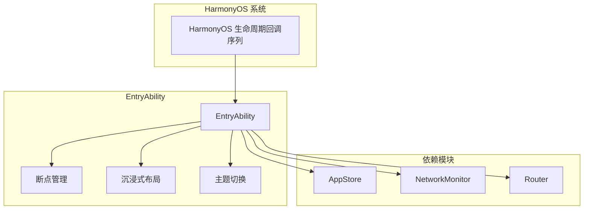
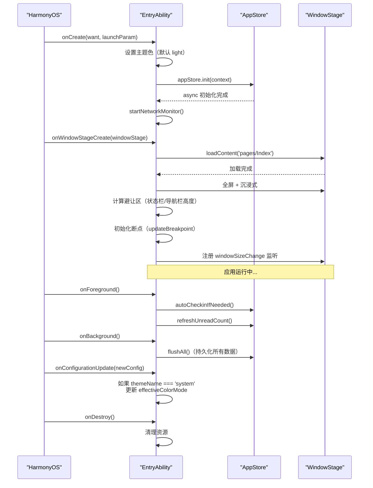

# 应用生命周期

## 概述

`entryability/EntryAbility.ets` 是整个应用的 UIAbility 入口，管理应用从启动到销毁的完整生命周期，包括断点响应、沉浸式布局和状态栏适配。



## 生命周期时序



## 各生命周期方法

### onCreate

`EntryAbility.ets:20-44` — 在 loadContent 前尽可能早地设置主题色，减少启动闪烁。

> **注意**：代码块为简化示意，实际源码使用 `common/constants/AppStorageKeys.ets` 导出的命名常量（如 `KEY_THEME_NAME` 替代 `'themeName'`），并包含更完整的错误处理。

```typescript
// EntryAbility.ets:20-44 — 启动初始化
onCreate(want: Want, launchParam: AbilityConstant.LaunchParam): void {
  // 1. 设置默认主题色（AppStore 还没初始化）
  appContext.setColorMode(ConfigurationConstant.ColorMode.COLOR_MODE_NOT_SET)
  AppStorage.setOrCreate('themeName', 'light')
  AppStorage.setOrCreate('effectiveColorMode', 'light')

  // 2. 异步初始化 AppStore
  appStore.init(this.context)

  // 3. 启动网络监视器
  startNetworkMonitor()
}
```

**注意**：`appStore.init` 是异步操作，`Index` 页面会等待 `initialized` 标志就绪后才跳转主页面。

### onWindowStageCreate

`EntryAbility.ets:60-93` — 窗口创建后执行页面加载和环境设置：

1. 加载 `pages/Index` 页面
2. 设置全屏沉浸式布局
3. 状态栏样式适配（浅色/深色）
4. 计算系统避让区高度（`statusBarHeight`、`navBarHeight`）
5. 初始化断点并监听窗口大小变化

### onConfigurationUpdate

`EntryAbility.ets:46-54` — 仅在 `themeName === 'system'` 时更新主题色：

> **注意**：代码块为简化示意，实际源码使用 `common/constants/AppStorageKeys.ets` 导出的命名常量（如 `KEY_THEME_NAME` 替代 `'themeName'`），并包含更完整的错误处理。

```typescript
// EntryAbility.ets:46-54 — 系统配置变更
onConfigurationUpdate(newConfig: Configuration): void {
  if (themeName === 'system') {
    const isDark = newConfig.colorMode === COLOR_MODE_DARK
    AppStorage.setOrCreate('effectiveColorMode', isDark ? 'dark' : 'light')
    updateStatusBarStyle(isDark)
  }
}
```

### onForeground / onBackground

> **注意**：代码块为简化示意，实际源码使用 `common/constants/AppStorageKeys.ets` 导出的命名常量（如 `KEY_THEME_NAME` 替代 `'themeName'`），并包含更完整的错误处理。

```typescript
// EntryAbility.ets:99-109 — 前后台切换
onForeground(): void {
  appStore.autoCheckinIfNeeded()  // 自动签到
  appStore.refreshUnreadCount()   // 刷新未读
}

onBackground(): void {
  appStore.flushAll()  // 全量持久化，防被系统杀死
}
```

## 断点系统

`EntryAbility.ets:111-132` 的 `updateBreakpoint` 方法实时计算响应式断点：

| 窗口宽度 (vp) | 断点 | 列数 | 侧边栏 | 板块列 |
|---------------|------|------|--------|--------|
| < 600 | `sm` | 1 | 隐藏 | 100% |
| 600 ~ 840 | `md` | 2 | 显示 | 100% |
| >= 840 | `lg` | 3 | 显示 | 40% |

断点通过 `AppStorage.setOrCreate('currentBreakpoint', newBp)` 广播给所有组件。

## 沉浸式布局

布局参数计算（`EntryAbility.ets:78-83`）：

> **注意**：代码块为简化示意，实际源码使用 `common/constants/AppStorageKeys.ets` 导出的命名常量（如 `KEY_THEME_NAME` 替代 `'themeName'`），并包含更完整的错误处理。

```typescript
// 状态栏高度（顶部避让区）
const topInset = avoidArea.topRect.height / density
AppStorage.setOrCreate('statusBarHeight', topInset)

// 导航栏高度（底部避让区）
const bottomInset = avoidArea.bottomRect.height / density
AppStorage.setOrCreate('navBarHeight', bottomInset)
```

## 错误处理

### AppStore 初始化失败

`EntryAbility.ets:37-39` 中 `appStore.init` 的 catch 分支仅记录日志，不阻塞应用启动。`Index` 页面需通过 `AppStorage('appInitialized')` 的值为 false 时显示加载中或超时提示。如果持久化数据损坏，`AppStore.init` 会跳过损坏数据，使用默认值继续运行。

### 避让区计算异常

沉浸式布局的避让区计算（`EntryAbility.ets:78-83`）可能因窗口未完全就绪或 DisplayManager 异常而失败。外层 try-catch （`EntryAbility.ets:89-91`）保证此异常不影响页面加载，仅记录 `logger.error`。

### 主题切换闪烁

`onConfigurationUpdate` 仅在 `themeName === 'system'` 时更新系统主题。如果从 light 切换到 dark 时出现短暂闪烁，是因为 `appStore.init` 的异步完成晚于 `loadContent`。`onCreate` 中的预设置（`EntryAbility.ets:23-29`）可以部分缓解。

## 常见问题

**Q: 应用启动卡在空白页？**
A: 确认 `AppStore.initialized` 是否有值。`Index` 页面等待该标志超时后可能没有回退逻辑，可检查日志中是否有 `AppStore init failed` 或 `Failed to load the content` 信息。

**Q: 横竖屏旋转后布局异常？**
A: `onWindowSizeChange` 实时触发断点更新。如果异常，检查 `updateBreakpoint` 是否正确计算 `densityPixels`。某些设备在旋转时 `getDefaultDisplaySync` 可能返回旧值，建议在 `onConfigurationUpdate` 中再次触发断点计算。

**Q: onBackground 时数据没有持久化？**
A: 确认 `flushAll()` 之前的所有异步写操作是否已完成。`SerialQueue` 队列中的 pending 任务如果在 `flushAll()` 之前尚未执行，写入会丢失。极端情况下可在 `onBackground` 中增加等待逻辑。

## 关联文档

- [Store 架构](../状态管理层/Store架构.md) — AppStore 初始化细节
- [主页面与响应式布局](../页面模块/主页面与响应式布局.md) — 三列布局的断点响应
