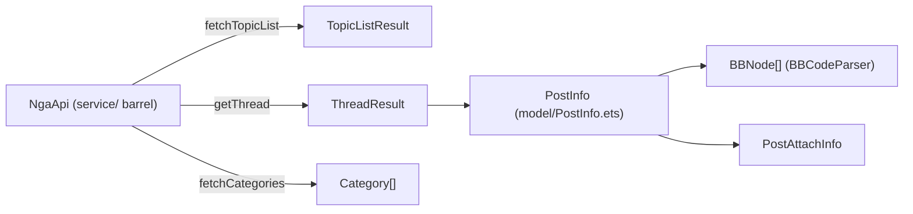
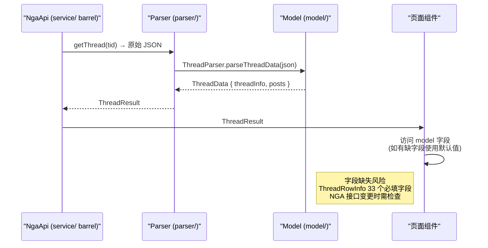

# 数据模型

## 概述

`model/` 目录包含项目中所有数据类型的定义，不包含业务逻辑。模型以 Class 和 Interface 为主，部分枚举（如 `BBNodeType`）。

P0-1 重构后，原散落在 `service/NgaApi.ets` 中的领域数据类（`PostInfo`、`UserInfo`、各业务 `*Result`）已统一迁入 `model/`，`service/NgaApi.ets` 现仅为 barrel re-export 聚合入口（参见 [API 通信](../服务层/API通信.md)）。原 `model/Api.ets`（无人引用的死代码）已删除。

## 文件列表

| 文件 | 核心导出 | 说明 |
|------|----------|------|
| `BBCodeNode.ets` | `BBNodeType(enum)`, `BBNode` | BBCode 语法树节点定义 |
| `Forum.ets` | `Category`, `CategorySub`, `BoardContent`, `Board`, `SubBoard`, `BoardCategory` | 论坛板块分类 |
| `Thread.ets` | `ThreadPagination`, `ThreadInfo`, `ThreadData`, `ThreadRowInfo`, `Attachment` | 帖子/主题信息 |
| `Post.ets` | `Post` | 楼层/回复 |
| `Topic.ets` | `TopicListInfo` | 主题列表 |
| `User.ets` | `User`, `ProfileData`, `AdminForumsData`, `ReputationData` | 用户资料 |
| `Notification.ets` | `NgaNotification` | 通知 |
| `Message.ets` | `MessageThreadInfo`, `MessageListInfo`, `MessageDetailInfo` | 私信 |
| `NoteInfo.ets` | `UserNoteEntry` | 用户笔记 |
| `FilterKeyword.ets` | `FilterKeyword` | 关键词过滤 |
| `SocialEntries.ets` | `FavBoard`, `BlacklistEntry` | 收藏版块与黑名单条目（P2 从 `store/settings/SettingsState` 迁出，消除 `datasource` 反向依赖 `store` 的分层违规） |
| `PostInfo.ets` | `PostInfo`, `PostAttachInfo` | 单条帖子（主帖/回复/评论）与内联附件，P0-1 从 `service/NgaApi.ets` 迁入 |
| `UserInfo.ets` | `UserInfo` | 当前登录用户轻量信息（uid/昵称/头像），P0-1 从 `service/NgaApi.ets` 迁入 |
| `ThreadResult.ets` | `ThreadPagination`, `ThreadResult`, `PostAuthResult`, `PostReplyResult` | 帖子详情接口返回结果，P0-1 从 `service/NgaApi.ets` 迁入 |
| `MessageResult.ets` | `MessageListResult`, `MessageDetailResult`, `MessageSendResult` | 私信模块接口返回结果，P0-1 从 `service/NgaApi.ets` 迁入 |
| `NgaApiResults.ets` | `ApiResult`, `VoteResult`, `CaptchaResult`, `LoginStep1/2Result`, `CategoriesResult`, `TopicListResult`, `NotificationsResult`, `UserProfileResult`, `DomainResult`, `CurrentUserResult`, `CheckinResult`, `SearchForumResult`, `InjectResult`, `UploadAttachmentResult`, `FavBoardItem`, `ForumFavoritesResult`, `ForumStat`, `UserActivityAnalysis` | NGA API 各业务接口的 Result 类型集合，P0-1 从 `service/NgaApi.ets` 迁入 |
| `raw/NgaRawTypes.ets` | NGA 原始 JSON 类型 | 与 NGA API 直接对应的原始类型 |

## 核心模型说明

### BBCodeNode

`model/BBCodeNode.ets:1-40` 定义了 AST 节点类型枚举 `BBNodeType`（39 种节点类型），`model/BBCodeNode.ets:42-59` 定义了节点类 `BBNode`，全部字段显式初始化默认值：

```typescript
// BBCodeNode.ets:42-58 — 节点字段全部显式初始化默认值
class BBNode {
  type: BBNodeType = BBNodeType.TEXT
  text: string = ''
  id: number = 0
  children: BBNode[] = []
  href: string = ''
  color: string = ''
  size: number = 0
  src: string = ''
  // ...另有 title / emotionCat / emotionCode / fontFamily / align
  //     / colSpan / rowSpan / colWidth 等渲染相关字段
}
```

详见 [BBCode 解析与渲染](../服务层/BBCode解析与渲染.md)。

### PostInfo（model/PostInfo.ets）

`PostInfo` 是最核心的楼层数据模型，P0-1 重构后由 `service/NgaApi.ets` 迁入 `model/PostInfo.ets`，定义在 `model/PostInfo.ets:26-55`，附件 `PostAttachInfo` 定义在 `model/PostInfo.ets:9-21`。

| 字段 | 类型 | 说明 |
|------|------|------|
| `tid` | `number` | 帖子 ID |
| `pid` | `number` | 楼层 ID |
| `lou` | `number` | 楼层号 |
| `authorid` | `number` | 作者 UID |
| `author` | `string` | 作者昵称 |
| `subject` | `string` | 标题 |
| `content` | `string` | BBCode 内容 |
| `postdate` | `string` | 发帖时间 |
| `avatar` | `string` | 头像 URL |
| `signature` | `string` | 签名 |
| `attachs` | `PostAttachInfo[]` | 附件列表（默认 `[]`） |
| `comments` | `PostInfo[]` | 评论列表（默认 `[]`，递归结构） |
| `hotReplies` | `string[]` | 热门回复 PID 列表（默认 `[]`） |
| `isanonymous` | `boolean` | 是否匿名 |
| `isInBlackList` | `boolean` | 是否在黑名单 |
| `reputation` | `number` | 威望值 |
| `alterinfo` | `string` | 改名/换头信息 |
| `score` / `score_2` | `number` | 评分 |
| `memberGroup` | `string` | 用户组 |
| `muteTime` | `string` | 禁言截止时间 |

`PostInfo` 全字段均为 class 显式默认值，是消费方最常用的「防御性」模型。

### Category — 板块分类

`model/Forum.ets:1-5` 定义顶层板块分类接口 `Category`（interface，无默认值）：

```typescript
// Forum.ets:1-5 — 板块分类（interface，字段缺失需调用方防护）
interface Category {
  id: string;            // 分类 ID
  name: string;          // 分类名
  sub: CategorySub[];    // 二级分组列表
}
```

Forum 中其余类型（`CategorySub`、`BoardContent`、`Board`、`SubBoard`、`BoardCategory`）均为 interface，字段缺失时需调用方自行防护（仅 `BoardContent.bit?` 为可选字段）。

### ThreadRowInfo — 最密集的模型

`model/Thread.ets:33-67` 定义了 33 个必填字段的接口 `ThreadRowInfo`，是项目中字段最多的模型。其中 `comments: ThreadRowInfo[]`（`model/Thread.ets:51`）和 `hotReplies: string[]`（`model/Thread.ets:52`）两个数组字段在后端返回缺失时将产生 `undefined`，需消费方做可选链处理。

> 注意：`ThreadResult.ets` 中另有一个 class 版本的 `ThreadPagination`（`model/ThreadResult.ets:17-21`，全字段默认值），与 `Thread.ets` 中 interface 版本的 `ThreadPagination` 并存——前者用于业务层结果封装，后者用于解析器内部数据流。

### ProfileData — 防御性编程最佳实践

`model/User.ets:8-28` 是防御性做得最好的模型，20 个字段全部用 class 初始化默认值，尤其 `adminForums: AdminForumsData[] = []`（`model/User.ets:26`）和 `reputationEntryList: ReputationData[] = []`（`model/User.ets:27`）确保遍历不抛异常。

## 模型间关系





## 错误处理

### 字段缺失容错

项目中模型分为两种定义模式：

| 模式 | 示例文件 | 容错表现 |
|------|----------|----------|
| **class + 显式默认值** | `BBCodeNode.ets`、`User.ets`（ProfileData）、`FilterKeyword.ets`、`PostInfo.ets`、`NgaApiResults.ets`（各 *Result） | 字段缺失时使用默认值（`0`/`''`/`[]`） |
| **interface 无默认值** | `Forum.ets`、`Thread.ets`、`Topic.ets`、`Message.ets`、`Notification.ets` | 字段缺失时为 `undefined`，需调用方自行判断 |

**高风险接口**（未使用 class、字段多、后端返回不稳定的场景）：

1. **`ThreadRowInfo`**（`model/Thread.ets:33-67`）— 33 个必填字段，NGA 接口在特定场景下可能缺失 `anonystatus`、`alterinfo` 等字段
2. **`Forum.ets`** 中的各接口 — 除 `BoardContent.bit?` 外全部必填
3. **`NotificationInfo`** 及其派生接口 — `unread: boolean` 等字段在后端可能不存在

### 解析器层的兜底

API 返回的原始 JSON 通过 `parser/` 解析器转换时，解析器负责填充缺失字段的默认值（`parseThreadData` 等）。消费方（页面组件）应优先使用解析后数据而非直接操作原始 JSON。

### 数组字段空值防护

数组字段（`sub`、`attachs`、`comments`、`hotReplies` 等）如果定义为 `interface` 中的 `Type[]` 而非 class 中初始化的 `= []`，在 NGA 接口返回缺失时将产生 `undefined`，调用 `.map()`/`.forEach()` 会抛出 `TypeError`。消费方需做可选链处理（`arr?.map()`）。

对于 class 定义的模型（如 `PostInfo`、`ProfileData`），数组字段已显式初始化为 `= []`，遍历安全。

### 匿名用户处理

`authorid = 0` 或 `isanonymous = true` 时，用户头像和信息不可点击。`User.ets` 的 `ProfileData` 中 `uid: string = ''` 默认值为空字符串，匿名场景下不会产生伪造的交互。

## 边缘情况

1. **缺失字段**：NGA 接口可能返回缺少某些字段的 JSON，模型构造函数需设置合理默认值
2. **匿名用户**：`authorid = 0` 或 `isanonymous = true` 时，用户信息不可点击
3. **威望为负**：`reputation` 字段可能为负数时，显示时需处理符号
4. **巨量附件**：一个楼层可能包含数十个附件，`attachs` 数组需考虑懒加载
5. **ThreadPagination 双定义**：`Thread.ets`（interface，解析器内部）与 `ThreadResult.ets`（class，业务结果封装）各有一份 `ThreadPagination`，修改字段时需同步两处

## 常见问题

**Q: 模型字段与 API 返回字段不一致怎么办？**
A: 解析器（`parser/`）负责从 API 原始数据映射到模型字段。如果 API 变更，只需修改对应解析器，不涉及消费方代码。

**Q: P0-1 后 `PostInfo` / `*Result` 现在从哪里导入？**
A: P0-1 已将 `PostInfo`、`UserInfo`、`ThreadResult`、`MessageResult` 及各 `*Result` 从 `service/NgaApi.ets` 迁入 `model/` 层。消费方应直接从 `model/` 导入类型与构造器（如 `import { PostInfo } from '../model/PostInfo'`），消除 `common → service` 的反向依赖（原 5 处 import 已改指向 `model/`）。`service/NgaApi.ets` 现仅为 barrel，通过 `export * from './api/XxxApi'` 聚合 7 个业务域函数。

**Q: 模型字段的类型安全如何保证？**
A: 所有字段在 Class 定义中显式初始化（`number = 0`、`string = ''`、`boolean = false`），JSON 解析时类型不匹配的字段使用默认值，不会抛出异常。

## 关联文档

- [API 通信](../服务层/API通信.md)
- [BBCode 解析与渲染](../服务层/BBCode解析与渲染.md)
- [架构决策 003 barrel re-export](../架构决策/003-barrel-re-export模式.md)
- [架构决策 006 保守合并原则](../架构决策/006-保守合并原则.md) — 类布局固定，领域类迁移不改字段
- [重构计划/模块可维护性重构计划.md](../重构计划/模块可维护性重构计划.md)
