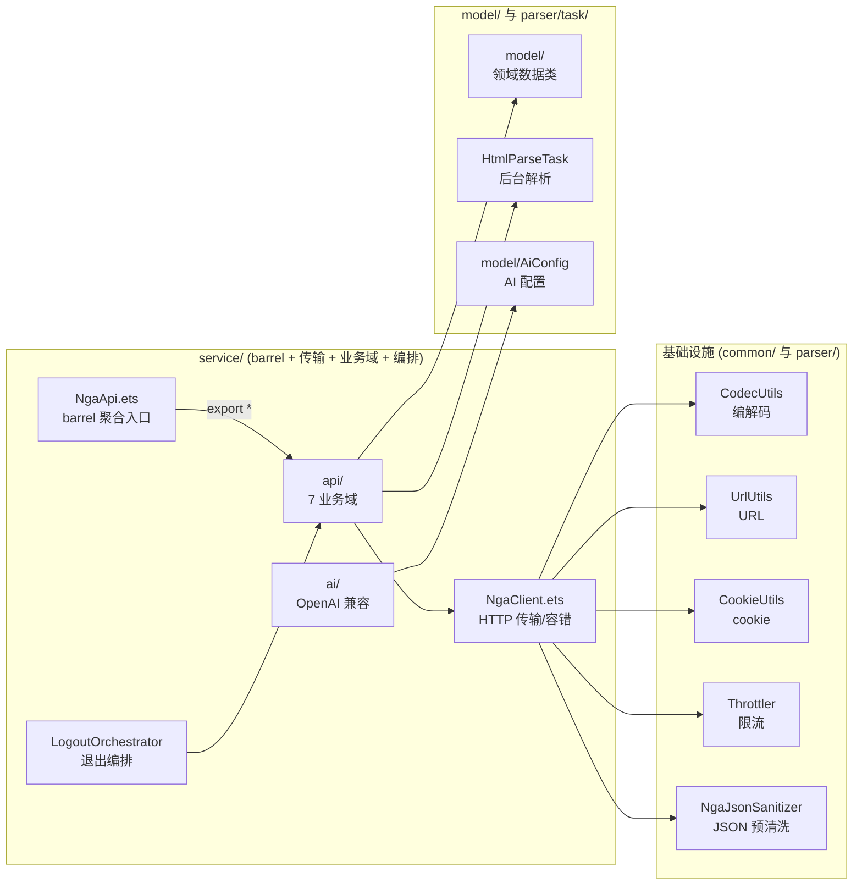
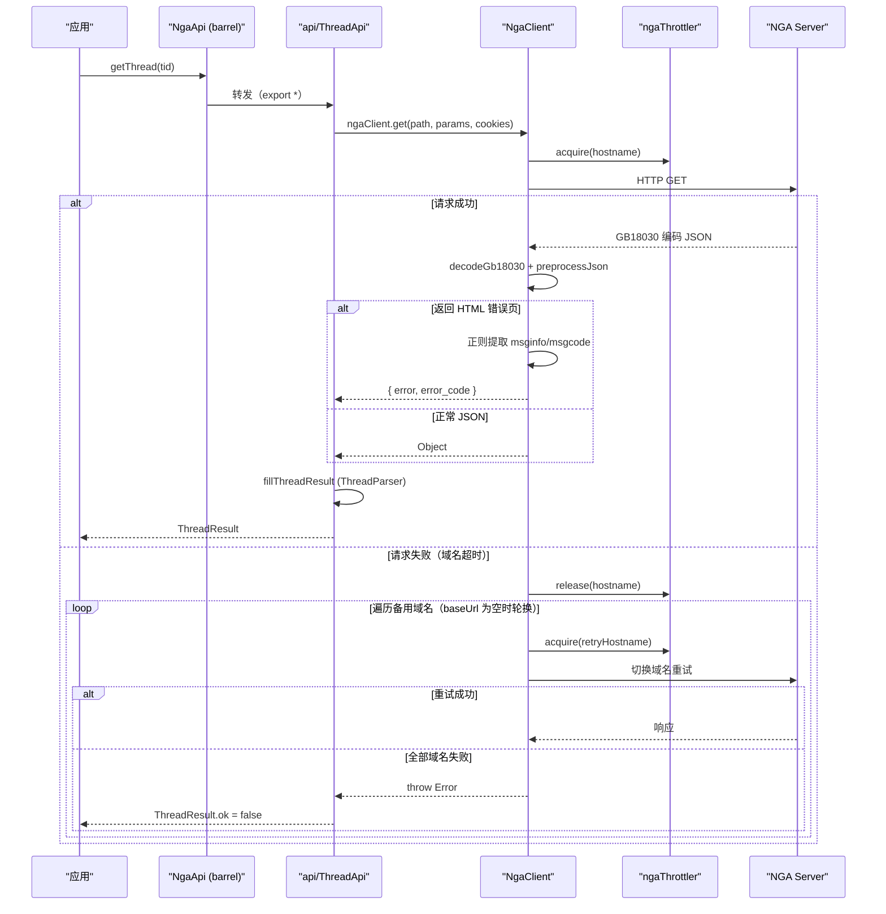
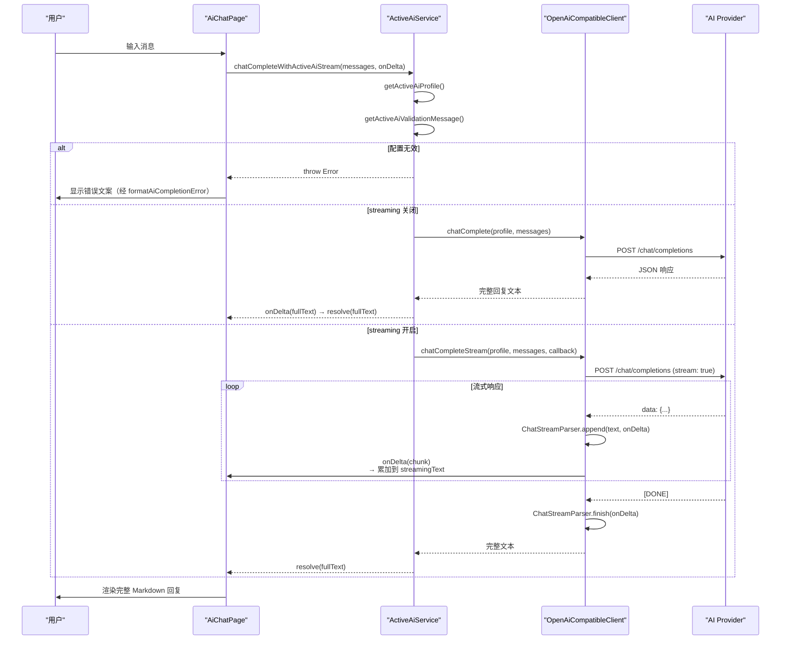

# API 通信

## 概述

API 通信层分为两层架构：`NgaClient` 负责 HTTP 传输、编码解码与域名故障转移，`NgaApi` 作为 barrel 聚合入口，把具体业务接口按域拆分至 `service/api/` 下 7 个子文件。这种设计将传输容错逻辑集中一处，避免各业务接口重复实现。

经过模块化重构（P0-1 / P1-5 / P2-4 / P2-5），`service/` 目录的职责边界更清晰：

- **传输层 `NgaClient.ets`**：只关心 HTTP 收发、GB18030 解码、域名轮换重试、限流；不再承担编解码工具实现。
- **编解码工具 `common/utils/`**：`CodecUtils`（UTF-8/Base64/GB18030/GBK 百分号编码/表单与 multipart 构造）、`UrlUtils`（主机名提取、URL 拼接）、`CookieUtils`（set-cookie 解析）——均为无副作用纯函数。
- **业务接口 `service/api/*.ets`**：7 个业务域子文件，每个子文件直接 `import { ngaClient } from '../NgaClient'`。
- **barrel 聚合 `NgaApi.ets`**：仅 `export * from './api/XxxApi'`，让 24 个引用方继续从 `'../service/NgaApi'` 导入而零改动（详见 [ADR 003](../架构决策/003-barrel-re-export模式.md)）。
- **领域数据类**：`ApiResult` / `PostInfo` / `ThreadResult` 等已从 `NgaApi.ets` 迁出至 `model/` 层。
- **退出登录编排 `LogoutOrchestrator.ets`**：集中编排"服务端登出 → 本地清理 → 导航跳转"完整流程，服务端登出失败不阻塞本地清理。
- **AI 服务模块 `service/ai/`**：OpenAI 兼容自定义 AI 对话能力（详见下文 [AI 服务模块](#ai-服务模块)）。

`service/` 目录的文件结构：



> `api/` 下 7 个业务域子文件：`AuthApi`（登录/会话/凭据）、`UserApi`（用户资料/成分）、`ForumApi`（板块/搜索/主题）、`ThreadApi`（帖子/回帖/上传）、`FavoriteApi`（收藏/投票/签到）、`MessageApi`（通知/私信）、`MiscApi`（域名切换）。各子文件均 `import { ngaClient } from '../NgaClient'`，`NgaApi.ets` 仅以 `export *` 聚合它们。

## NgaClient 传输层

`NgaClient.ets` 导出两类东西：`ngaClient` 对象（封装 GET/POST/Multipart/HTML 等方法）与顶层 `ngaUploadFile` 函数（附件二进制上传）。

### 核心请求流程

`ngaRequest` 是 JSON 接口的核心入口（`NgaClient.ets:353-402`）：

```typescript
// NgaClient.ets:353-402 — JSON 核心请求
async function ngaRequest(path, method, params, body, cookies, baseUrl, extraHeaders, skipInchst?) {
  // 1. 默认注入 __inchst=UTF8（skipInchst 时跳过，如 ngaPostWithQuery）
  if (!skipInchst && !params['__inchst']) params['__inchst'] = 'UTF8';

  // 2. 委托 executeWithRetry 完成「限流 + 首次请求 + 域名轮换重试」
  const response = await executeWithRetry(path, params, method, body, cookies, extraHeaders, baseUrl);

  // 3. GB18030 解码
  const rawText = decodeGb18030(response.body);

  // 4. HTML 错误页检测 → 提取 msginfo/msgcode
  // 5. preprocessJson → JSON.parse，失败返回 __parseError 标记
}
```

### executeWithRetry — 统一的容错执行器（P2-4 抽取）

`executeWithRetry`（`NgaClient.ets:206-287`）封装了「首次请求 + 失败后遍历 `DOMAINS` 重试 + `ngaThrottler` acquire/release」三段逻辑，被 `ngaRequest` 与 `ngaGetHtmlText` 共用：

```typescript
// NgaClient.ets:249-287 — 限流 + 域名轮换重试
await ngaThrottler.acquire(hostname);          // 首次按域名限流
try {
  response = await httpReq(url, method, header, body);
} catch (firstError) {
  ngaThrottler.release(hostname); released = true;
  for (let i = 1; i < DOMAINS.length; i++) {   // 遍历备用域名
    const retryDomainIdx = (activeDomainIndex + i) % DOMAINS.length;
    const retryBaseUrl = baseUrl || DOMAINS[retryDomainIdx];
    await ngaThrottler.acquire(extractHostname(retryBaseUrl));
    try { response = await httpReq(...); break; }
    catch (retryError) { firstErrorMsg = ...; }
    finally { ngaThrottler.release(retryHostname); }
  }
  if (!retrySuccess) throw new Error(`请求失败: ${firstErrorMsg}`);
} finally { if (!released) ngaThrottler.release(hostname); }
```

**保守决策（baseUrl quirk）：** `baseUrl` 形参控制重试是否轮换域名（`NgaClient.ets:213`）：

- `ngaRequest` 传入 `baseUrl = ''`（空串）→ `retryBaseUrl = baseUrl || DOMAINS[retryDomainIdx]` 命中轮换后的域名，**会轮换**。
- `ngaGetHtmlText` 传入 `baseUrl = DOMAINS[activeDomainIndex]`（非空）→ `retryBaseUrl` 永远命中该域名，**不轮换**，逐字保持原行为（HTML 接口与 JSON 接口的域名语义不同，强行轮换会破坏会话）。

### 请求方法封装

| 方法 | 函数名 | 说明 |
|------|--------|------|
| GET | `ngaClient.get`（`ngaGet` `NgaClient.ets:291-294`） | 标准 GET 请求 |
| POST | `ngaClient.post`（`ngaPost` `NgaClient.ets:296-301`） | 表单编码 POST，支持 GBK 字段 |
| POST with query | `ngaClient.postWithQuery`（`NgaClient.ets:303-311`） | POST + URL 参数，跳过 `__inchst` |
| Multipart | `ngaClient.postMultipart`（`NgaClient.ets:313-320`） | multipart/form-data 表单 |
| Raw | `ngaClient.getRaw`（`NgaClient.ets:322-326`） | 返回 ArrayBuffer，不解码 |
| HTML | `ngaClient.getHtmlText`（`NgaClient.ets:328-338`） | 返回 GB18030 解码后的 HTML 文本，不轮换域名 |
| 指定 baseUrl | `ngaClient.getWithBaseUrl`（`NgaClient.ets:340-343`） | GET 但绑定特定域名 |
| 附件二进制上传 | `ngaUploadFile`（`NgaClient.ets:613-706`） | 上传到 `img8.nga.cn/attach.php` |

### 错误检测与降级

`NgaClient.ets:372-388` 处理服务器返回的 HTML 错误页面（而非 JSON）：

```typescript
// NgaClient.ets:372-388 — 检测 HTML 错误标记
const trimmed = rawText.trimStart();
if (trimmed.startsWith('<!DOCTYPE') || trimmed.startsWith('<html')) {
  // 提取 <!--msginfostart--> 中的错误描述（兜底用 <title>）
  // 提取 <!--msgcodestart--> 中的错误码
  return { 'error': { '0': htmlError }, 'error_code': codeNum };
}
```

JSON 解析失败时（`NgaClient.ets:390-401`）返回带 `__parseError` 标记的对象，而非抛异常，让业务层自行决定降级路径（如 `getThread` 在 JSON 失败时降级到 HTML 解析）。

### 限流控制

| 参数 | 值 | 位置 |
|------|-----|------|
| 连接超时 | `15000 ms` | `NgaClient.ets:146` |
| 读取超时 | `30000 ms` | `NgaClient.ets:145` |
| 限流器 | `ngaThrottler`（令牌桶） | `common/concurrency/Throttler.ets:149` |
| 默认最大并发 | `6`（每域名） | `Throttler.ets:26` |
| 默认最小间隔 | `150 ms`（每域名） | `Throttler.ets:27` |

`Throttler` 在 P1-2 从 `service/Throttle.ets` 迁入 `common/concurrency/`，按域名维护独立的令牌桶（`Throttler.ets:22-112`）。

## NgaApi 公共 API

`NgaApi.ets` 本身是纯 barrel（`NgaApi.ets:17-23`），7 行 `export * from './api/XxxApi'` 把业务函数按域聚合。真正的接口实现分布在 `service/api/` 下。

### 返回类型

所有 API 返回类型显式定义为 Class，集中在 `model/NgaApiResults.ets`（P0-1 从 `NgaApi.ets` 迁出）：

| 返回类 | 继承 | 字段 | 位置 |
|--------|------|------|------|
| `ApiResult` | — | `ok`, `error` | `model/NgaApiResults.ets:14-17` |
| `VoteResult` | ApiResult | `message` | `model/NgaApiResults.ets:22-24` |
| `CaptchaResult` | ApiResult | `image` | `model/NgaApiResults.ets:29-31` |
| `LoginStep1Result` | ApiResult | `needCaptcha`, `loginToken`, `captchaId`, `captchaImage` | `model/NgaApiResults.ets:36-41` |
| `LoginStep2Result` | ApiResult | 同上 + `token`, `user` | `model/NgaApiResults.ets:46-53` |
| `InjectResult` | ApiResult | `token`, `user` | `model/NgaApiResults.ets:114-117` |
| `UploadAttachmentResult` | ApiResult | `url`, `attachments`, `attachmentsCheck` | `model/NgaApiResults.ets:122-126` |

帖子相关结果类单独放在 `model/ThreadResult.ets`：`ThreadResult`（`ThreadResult.ets:26-31`，含 `threadInfo`/`forumName`/`pagination`/`posts`）、`ThreadPaging`（`ThreadResult.ets:17-21`，业务封装用 class 版本）、`PostAuthResult`（`ThreadResult.ets:36-40`）、`PostReplyResult`（`ThreadResult.ets:45-48`）。

### 业务接口（按域）

> 调用方仍从 `'../service/NgaApi'` 导入（barrel 转发），但实现已拆分到 `service/api/*.ets`。

| 接口函数 | 实现位置 | 说明 |
|----------|----------|------|
| `verifyToken` | `api/AuthApi.ets:192-211` | Token 有效性验证（网络异常默认视为有效，避免离线强制登出） |
| `getCaptcha` / `loginStep1` / `loginStep2` | `api/AuthApi.ets:29` / `:41-65` / `:67-136` | 验证码、两步登录 |
| `injectCredentials` | `api/AuthApi.ets:215-244` | uid+cid 直登 |
| `getForumCategories` | `api/ForumApi.ets:14` | 论坛板块分类 |
| `getTopicList` | `api/ForumApi.ets:75` | 主题列表（分页） |
| `searchForum` | `api/ForumApi.ets:33` | 板块搜索 |
| `getThread` | `api/ThreadApi.ets:39-115` | 帖子详情，JSON API 优先、失败降级 HTML |
| `getThreadHtml` | `api/ThreadApi.ets:279-309` | 强制走 HTML 解析的降级入口 |
| `getPostAuth` | `api/ThreadApi.ets:313-342` | 发帖/回复鉴权（取 auth + attach_url） |
| `postReply` / `postComment` | `api/ThreadApi.ets:344-385` / `:387-423` | 发送回复 / 评论 |
| `uploadAttachment` | `api/ThreadApi.ets:427-476` | 附件上传（经 `ngaUploadFile`） |
| `votePost` / `checkin` / `addFavorite` | `api/FavoriteApi.ets:53` / `:140` / `:90` | 投票、签到、收藏 |
| `getNotifications` / `getMessageList` | `api/MessageApi.ets:15` / `:54` | 通知、私信 |
| `getCurrentUser` / `getUserProfile` | `api/UserApi.ets:15` / `:55` | 当前用户、用户资料 |
| `setDomain` / `getActiveDomain` | `api/MiscApi.ets:11` / `:29` | 域名切换 |

### JSON / HTML 双通道解析（getThread）

`getThread`（`api/ThreadApi.ets:39-115`）的策略：

1. 若 `getForceHtmlMode()`（`ThreadApi.ets:28-31`，调试开关 `AppStorage['nga_forceHtmlMode']`）或缺少 `tid`，直接走 HTML。
2. 否则先请求 JSON API（`__output=8`）；`parseNgaError` 命中错误或请求异常时，降级到 `getHtmlText` + `taskpool.execute(parseHtmlTask, html)`。
3. 两通道最终都调用 `fillThreadResult`（`ThreadApi.ets:146-273`）把原始 JSON/HTML 对象映射成 `ThreadResult`。

## 编解码工具下沉（P1-5）

传输层不再内联编解码逻辑，统一委托给 `common/utils/` 的纯函数：

| 工具 | 位置 | 职责 |
|------|------|------|
| `decodeGb18030` | `CodecUtils.ets:43-46` | ArrayBuffer → GB18030 字符串 |
| `stringToUint8Array` / `uint8ArrayToBase64` | `CodecUtils.ets:23-26` / `:33-36` | UTF-8 编码、Base64 |
| `gbkPercentEncode` | `CodecUtils.ets:80-98` | GBK 百分号编码（emoji 先转 HTML 实体避免拆分） |
| `buildEncodedBody` | `CodecUtils.ets:107-125` | 构造 `application/x-www-form-urlencoded`，`gbkFieldKeys` 字段走 GBK |
| `buildMultipart` | `CodecUtils.ets:132-146` | 构造 `multipart/form-data` 纯文本字段体 |
| `extractHostname` | `UrlUtils.ets:13-16` | 从 URL 提取主机名（含端口） |
| `buildUrl` | `UrlUtils.ets:27-43` | baseUrl + path + params 拼接，跳过空值 |
| `parseSessionCookies` / `normalizeCookieList` | `CookieUtils.ets:23-42` / `:50-60` | 从 set-cookie 解析 uid/cid；归一化为数组 |

`NgaClient.ets:6-15` 的 import 体现了这一依赖边界。`Throttler`（`common/concurrency/Throttler.ets`）与 `NgaJsonSanitizer`（`parser/NgaJsonSanitizer.ets`，原 `JsonUtil`，P1-1 改名）同理。

## 请求时序



## 并发解析

`getThread` / `getThreadHtml` 利用 `taskpool` 在后台线程执行 HTML 解析，避免阻塞 UI 线程（`parser/task/HtmlParseTask.ets:3-8`）：

```typescript
// HtmlParseTask.ets:3-6 — @Concurrent 后台解析
@Concurrent
function parseHtmlTask(html: string): Object {
  return parseHtmlToRawJson(html) as Object
}
```

调用点：`api/ThreadApi.ets:68` 与 `:106`，`const rawObj = await taskpool.execute(parseHtmlTask, html)`。`parseHtmlToRawJson` 实际由 `parser/nga/html-thread/index.ets` 装配（`HtmlThreadParser.ets` 是 barrel 转发，详见 [BBCode 解析与渲染](./BBCode解析与渲染.md)）。

## 数据模型

| 模型 | 文件 | 核心字段 |
|------|------|----------|
| `ApiResult` | `model/NgaApiResults.ets:14-17` | ok, error |
| `PostInfo` | `model/PostInfo.ets:26-55` | tid, pid, lou, author, content, attachs, comments |
| `PostAttachInfo` | `model/PostInfo.ets:9-21` | aid, attachurl, url_utf8_org_name, name, ext, thumb |
| `ThreadResult` | `model/ThreadResult.ets:26-31` | threadInfo, forumName, pagination, posts |
| `ThreadPaging` | `model/ThreadResult.ets:17-21` | page, totalPages, totalRows |
| `PostAuthResult` | `model/ThreadResult.ets:36-40` | auth, attachUrl, if_moderator |
| `PostReplyResult` | `model/ThreadResult.ets:45-48` | tid, pid |
| `UploadAttachmentResult` | `model/NgaApiResults.ets:122-126` | url, attachments, attachmentsCheck |
| `TopicListInfo` | `model/Topic.ets` | threads, totalPages, forumName |
| `Category` | `model/Forum.ets` | fid, name, children |
| `UserInfo` | `model/UserInfo.ets` | uid, nickName, avatarUrl |

## 边缘情况

1. **非标准 JSON**：NGA 接口 JSON 前可能附加非 JSON 字符，`preprocessJson`（`parser/NgaJsonSanitizer.ets`）负责清理。
2. **HTML 错误页**：某些错误码下服务器直接返回 HTML 而非 JSON，`ngaRequest` 正则提取 `msginfo` / `msgcode`（`NgaClient.ets:372-388`）。
3. **GB18030 编码**：服务端使用 GB18030，所有响应文本需 `decodeGb18030` 解码后才能 `JSON.parse`。
4. **GBK 表单字段**：发帖/回复的 `post_content`、`post_subject` 含中文与 emoji，必须经 `gbkPercentEncode`（emoji 先转 HTML 实体避免代理对被拆分，`common/utils/CodecUtils.ets:80`），由 `ngaPost` 的 `gbkFieldKeys` 参数触发（`api/ThreadApi.ets`）。
5. **空响应**：部分接口成功返回空对象，需防御性处理。
6. **JSON 解析失败**：`ngaRequest` 返回 `{ __parseError: true, __rawLength, error }` 而非抛异常（`NgaClient.ets:390-401`），业务层据此决定是否降级。
7. **附件上传响应是 JS 对象字面量**：`uploadAttachment` 需把单引号转双引号、补全属性名引号后才可 `JSON.parse`（`api/ThreadApi.ets:446-456`）；`error_code != 0` 视为附件过大被拒。

## 常见问题

**Q: 请求返回 `ApiResult.ok = false`，但 status code 是 200？**
A: 这是 NGA 业务层错误，错误描述在 `ApiResult.error` 字段中。常见原因：token 过期、权限不足、发帖间隔过短。HTML 错误页场景下错误码在 `error_code` 字段。

**Q: 如何排查 HTTP 请求失败？**
A: 查看日志中 `[NGA][REQ]` tag，确认请求 URL、方法和 body。`[NGA][RES]` 可见响应状态码。如果出现 `<!DOCTYPE` 前缀，说明服务器返回了 HTML 错误页。附件上传看 `[NGA][UPLOAD]` tag。

**Q: 为什么有时请求很慢？**
A: `ngaThrottler` 限制了每个域名的并发数（默认 6）与最小间隔（默认 150 ms），多个并发请求会排队等待。另外域名故障转移机制会遍历所有备用域名，全部超时后返回最后一次的错误。

**Q: 为什么 `ngaGetHtmlText` 不轮换域名而 `ngaRequest` 轮换？**
A: 两者共用 `executeWithRetry`，差异在调用方传入的 `baseUrl`：`ngaRequest` 传空串触发轮换，`ngaGetHtmlText` 传 `DOMAINS[activeDomainIndex]` 固定域名（`NgaClient.ets:213`，参见 `:330-335` 中 `ngaGetHtmlText` 的注释）。HTML 接口与 JSON 接口的会话语义不同，强行轮换会破坏 `ngaGetHtmlText` 的既有行为。

**Q: 业务函数到底在哪个文件？**
A: 统一从 `'../service/NgaApi'` 导入即可，barrel 会转发。若需定位实现：登录/会话在 `api/AuthApi`，板块/搜索/主题在 `api/ForumApi`，帖子/回帖/上传在 `api/ThreadApi`，详见上文「业务接口（按域）」表。

## AI 服务模块

`service/ai/` 提供基于 OpenAI 兼容协议的自定义 AI 对话能力。用户可通过 `pages/ai/AiSettingsPanel.ets` 配置多个第三方 AI 服务商，在 `pages/ai/AiChatPage.ets` 中进行流式对话。

### 分层结构

| 层 | 文件 | 职责 |
|---|------|------|
| **数据模型** | `model/AiConfig.ets` | `AiProviderProfile`（端点/密钥/模型/温度/流式开关）、`AiTestResult` |
| **预设** | `ai/AiModelPresets.ets` | 7 个流行服务商预设（DeepSeek、智谱、豆包、MiniMax、Kimi、OpenAI、自定义） |
| **传输** | `ai/OpenAiCompatibleClient.ets` | OpenAI 兼容 API 客户端：`chatComplete`（普通）、`chatCompleteStream`（流式）、`testConnection`、`listModels。SSE 流经 `ChatStreamParser` 解析，`dataReceive`/`dataEnd` 事件驱动 |
| **门面** | `ai/ActiveAiService.ets` | 当前激活配置校验 + 调用 + 错误格式化门面。`chatCompleteWithActiveAiStream` 检测 `profile.streaming`，关闭流式时自动降级为一次性请求 |
| **错误翻译** | `ai/AiErrorTranslator.ets` | HTTP 状态码 → 中文提示映射（401→密钥无效、403→无权限、404→地址/模型不存在、429→额度用尽等），附带修复操作建议 |
| **设置域** | `store/settings/domain/AiSettings.ets` | `aiProfiles` / `activeAiProfileId` 增删改查及激活切换，遵循 SettingsContext 注入模式 |

### 流式对话流程



### Markdown 渲染管线

| 组件 | 文件 | 职责 |
|------|------|------|
| 解析器 | `parser/md/MdParser.ets` | 原始 Markdown → `MdNode[]` AST，两步法：块级解析（标题/段落/列表/代码块等）+ 内联解析（粗体/斜体/链接等） |
| 模型 | `model/MdNode.ets` | `MdNodeType` 枚举（11 种节点类型）+ `MdNode` 类（id/type/text/children/level/href/language），全局自增 ID 确保 ForEach key 唯一 |
| 渲染 | `common/components/MdContentView.ets` | `MdNode[]` → ArkUI 组件树。每次 `@Prop text` 更新时全量重解析并刷新 UI |

### 边缘情况

1. **流式中断**：网络断开时 `dataEnd` 事件仍会触发，`ChatStreamParser.finish` 返回当前已积累文本而非抛异常
2. **配置不完整**：`getActiveAiValidationMessage` 在端点/模型名/API Key 为空时返回具体提示文案，指导用户补全
3. **HTTP 状态码**：非 200 响应以状态码数字抛异常，`formatAiCompletionError` 和 `translateError` 映射为用户友好信息
4. **空响应**：`parseChatResponse` / `parseStreamDelta` 返回空串时，`chatComplete` 和 `chatCompleteStream` 抛 "AI 响应为空或格式不兼容"
5. **格式不兼容**：响应 JSON 缺少 `choices[0].message.content` 或流式 `delta` 结构时静默返回空串，最终由调用方判空处理
6. **MdContentView 流式优化**：使用 `@State parsedNodes` + `ForEach` 直接读取，避免 `@Builder` 参数间接传入导致响应式断连

## 关联文档

- [ADR 001 单一 Module 与 @Observed 状态管理](../架构决策/001-单一Module与@Observed状态管理.md)
- [ADR 002 NgaClient 双层架构设计](../架构决策/002-NgaClient双层架构设计.md)
- [ADR 003 barrel re-export 模式](../架构决策/003-barrel-re-export模式.md)
- [BBCode 解析与渲染](./BBCode解析与渲染.md) — `HtmlParseTask` / `parseHtmlToRawJson` 的解析链路
- [数据模型概述](../数据模型/数据模型概述.md) — `model/` 层领域数据类
- [Store 架构](../状态管理层/Store架构.md) — `appStore.getSession` / 凭据注入路径
