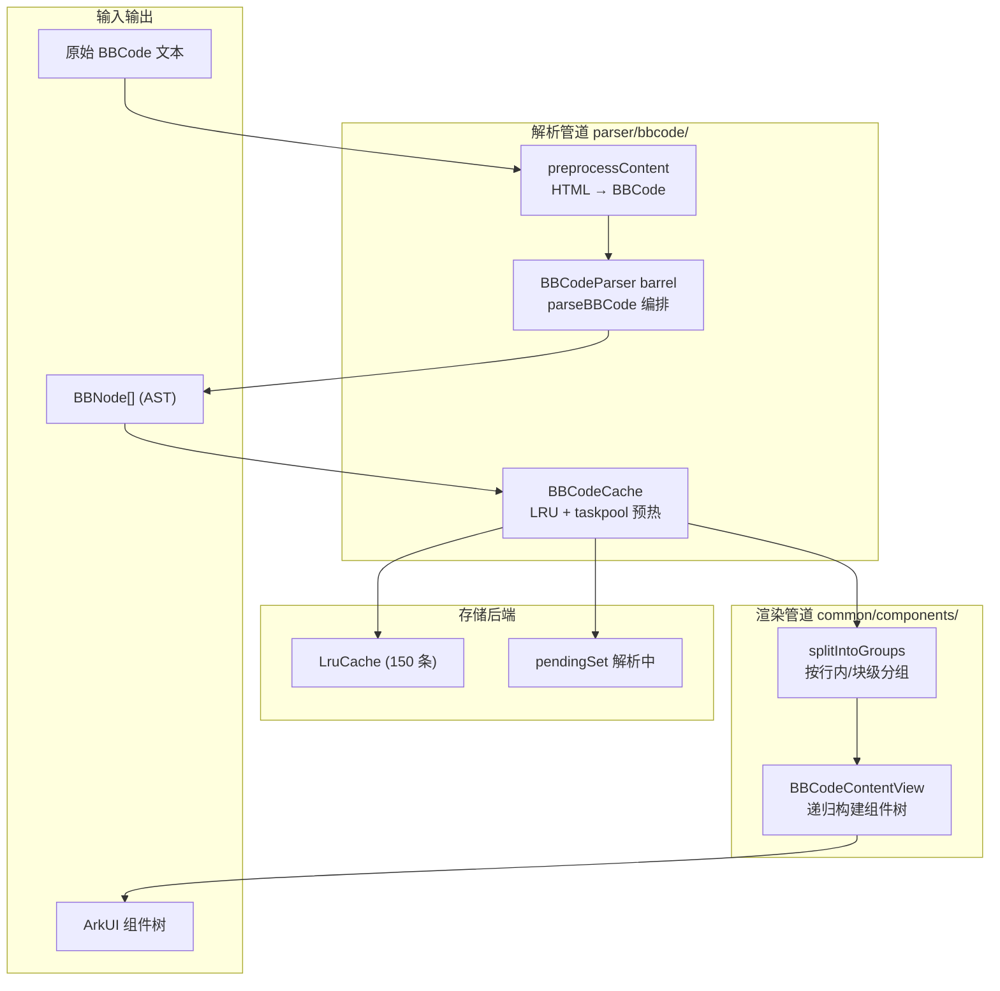
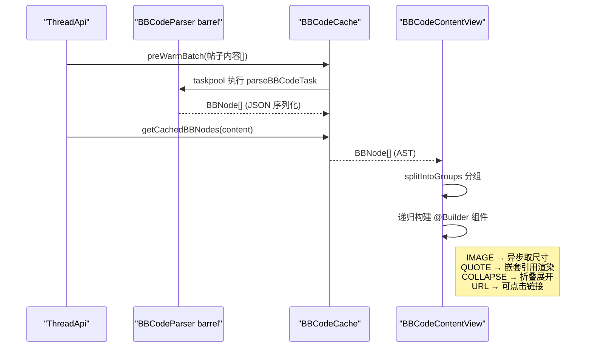

# BBCode 解析与渲染

## 概述

NGA 帖子内容使用 BBCode 标记语言。解析渲染管道由 `parser/bbcode/BBCodeParser.ets`（barrel 入口）→ `parser/bbcode/BBCodeCache.ets`（缓存 + taskpool 预热）→ `common/components/BBCodeContentView.ets`（渲染）三部分组成，将原始 BBCode 文本转换为 ArkUI 组件树。

> P1-6 重构后，`parser/bbcode/` 不再是单一巨型文件，而是按解析阶段拆分为词法层（`lexer.ets`）、编排层（`parser.ets`）、行内层（`inline-parser.ets`）、块级 handler（`block-handlers/`）多个子模块，`BBCodeParser.ets` 仅作 barrel 转发 `parseBBCode`（参见 `BBCodeParser.ets:1-9`）。P2-2 进一步将渲染期工具外迁至 `common/components/bbcode/`（`BBCodeRenderContext`、`bbcode-utils`）。

## 整体流程





## 数据模型

`model/BBCodeNode.ets:1-40` 定义统一的 AST 节点枚举，`BBCodeNode.ets:42-59` 定义节点类：

```typescript
// BBCodeNode.ets:1-40 — 38 种节点类型枚举
export enum BBNodeType {
  TEXT, BOLD, ITALIC, UNDERLINE, STRIKETHROUGH,
  COLOR, SIZE, FONT, URL, IMAGE, QUOTE, COLLAPSE,
  CODE, LIST, LIST_ITEM, PID_LINK, UID_LINK, TID_LINK,
  MENTION, POST_BY, EMOTION, VIDEO, AUDIO, DICE,
  WARN, ALBUM, FLOAT_LEFT, FLOAT_RIGHT, ALIGN,
  TABLE, TABLE_ROW, TABLE_CELL, STYLE_DIV,
  FLASH, HR, PARAGRAPH, SUBSCRIPT, SUPERSCRIPT,
}

// BBCodeNode.ets:42-59 — AST 节点（布局编译时固定，字段不可改）
export class BBNode {
  type: BBNodeType = BBNodeType.TEXT
  text: string = ''
  id: number = 0
  children: BBNode[] = []
  href: string = ''        // URL / PID_LINK 等链接
  color: string = ''
  size: number = 0
  src: string = ''         // IMAGE / VIDEO / AUDIO 源地址
  title: string = ''
  emotionCat: string = ''  // 表情分类
  emotionCode: string = '' // 表情编码
  fontFamily: string = ''
  align: string = ''
  colSpan: number = 0
  rowSpan: number = 0
  colWidth: number = 0
}
```

## BBCodeParser 解析器（barrel）

`parser/bbcode/BBCodeParser.ets` 是 barrel 入口，仅 `export { parseBBCode } from './parser'`（`BBCodeParser.ets:9`）。实际逻辑拆分至下列子模块（P1-6 拆分）：

| 子模块 | 职责 | 关键导出 |
|--------|------|----------|
| `lexer.ets` | 词法/状态层：节点工厂、文本预处理、URL 白名单、HTML 实体入口 | `ParseState`、`preprocessContent`、`isSafeUrl`、`createBBNode`、`pushTextNode` |
| `parser.ets` | 编排层：块级循环、标签族分发、表格/列表结构化解析 | `parseBBCode`、`parseBlockNodes`、`tryMatchBlock` |
| `inline-parser.ets` | 行内层：pid/uid/tid 链接、@提及、表情、格式化标签 | `parseInlineInto`、`checkInlineFormat`、`guessMediaTypeFromExt` |
| `block-handlers/` | 各块级标签的独立 handler（10 个文件） | `handleQuote` / `handleCollapse` / `handleCode` / `handleList` / `handleNuke` / `handleTable` / `handleFlash` / `handleImg` / `handlePostBy` / `handleFormat`（含 `handleDice` / `handleFloatLeft` / `handleFloatRight` / `handleAlign` / `handleStyle` / `handleHip` / `handleComment` / `handleRandomBlock`） |

### 预处理阶段

`preprocessContent`（`lexer.ets:92-108`）在解析前将 HTML 片段转换为 BBCode：

```typescript
// lexer.ets:93-107 — 预处理（还原中括号 + 规范化 blockquote/a/img）
return s
  .replace(/&#91;/g, '[').replace(/&#93;/g, ']')
  .replace(/<blockquote[^>]*>/gi, '[quote]')
  .replace(/<\/blockquote>/gi, '[/quote]')
  .replace(/<a\s+href="(https?:\/\/[^"]+)"[^>]*>(.*?)<\/a>/gi, '[url=$1]$2[/url]')
  .replace(/]+class="nga-emotion"[^>]+alt="([a-z]+):([^"]+)"\s*\/?>/gi, '[s:$1:$2]')
  // 旧版 [img] 表情图也归一化为 [s:cat:code]
```

### 解析策略

- **块级解析**（`parseBlockNodes`，`parser.ets:41-103`）：消费文本段与块级标签，遇到 `closePattern` 指定的闭合标签时返回当前层级结果。文本段先经 `decodeHtmlEntities`（`_shared/HtmlEntityCodec.ets:56-72`）解码，再交给行内层。
- **标签族分发**（`tryMatchBlock`，`parser.ets:113-133`）：按拆分前 `tryMatchBlock` 的 if 顺序依次调用各 handler，命中即返回，保证行为等价。
- **行内解析**（`parseInlineInto`，`inline-parser.ets:36-228`）：处理 pid/uid/tid 链接、`[@uid]` 提及、`[s:cat:code]` 表情、`Post by xxx (uid)`、`[url]` 以及 `b/i/u/del/color/size/font/sub/sup` 等格式化标签（`checkInlineFormat`，`inline-parser.ets:230-279`）。

## BBCodeCache 缓存

`parser/bbcode/BBCodeCache.ets` 缓存解析后的 AST 避免重复解析，并提供 taskpool 预热：

- **同步命中**（`getCachedBBNodes`，`BBCodeCache.ets:45-52`）：先查 `LruCache`（容量 150，`BBCodeCache.ets:8-9`），未命中则主线程同步 `parseBBCode` 后写入缓存。
- **异步预热**（`preWarmBatchAwait`，`BBCodeCache.ets:68-104`）：批量去重（已缓存或 pending 跳过），加入 `pendingSet` 防重；构造 `taskpool.TaskGroup` 并行解析（`group.addTask`，`BBCodeCache.ets:79-86`）；`withTimeout(10000ms)` 包裹 `taskpool.execute`（`BBCodeCache.ets:88-99`），结果 JSON 经 `bbNodesFromJSON` 反序列化回填缓存（`BBCodeCache.ets:100-103`）。
- **Key**：直接以原始帖子内容字符串作为 key（同内容在预览/详情中复用）。

## BBCodeContentView 渲染

`common/components/BBCodeContentView.ets` 将 AST 转换为 UI 组件树。P2-2 重构后，渲染期纯函数/常量已外迁至 `common/components/bbcode/`：

| 外迁文件 | 内容 |
|----------|------|
| `bbcode/BBCodeRenderContext.ets` | `RenderContext`（inQuote / quoteDepth）、`QuoteSplit` / `splitQuoteChildren`、`NodeGroup`、`QUOTE_BORDER_COLORS`（引用 `AppColors.quoteBorders`） |
| `bbcode/bbcode-utils.ets` | `isInlineNode`、`isInlineGroupBlank`、`calcScaleSize`、下标/上标尺寸与偏移计算（`SUB_SUP_SCALE` 等） |

### 性能优化 — 节点分组

`splitIntoGroups`（`BBCodeContentView.ets:215-238`）将连续的行内节点合并为一个 `NodeGroup`，块级节点独立成组。顶层渲染时（`RenderChildren`，`BBCodeContentView.ets:243-263`）优先使用 `aboutToAppear` 中缓存的 `cachedGroups`（`BBCodeContentView.ets:46`），避免重复分组。

```typescript
// BBCodeContentView.ets:215-238 — 行内节点分组（逻辑同旧版，节点判定外迁）
private splitIntoGroups(nodes: BBNode[]): NodeGroup[] {
  while (i < nodes.length && isInlineNode(nodes[i].type)) {
    inlineNodes.push(nodes[i])  // 合并连续行内节点
    i++
  }
  // 块级节点独立成组
}
```

`isInlineNode`（`bbcode-utils.ets:11-20`）判定 TEXT / BOLD / ITALIC / URL / PID_LINK / EMOTION / SUBSCRIPT 等是否为行内类型。

### 各标签渲染策略

| 节点类型 | 渲染方式 | 说明 |
|----------|----------|------|
| `TEXT` | `Span()` | 基本文本节点 |
| `BOLD` | `Span().fontWeight(Bold)` | 粗体（`h`/`item` 也归一为 BOLD） |
| `URL` / `PID_LINK` / `UID_LINK` / `TID_LINK` / `MENTION` | `Span().onClick(href)` | 可点击链接，主题色 + 下划线 |
| `IMAGE` | `Image()` | 异步加载 + 尺寸获取，支持主动/被动两种策略 |
| `QUOTE` | `Column() + 左竖线边框` | 支持嵌套，边框色按深度循环 |
| `COLLAPSE` | `Column() + onClick` | 点击展开/折叠，记录已展开 `title` |
| `CODE` | `Scroll() + 灰色背景` | 代码块，横向可滚 |
| `EMOTION` | `ImageSpan()` | NGA 表情，无资源时降级为 `[表情:cat:code]` |
| `LIST` | `Column() + ForEach` | 无序列表（`•` 前缀） |
| `TABLE` | `Column/Row()` | 表格，支持 colSpan（`layoutWeight`） |
| `AUDIO` | `AudioPlayer` | 内嵌音频播放器组件 |
| `VIDEO` | `MutedVideo` | 静音视频预览 |
| `FLASH` | `Text('[Flash 内容]').onClick` | 降级为可点击占位 |
| `DICE` | `Row() + 骰子图标` | 骰子标记 |

### 引用（QUOTE）嵌套

```typescript
// bbcode/BBCodeRenderContext.ets:42-53 — QUOTE 头/体拆分（从 BBCodeContentView 外迁）
export function splitQuoteChildren(children: BBNode[]): QuoteSplit {
  // 第一个子节点为 POST_BY 时视为引用头，body 为后续内容
  if (children.length > 0 && children[0].type === BBNodeType.POST_BY) {
    result.hasHeader = true
    // body 为 children[1..]
  } else {
    result.body = children
  }
}
```

渲染时 `RenderQuote`（`BBCodeContentView.ets:535-554`）按 `quoteDepth` 取 `QUOTE_BORDER_COLORS[Math.min(depth, len-1)]`（即 `AppColors.quoteBorders`，3 种颜色循环）标识嵌套层级。

## HTML 实体解码（_shared）

P1-1 合并了项目内 4 份重复的 `decodeHtmlEntities` 实现，统一到 `parser/_shared/HtmlEntityCodec.ets`：

| 函数 | 用途 | 行号 |
|------|------|------|
| `decodeHtmlEntities` | BBCode 正文解码：标准实体 + `<br>` 转换行 + 剥离残余 HTML 标签 | `HtmlEntityCodec.ets:56-72` |
| `unescapeHtml` | 纯文本字段（用户名/标题/签名/消息）解码：仅反转实体，不触碰 `<` / 标签 / 换行 | `HtmlEntityCodec.ets:32-47` |

两者都支持 `&#91;` / `&#93;` / `&nbsp;` / `&#十进制;` / `&#x十六进制;`（含 BMP 之外代理对）。这是 ADR 006「保守合并原则」的典型案例——两类语义不同但实现高度重叠的函数，合并时保留两者入口而非强行统一为单个函数。

## 附件 / 图片 URL 解析（_shared）

`parser/_shared/AttachUrl.ets` 集中附件与图片 URL 解析：

| 函数 | 用途 | 行号 |
|------|------|------|
| `resolveAttachUrl` | 解析 ThreadApi 返回的附件 `attachurl` 字段（相对路径拼 CDN，纯数字/无斜杠视为非法返回空） | `AttachUrl.ets:23-28` |
| `resolveImgUrl` | 解析 BBCode `[img]` 标签图片地址（http 原样 / `/mon_` / `./mon_` 拼 CDN / `/` 相对，并 `stripImageSuffix` 去杂讯） | `AttachUrl.ets:36-44` |

`NGA_CDN_BASE = 'https://img.nga.178.com/attachments'`（`AttachUrl.ets:14`）。

## 错误处理

### 解析失败降级

`parseBBCode`（`parser.ets:31-38`）在收到空内容时直接返回空数组，不抛出异常。整个解析过程**无 try-catch**，依赖防御式边界检查：

- **空输入保护**（`parser.ets:32`）：`!content`（`null`/`undefined`/空串）→ 返回 `[]`
- **空文本跳过**（`lexer.ets:81-89`，`pushTextNode`）：连续换行折叠为单个，归一化后为空则忽略
- **标签未闭合回退**：找不到闭合标签时取到字符串末尾（如 `inline-parser.ets:55-57` 的 `closeIdx >= 0 ? bodyEnd : segLen`），避免死循环；`CLOSE_TAG_PATTERN`（`lexer.ets:20`）吞咽游离的闭合标签

### 不安全 URL 拦截

`isSafeUrl`（`lexer.ets:52-62`）白名单校验拦截 `javascript:` / `vbscript:` / `data:` 三种危险协议，放行 `http(s)` / `mailto` / 单斜杠相对路径 / `./` 相对路径 / `*.php`。拦截的 URL 赋为空字符串（`inline-parser.ets:186`），不抛异常。

### 缓存异常保护

`preWarmBatchAwait`（`BBCodeCache.ets:68-104`）：

- `group.addTask()` 失败时仅 `console.error`，不阻塞其他任务（`BBCodeCache.ets:81-86`）
- `taskpool.execute()` 超时或失败时清理 `pendingSet`，防止内存泄漏（`BBCodeCache.ets:93-99`）
- **已知薄弱点**：`bbNodesFromJSON`（`BBCodeCache.ets:12-19`）的 `JSON.parse` 无 try-catch 保护，taskpool 返回异常 JSON 时将抛出未捕获异常

### 渲染容错

- **图片尺寸获取失败**：`ImageSizeUtil` 超时或返回非图片内容时使用默认比例 16:9（`BBCodeContentView.ets:134-140`，`getImageAspectRatio`），不破坏页面布局
- **嵌套过深**：多层 QUOTE（10+ 层）导致组件树膨胀时，`splitIntoGroups` 的行内合并可部分缓解
- **音频播放错误**：`AudioPlayer.ets:110-113` 的 `error` 回调置 `hasError = true` 并 `isLoading = false`，UI 切换为「加载失败」状态

## 关联组件

| 组件 | 文件 | 说明 |
|------|------|------|
| `AudioPlayer` | `common/media/AudioPlayer.ets` | BBCode AUDIO 标签的播放器组件 |
| `MutedVideo` | `common/media/MutedVideo.ets` | 静音视频预览 |
| `ImageSizeUtil` | `common/media/ImageSizeUtil.ets` | 图片尺寸预获取 |
| `VideoSizeUtil` | `common/media/VideoSizeUtil.ets` | 视频尺寸预获取 |
| `EmotionResources` | `common/media/EmotionResources.ets` | NGA 表情映射（`getEmotionResource` / `isEmotionCategoryNeedDarkBg`） |
| `LinkUtils` | `common/utils/LinkUtils.ets` | URL 链接处理 |
| `NetworkUtil` | `common/utils/NetworkUtil.ets` | `isWifiConnected` + `shouldUsePassive(strategy)`，图片/视频/头像三类媒体统一的被动加载策略判定入口（ALWAYS→主动 / MANUAL→被动 / WIFI_ONLY 视网络） |
| `PostItem` | `common/components/post-item/` | 帖子项（P2-2 拆为 PostItemHeader / PostAttachments / PostComments / PostVoteBar 4 子组件，内部使用 BBCodeContentView） |

## 边缘情况

1. **嵌套过深**：多层 QUOTE/COLLAPSE 嵌套可能导致递归层级过深，影响渲染性能
2. **HTML 混合内容**：部分帖子内容混入 HTML 片段，需要 `preprocessContent` 与 `decodeHtmlEntities` 双重清洗
3. **表情 URL 格式变化**：NGA 表情图片 URL 格式可能变化，`preprocessContent` 的 emotion 正则与 `[s:cat:code]` 归一化需同步维护
4. **恶意标签**：PidLink/UidLink/TidLink 可能指向恶意内容，`isSafeUrl` 白名单 + LinkUtils 二次校验
5. **被动加载策略**：非 ALWAYS 策略下图片仅渲染紧凑占位，点击后经 `onImageClick` 走 ImageViewer。`Avatar` 头像组件同步接入同一策略（`shouldUsePassive`）：被动模式下不渲染真实 `Image`，落到首字母 + 彩色背景占位，点击行为不变

## 常见问题

**Q: 帖子内容部分 BBCode 标签没有正确渲染？**
A: 检查 `BBNodeType` 枚举是否覆盖该标签类型，以及 `BBCodeContentView.RenderBlockNode` / `RenderInlineSpan` 是否有对应分支。部分 NGA 特有标签（如 `[dice]` 仅渲染骰子图标、`[warn]` 渲染警示框）已实现，但仍有少量标签（如 `HR` / `PARAGRAPH`）尚无专属 UI，落空忽略。

**Q: BBCode 渲染性能差怎么办？**
A: 大段文本或极深嵌套的 QUOTE（10+ 层）会导致组件树膨胀。`splitIntoGroups` 的行内合并可缓解；列表/帖子详情等长内容场景由调用方配合 `LazyForEach` 选择性渲染。

**Q: 为什么 `decodeHtmlEntities` 和 `unescapeHtml` 是两个函数而不合并？**
A: 语义不同——前者用于 BBCode 正文（需把 `<br>` 转换行、剥离残余标签），后者用于纯文本字段（用户名/标题等，绝不能吞掉 `<` 或标签）。实现重叠但行为差异显著，故保留两个入口，是 ADR 006「保守合并原则」的体现。

**Q: 图片尺寸获取失败，布局偏移怎么办？**
A: `ImageSizeUtil` 获取失败时使用默认比例 16:9（`getImageAspectRatio`），页面布局不会完全错乱。可在设置中通过 `imageLoadStrategy`（ALWAYS / WIFI_ONLY / MANUAL）与 `enableImageSizePrefetch` 平衡精度、流量与耗时。

## 关联文档

- [欢迎阅读](../欢迎阅读.md)
- [数据解析器](../解析器模块/数据解析器.md) — HtmlThreadParser / BBCodeParseTask / HtmlParseTask（taskpool @Concurrent 任务）
- [公共组件概述](../公共组件模块/公共组件概述.md) — BBCodeContentView、PostItem 及 post-item 子组件
- [数据模型概述](../数据模型/数据模型概述.md) — BBNode 数据模型
- [ADR 003 barrel re-export 模式](../架构决策/003-barrel-re-export模式.md) — BBCodeParser.ets barrel 转发 parseBBCode 的决策
- [ADR 006 保守合并原则](../架构决策/006-保守合并原则.md) — decodeHtmlEntities / unescapeHtml 保留双入口的合并策略
