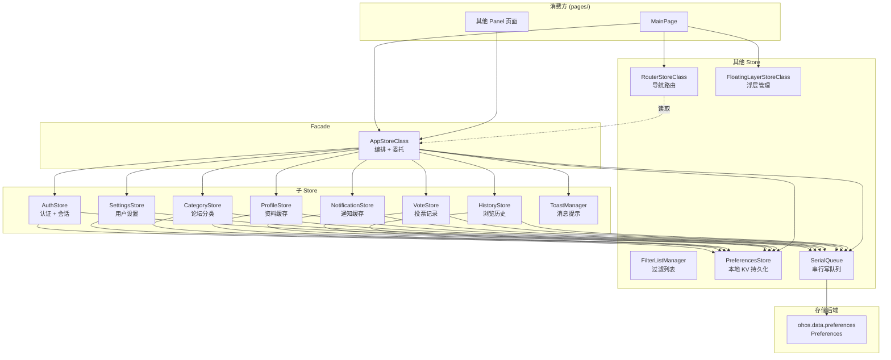
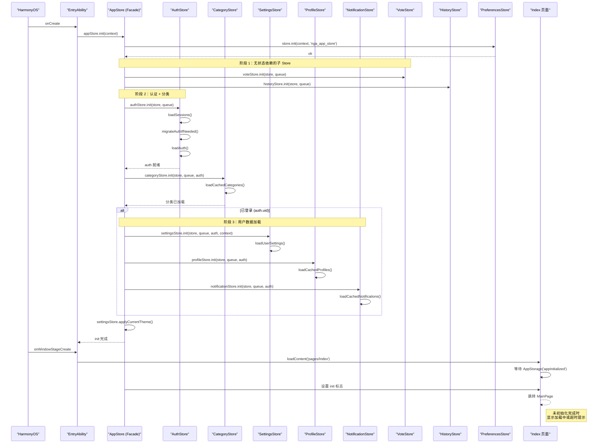

# Store 架构

## 概述

状态管理层采用 Facade 模式：`AppStore` 作为统一门面，将各领域职责委派给独立子 Store。所有 Store 文件位于 `store/` 目录下，共 14 个源文件。

### 初始化时序

## 文件清单

| 文件 | 类/导出 | 职责 |
|------|---------|------|
| `AppStore.ets` | `appStore` (AppStoreClass) | Facade 编排，委托调用，跨域协调 |
| `AuthStore.ets` | `AuthStore` | 认证状态 + 多账户会话管理 |
| `SettingsStore.ets` | `SettingsStore` | 黑名单、收藏、主题、TTS、关键词过滤、便签等 |
| `CategoryStore.ets` | `CategoryStore` | 论坛分类列表的本地缓存与后台刷新 |
| `ProfileStore.ets` | `ProfileStore` | 用户资料 LRU 缓存（200 条/5 分钟 TTL） |
| `NotificationStore.ets` | `NotificationStore` | 通知列表缓存与未读数（30 秒查询间隔） |
| `VoteStore.ets` | `VoteStore` | 帖子投票记录持久化（最多 200 条） |
| `HistoryStore.ets` | `HistoryStore` | 浏览历史持久化（最多 500 条） |
| `ToastManager.ets` | `ToastManager` | Toast 消息提示状态管理（2.5 秒自动消失） |
| `FilterListManager.ets` | `FilterListManager<T>` | 泛型过滤列表管理（增删改查） |
| `RouterStore.ets` | `routerStore` | 板块导航 + 活动栈管理 |
| `FloatingLayerStore.ets` | `floatingLayerStore` | 浮层堆栈管理 |
| `PreferencesStore.ets` | `PreferencesStore` | 异步 KV 持久化 |
| `SerialQueue.ets` | `SerialQueue` | 异步 FIFO 串行写队列 |

## 子 Store 详解

### AuthStore（`AuthStore.ets:41`）

认证状态与多账户登录会话管理。

- `state: AuthState` — 被 `@Observed` 装饰，UI 可直接绑定
- 多账户会话（Session）以 token 为 key 持久化，7 天自动过期清理
- 旧版扁平 Key 格式自动迁移至 JSON 格式

### SettingsStore（`SettingsStore.ets:56`）

所有用户设置的集中管理，包括黑名单、收藏版块、主题模式、字号、TTS 参数、图片加载策略、关键词过滤、用户便签、握持手势等。

当认证 uid 变更时通过 `reset()` 清空旧用户数据。设置变更通过 `persistSettings()` 异步写入 Preferences，写入内容为整个 `SettingsState` 对象的 JSON 序列化。

### ProfileStore（`ProfileStore.ets:15`）

用户资料 LRU 缓存，基于 `LruCache<ProfileData>`：

- 容量：200 条
- TTL：5 分钟
- 过期后标记为 stale 但不立即删除（stale read），后台延迟 10 秒发起网络刷新
- 按用户隔离存储，key 为 `cached_profiles_{uid}`

### VoteStore（`VoteStore.ets:17`）

投票记录持久化。每个用户最多保留 200 条帖子的投票记录（up/down PID），超出时淘汰最早记录。

### HistoryStore（`HistoryStore.ets:21`）

浏览历史持久化。每条记录包含帖子 ID、标题、作者信息等，最多 500 条。按用户隔离存储，key 为 `history_{uid}`。

### NotificationStore（`NotificationStore.ets:14`）

通知缓存与未读数：

- 缓存通知列表，首次读取时从 Preferences 恢复
- `refreshUnreadCount()` 有 30 秒查询间隔限流
- 未读数通过 `AppStorage.setOrCreate('unreadNotiCount', ...)` 驱动角标

### CategoryStore（`CategoryStore.ets:14`）

论坛分类列表缓存。首次从 Preferences 加载，后台 10 秒延迟发起网络刷新。数据无变化时不写盘（JSON 深度比较），减少持久化频率。

### ToastManager（`ToastManager.ets:10`）

Toast 消息提示状态管理。显示新 Toast 时清除上一个定时器（`clearTimeout`），保证同一时间只有一个 Toast 显示，2.5 秒后自动消失。

## Facade 编排逻辑

### 跨域协调

`AppStore.ets:48-77` 负责以下编排场景：

| 场景 | 触发 | 操作 |
|------|------|------|
| 初始化 | `init(context)` | PreferencesStore → AuthStore → CategoryStore → (已登录时) 加载用户数据 |
| 登录/切换用户 | `setAuth(token, uid, ...)` | AuthStore 更新 + uid 变更检测 → 重新加载各子 Store → 应用主题 |
| 登出 | `clearAuth()` | AuthStore 清空 + 所有子 Store reset() |
| 后台 | `flushAll()` | 排空 SerialQueue → PreferencesStore.flush() |

### 初始化顺序

`AppStore.ets:48-71`：

1. `PreferencesStore.init()` — 基础设施就绪
2. `VoteStore.init()`, `HistoryStore.init()` — 无状态依赖的子 Store
3. `AuthStore.init()` — 认证 + Session
4. `CategoryStore.init()` — 论坛分类
5. (已登录) `SettingsStore`, `ProfileStore`, `NotificationStore` — 用户数据
6. `applyCurrentTheme()` — 主题应用（需要 context）

### 登录切换流程

`AppStore.ets:91-97` 中 `setAuth` 检测 uid 是否变化，只有 uid 变化时才重新加载用户数据，避免不必要的网络请求和 UI 刷新。

## 并发保障

- **SerialQueue**（`store/SerialQueue.ets`）：FIFO 队列，异步写任务依次执行，保证 `putJSON` 顺序
- **scheduleFlush**：500ms 延迟批量刷盘，高频写入场景减少 I/O 次数
- **flushAll**：应用 `onBackground` 时触发全量持久化，防被系统杀死后丢失数据

## 错误处理

### 存储写入失败

`PreferencesStore` 的写入操作通过 `SerialQueue` 串行化，单次写入失败不会阻塞后续操作（队列 catch 分支仅 `console.error` 后继续执行下一个任务）。

### 认证恢复失败

`AuthStore.ets:92-101` 在读取本地认证失败时返回空值，`auth.isAuthenticated` 为 `false`，应用自动跳转登录页。

### 数据不一致

当 uid 变更时（`AppStore.ets:91-97`），Facade 检查 uidChanged 后重新加载各子 Store，并在 `clearAuth` 时重置所有子 Store，避免跨用户数据污染。

### 子 Store init 容错

每个子 Store 的 `init` 方法内部对存储读取失败有容错：
- `AuthStore`：`loadAuth` 返回空值 → `initialized = true`
- `SettingsStore`：`getJSON` 返回 null → 使用默认 `SettingsState`
- `ProfileStore`：读取失败 → 空缓存
- `CategoryStore`：读取失败 → 空列表

## 常见问题

**Q: 修改了 Store 中的字段，UI 没有更新？**
A: 确认目标字段是否在 `@Observed` 类的直接属性上。`AuthState` 和 `SettingsState` 被 `@Observed` 装饰，但 `state` 本身是一个对象引用——修改 `state.xxx = newVal` 而非 `state = newState` 才能触发监测。嵌套对象（如 `settings.blacklist`）需使用不可变替换。

**Q: AppStore init 失败怎么办？**
A: `AppStore.ets:68-70` 中 init 的 catch 分支仅 `hilog.error`，不影响应用启动。`AuthState.initialized` 在此状态下可能仍为 false，`Index` 页面需做等待超时处理。

**Q: 应用切后台再切回来后状态丢失？**
A: 检查 `onBackground` 是否触发了 `flushAll()`。如果闪退前未持久化，重启时从 Preferences 恢复上一个有效状态。

**Q: 新增功能需要加全局状态，放在哪个 Store？**
A: 创建新的子 Store 文件，只需在 `AppStoreClass` 中添加 `readonly xxxStore = new XxxStore()`，然后添加 Facade 委托方法即可，无需修改现有子 Store。

**Q: 如何在子 Store 之间共享数据？**
A: 子 Store 之间不直接引用对方，需要跨域操作时由 AppStore Facade 编排。例如 `setAuth` 中 uid 变化后统一重新加载各子 Store。

## 关联文档

- [Welcome](../欢迎阅读.md) — 模块依赖关系总览
- [Architecture Decision: @Observed](../架构决策/001-单一Module与@Observed状态管理.md) — 单体 Store + Observe 选型决策
- [App Lifecycle](../应用生命周期/应用生命周期.md) — AppStore init/onBackground 调用
- [公共组件概述](../公共组件模块/公共组件概述.md) — Toast 组件使用
