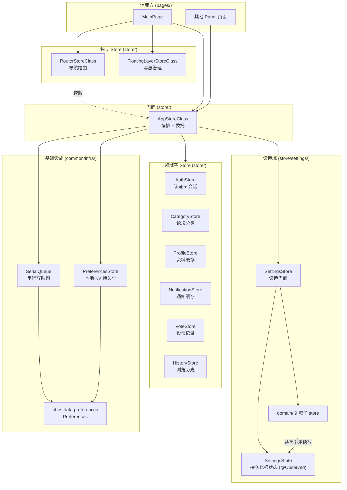
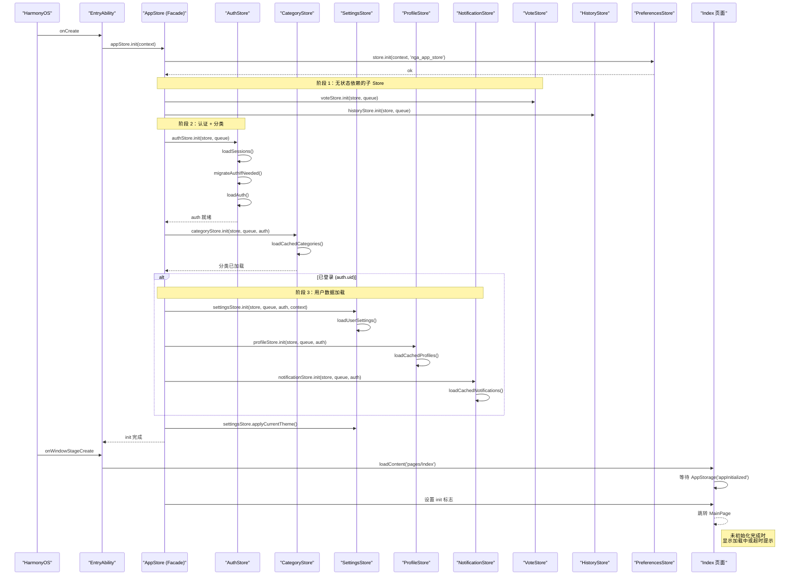

# Store 架构

## 概述

状态管理层采用 Facade 模式：`AppStore` 作为统一门面，将各领域职责委派给独立子 Store。所有 Store 文件位于 `store/` 目录下，共 22 个源文件——11 个根级 Store（含 BaseStore 与 AppStore 门面）+ `settings/` 下 2 个（`SettingsState` 持久化根状态、`SettingsContext` 共享依赖上下文）+ `settings/domain/` 下 9 个设置域子 store。

> 重构注记：`ToastManager`（消息提示）已迁出至 `common/feedback/`，`FilterListManager`（过滤列表）已迁至 `common/utils/`，`PreferencesStore`（KV 持久化）与 `SerialQueue`（串行写队列）已迁至 `common/infra/`。它们仍是 Store 层的依赖，但物理文件不再位于 `store/`，下图与下文均按迁移后的真实位置描述。



> 所有领域子 Store 均遵循统一持久化模式：经各自的 `PreferencesStore` 写入、`SerialQueue` 串行排队，最终落盘到 `ohos.data.preferences`。为保持图清晰，上图省略了各子 Store 到 `PStore`/`SQ` 的逐条边。

### 初始化时序



## 文件清单

### 根级 Store（`store/`，11 文件）

| 文件 | 类/导出 | 职责 |
|------|---------|------|
| `AppStore.ets` | `appStore` (AppStoreClass) | Facade 编排，委托调用，跨域协调 |
| `AuthStore.ets` | `AuthStore` | 认证状态 + 多账户会话管理 |
| `SettingsStore.ets` | `SettingsStore` | 设置门面：init/reset/loadUserSettings/persistSettings + readonly 各 domain |
| `CategoryStore.ets` | `CategoryStore` | 论坛分类列表的本地缓存与后台刷新 |
| `ProfileStore.ets` | `ProfileStore` | 用户资料 LRU 缓存（200 条/5 分钟 TTL） |
| `NotificationStore.ets` | `NotificationStore` | 通知列表缓存与未读数（30 秒查询间隔） |
| `VoteStore.ets` | `VoteStore` | 帖子投票记录持久化（最多 200 条） |
| `HistoryStore.ets` | `HistoryStore` | 浏览历史持久化（最多 500 条） |
| `RouterStore.ets` | `routerStore` (RouterStoreClass) | 板块导航 + 活动栈管理 |
| `FloatingLayerStore.ets` | `floatingLayerStore` (FloatingLayerStoreClass) | 浮层堆栈管理 |

### 设置域（`store/settings/`，2 文件 + domain/ 9 文件）

| 文件 | 导出 | 职责 |
|------|------|------|
| `settings/SettingsState.ets` | `SettingsState`、`FavBoard`、`BlacklistEntry` | `@Observed` 持久化根状态类（24 字段） |
| `settings/SettingsContext.ets` | `SettingsContext` | 域子 store 共享依赖上下文（state/persist/auth/context） |
| `settings/domain/ThemeSettings.ets` | `ThemeSettings` | 主题：theme + applyCurrentTheme（setColorMode/状态栏） |
| `settings/domain/DisplaySettings.ets` | `DisplaySettings` | 显示：fontSize/domainIndex/holdingHand/smartGrip/showSignature |
| `settings/domain/MediaSettings.ets` | `MediaSettings` | 媒体：TTS 四参 + imageLoadStrategy/imageSizePrefetch/videoMuted |
| `settings/domain/ReadingSettings.ets` | `ReadingSettings` | 阅读：threadNavMode/prefetchPageCount |
| `settings/domain/SocialListSettings.ets` | `SocialListSettings` | 社交列表：blacklist/favorites |
| `settings/domain/FilterKeywordSettings.ets` | `FilterKeywordSettings` | 关键词屏蔽：filterKeywords |
| `settings/domain/NoteSettings.ets` | `NoteSettings` | 便签：notes |
| `settings/domain/CheckinSettings.ets` | `CheckinSettings` | 签到：autoCheckin/lastCheckinDate |
| `settings/domain/AiSettings.ets` | `AiSettings` | AI 配置：aiProfiles/activeAiProfileId 增删改查及激活切换 |

### 已迁出的依赖（不再位于 `store/`）

| 文件 | 新位置 | 说明 |
|------|--------|------|
| `PreferencesStore.ets` | `common/infra/` | 异步 KV 持久化，被所有子 Store 依赖 |
| `SerialQueue.ets` | `common/infra/` | 异步 FIFO 串行写队列 |
| `ToastManager.ets` | `common/feedback/` | Toast 消息提示（2.5 秒自动消失） |
| `FilterListManager.ets` | `common/utils/` | 泛型过滤列表管理（增删改查） |

## BaseStore 基类

`store/BaseStore.ets` 是所有持久化 Store 的抽象基类，提供统一的生命周期管理和异步防护机制（P2-5 引入，AuthStore/CategoryStore/SettingsStore/ProfileStore/NotificationStore/VoteStore/HistoryStore 均已继承）。

```typescript
// BaseStore.ets:6-20 — 基类职责说明
export abstract class BaseStore<T> {
  abstract state: T
  protected generation: number = 0

  reset(): void { this.generation++ }          // 子类重置后调用 super.reset()
  protected isCurrent(gen: number): boolean {   // 过时异步回调自动失效
    return gen === this.generation
  }
  protected uidGuard(): boolean {               // 写入队列前检查 uid
    return this.auth ? !!this.auth.uid : true
  }
}
```

### generation 版本标记

`generation` 计数器（`BaseStore.ets:32`）是核心防过时机制：

- `reset()` 时自增（`BaseStore.ets:47-49`）
- 异步操作（写队列/网络请求）发起前捕获当前 `generation`，回调到达后用 `isCurrent(gen)` 比对
- 不匹配的操作直接丢弃，避免 Store 重置后旧数据污染新状态

典型用法见 `AuthStore.ets` 的登出流程：`clearAuth()` → `reset()`（generation++）→ 已入队的写操作回调到达时 `isCurrent()` 返回 false，自动跳过。

### 依赖注入方式

各 Store 的 init 签名不同（ArKTS 不支持方法重载），基类提供 `setDeps` 辅助方法（`BaseStore.ets:38-44`）。子类在自身 `init` 中显式调用：

```typescript
// AuthStore 示例
init(store: PreferencesStore, queue: SerialQueue): void {
  this.setDeps(store, queue)  // 无 auth 参数
  // ... 后续初始化
}

// SettingsStore 示例（需要 auth）
init(store: PreferencesStore, queue: SerialQueue, auth: AuthState, context: Context): void {
  this.setDeps(store, queue, auth)  // 带 auth 参数
  // ... 后续初始化
}
```

`isCurrent` 和 `uidGuard` 配合确保异步写入的原子性：generation 判定防止"写入旧状态"，uidGuard 判定防止"跨用户数据污染"。

## 子 Store 详解

### AuthStore（`AuthStore.ets:43`）

认证状态与多账户登录会话管理。

- `state: AuthState`（`AuthStore.ets:9-17`）— 被 `@Observed` 装饰，UI 可直接绑定
- 多账户会话（Session）以 token 为 key 持久化，7 天自动过期清理（`AuthStore.ets:36` `SESSION_MAX_AGE`，清理逻辑见 `AuthStore.ets:194-208`）
- 旧版扁平 Key 格式自动迁移至 JSON 格式（`AuthStore.ets:104-123` `migrateAuthIfNeeded`）

### SettingsStore（`SettingsStore.ets:36`）

用户设置的门面（Facade）。重构前是承载全部设置字段的胖类，P0-7 后职责拆为三层：

1. **门面 `SettingsStore`（`SettingsStore.ets:35-175`）**——只做编排与兼容转发。构造器（`SettingsStore.ets:52-62`）一次性装配 `SettingsContext` 与 8 个域子 store；`init`（`SettingsStore.ets:64-74`）注入 store/queue/auth/context 并在已登录时调用 `loadUserSettings`；`persistSettings`（`SettingsStore.ets:91-97`）将整个根状态 JSON 序列化后入队写盘；`reset`（`SettingsStore.ets:77-83`）新建空状态并重置有运行态的子 store。所有 setter（`SettingsStore.ets:118-174`）均为单行转发到对应域子 store，保证 `AppStore` / pages 调用方零改动。

2. **持久化根状态 `SettingsState`（`settings/SettingsState.ets:18-47`）**——`@Observed` 装饰，23 个字段对应 9 个设置域（含 AI 配置 `aiProfiles`、`activeAiProfileId`）。子 store 通过共享引用直接读写其字段，保持响应式不断。

3. **9 个设置域子 store（`settings/domain/`）**——各持 setter + `load` 分片。`load`（如 `MediaSettings.ets:64-76`）从反序列化对象按字段恢复；setter（如 `MediaSettings.ets:37-41`）改字段、必要时同步 AppStorage、最后调用 `ctx.persist()` 触发批量刷盘。`AiSettings` 通过 `notifyAiConfigChanged()` 额外同步 `AppStorage` 中的 `KEY_AI_CONFIG_VERSION`，供页面层感知配置变更。

设置字段按域归类：

| 域子 store | 字段 | 说明 |
|------------|------|------|
| ThemeSettings | `theme` | 主题模式（light/dark/system/original/white） |
| DisplaySettings | `fontSize`、`domainIndex`、`holdingHand`、`smartGrip`、`showSignature` | 字号、域名索引、握持手势、智能握持、签名显示 |
| MediaSettings | `ttsPerson`、`ttsSpeed`、`ttsVolume`、`ttsPitch`、`imageLoadStrategy`、`enableImageSizePrefetch`、`videoMuted` | TTS 四参、图片加载策略、图片尺寸预热、视频全局静音 |
| ReadingSettings | `threadNavMode`、`prefetchPageCount` | 楼层导航模式、预加载页数（0=关闭，1~5=向前预加载 N 页） |
| SocialListSettings | `blacklist`、`favorites` | 黑名单、收藏版块 |
| FilterKeywordSettings | `filterKeywords` | 关键词过滤 |
| NoteSettings | `notes` | 用户便签 |
| CheckinSettings | `autoCheckin`、`lastCheckinDate` | 自动签到、上次签到日期 |
| AiSettings | `aiProfiles`、`activeAiProfileId` | 自定义 AI 配置列表与激活切换 |

当认证 uid 变更时通过 `reset()` 清空旧用户数据。`videoMuted`、`imageLoadStrategy`、`enableImageSizePrefetch`、`showSignature` 等字段在 setter 中额外同步至 `AppStorage`（`MediaSettings.ets:24-39`、`loadUserSettings` 末尾 `SettingsStore.ets:112-115`），供组件通过 `@StorageProp` 响应式读取（如 `MutedVideo` 读取 `videoMuted`）。

新增阅读相关设置时，AppStore 门面对应提供转发：`setThreadNavMode`、`setPrefetchPageCount`、`setVideoMuted` 等（见 `AppStore.ets:155-159`）。

### ProfileStore（`ProfileStore.ets:18`）

用户资料 LRU 缓存，基于 `LruCache<ProfileData>`（`ProfileStore.ets:20`）：

- 容量：200 条
- TTL：5 分钟
- 过期后标记为 stale 但不立即删除（stale read），后台延迟 10 秒发起网络刷新
- 按用户隔离存储，key 为 `cached_profiles_{uid}`

### VoteStore（`VoteStore.ets:18`）

投票记录持久化。每个用户最多保留 200 条帖子的投票记录（`VoteStore.ets:13` `VOTE_MAX_ENTRIES`，淘汰逻辑 `VoteStore.ets:117-127`），超出时淘汰最早记录。

### HistoryStore（`HistoryStore.ets:27`）

浏览历史持久化。每条记录包含帖子 ID、标题、作者信息等，最多 500 条（`HistoryStore.ets:22` `HISTORY_MAX_COUNT`）。按用户隔离存储，key 为 `history_{uid}`。

### NotificationStore（`NotificationStore.ets:12`）

通知缓存与未读数：

- 缓存通知列表，首次读取时从 Preferences 恢复
- `refreshUnreadCount()`（`NotificationStore.ets:36`）有 30 秒查询间隔限流（`NOTI_QUERY_DELAY`，`NotificationStore.ets:17`）
- 未读数通过 `AppStorage.setOrCreate(KEY_UNREAD_NOTI_COUNT, ...)`（`NotificationStore.ets:51`）驱动角标

### CategoryStore（`CategoryStore.ets:17`）

论坛分类列表缓存。首次从 Preferences 加载，后台 10 秒延迟发起网络刷新（`CategoryStore.ets:23` `REFRESH_DELAY`）。数据无变化时不写盘（`CategoryStore.ets:87-89` 用 `JSON.stringify` 深度比较），减少持久化频率。

### ToastManager（`common/feedback/ToastManager.ets:10`）

Toast 消息提示状态管理（P1-4 从 `store/` 迁至 `common/feedback/`）。显示新 Toast 时清除上一个定时器（`clearTimeout`），保证同一时间只有一个 Toast 显示，2.5 秒后自动消失。仍由 `AppStore` 持有实例并通过 `showToast` 转发（`AppStore.ets:246`）。

## Facade 编排逻辑

### 跨域协调

`AppStore.ets:49-108` 负责以下编排场景：

| 场景 | 触发 | 操作 |
|------|------|------|
| 初始化 | `init(context)`（`AppStore.ets:49-72`） | PreferencesStore → VoteStore/HistoryStore → AuthStore → CategoryStore → (已登录时) 加载用户数据 |
| 登录/切换用户 | `setAuth(token, uid, ...)`（`AppStore.ets:92-98`） | AuthStore 更新 + uid 变更检测 → 重新加载用户数据 → 应用主题 |
| 登出 | `clearAuth()`（`AppStore.ets:100-108`） | AuthStore 清空 + 所有子 Store reset() |
| 后台 | `flushAll()`（`AppStore.ets:81-84`） | 排空 SerialQueue → PreferencesStore.flush() |

### 初始化顺序

`AppStore.ets:49-72`：

1. `PreferencesStore.init()`（`AppStore.ets:54`）— 基础设施就绪
2. `VoteStore.init()`, `HistoryStore.init()`（`AppStore.ets:55-56`）— 无状态依赖的子 Store
3. `AuthStore.init()`（`AppStore.ets:61`）— 认证 + Session
4. `CategoryStore.init()`（`AppStore.ets:62`）— 论坛分类
5. (已登录) `loadUserData()`（`AppStore.ets:74-78`）：`SettingsStore` → `ProfileStore` → `NotificationStore` — 用户数据
6. `applyCurrentTheme()`（`AppStore.ets:68`）— 主题应用（需要 context）

### 登录切换流程

`AppStore.ets:92-98` 中 `setAuth` 检测 `uidChanged`（由 `AuthStore.setAuth` 返回，`AuthStore.ets:58-68`），只有 uid 变化时才重新加载用户数据，避免不必要的网络请求和 UI 刷新。

## 并发保障

- **SerialQueue**（`common/infra/SerialQueue.ets`，P1-4 从 `store/` 迁入）：FIFO 队列，异步写任务依次执行，保证 `putJSON` 顺序
- **scheduleFlush**：500ms 延迟批量刷盘，高频写入场景减少 I/O 次数
- **flushAll**（`AppStore.ets:81-84`）：应用 `onBackground` 时触发全量持久化，防被系统杀死后丢失数据

## 错误处理

### 存储写入失败

`PreferencesStore`（`common/infra/`）的写入操作通过 `SerialQueue` 串行化，单次写入失败不会阻塞后续操作（队列 catch 分支仅 `console.error` 后继续执行下一个任务）。

### 认证恢复失败

`AuthStore.ets:92-102` 在读取本地认证失败时返回空值，`auth.isAuthenticated` 为 `false`，应用自动跳转登录页。

### 数据不一致

当 uid 变更时（`AppStore.ets:92-98`），Facade 检查 `uidChanged` 后重新加载各子 Store，并在 `clearAuth`（`AppStore.ets:100-108`）时重置所有子 Store，避免跨用户数据污染。

### 子 Store init 容错

每个子 Store 的 `init` 方法内部对存储读取失败有容错：
- `AuthStore`：`loadAuth` 返回空值 → `initialized = true`
- `SettingsStore`：`getJSON` 返回 null → 使用默认 `SettingsState`（`loadUserSettings` 中 `if (saved)` 守卫，`SettingsStore.ets:99-111`）
- `ProfileStore`：读取失败 → 空缓存
- `CategoryStore`：读取失败 → 空列表

### AppStore init 容错

`AppStore.ets:72-73` 中 init 的 catch 分支仅 `logger.error`，不影响应用启动。`AuthState.initialized` 在此状态下可能仍为 false，`Index` 页面需做等待超时处理。

## 常见问题

**Q: 修改了 Store 中的字段，UI 没有更新？**
A: 确认目标字段是否在 `@Observed` 类的直接属性上。`AuthState` 和 `SettingsState` 被 `@Observed` 装饰，但 `state` 本身是一个对象引用——修改 `state.xxx = newVal` 而非 `state = newState` 才能触发监测。设置域子 store 直接读写共享的 `SettingsState` 字段（通过 `ctx.state.xxx`），响应式不会断；嵌套对象（如 `settings.blacklist`）需使用不可变替换。参见 [ADR 005](../架构决策/005-@Observed继承位置.md) 关于 `@Observed` 必须装饰最终子类的约束。

**Q: AppStore init 失败怎么办？**
A: `AppStore.ets:72-73` 中 init 的 catch 分支仅 `logger.error`，不影响应用启动。`AuthState.initialized` 在此状态下可能仍为 false，`Index` 页面需做等待超时处理。

**Q: 应用切后台再切回来后状态丢失？**
A: 检查 `onBackground` 是否触发了 `flushAll()`。如果闪退前未持久化，重启时从 Preferences 恢复上一个有效状态。

**Q: 新增功能需要加全局状态，放在哪个 Store？**
A: 视性质而定：
- 若属于设置类（用户可调、需持久化、分用户隔离），优先在 `settings/domain/` 下评估是否新建域子 store——新域子 store 在 `SettingsState` 加字段、在 `SettingsStore` 门面加 `readonly` + 转发 setter，`loadUserSettings` 中补一行 `load` 调用。
- 若属于业务缓存类（通知、历史、资料等），创建新的根级子 Store 文件，在 `AppStoreClass` 中添加 `readonly xxxStore = new XxxStore()` 与 Facade 委托方法，在 `init`/`loadUserData`/`clearAuth` 中接入生命周期，无需修改现有子 Store。

**Q: 如何在子 Store 之间共享数据？**
A: 子 Store 之间不直接引用对方（设置域子 store 之间亦无横向 import，统一通过 `SettingsContext` 共享依赖）。需要跨域操作时由 AppStore Facade 编排。例如 `setAuth` 中 uid 变化后统一重新加载各子 Store。

**Q: SettingsStore 为什么 setter 都是单行转发？**
A: P0-7 把设置职责按域拆到 8 个子 store 后，门面保留全部旧签名做兼容转发（转发模式详见 [ADR 004](../架构决策/004-facade转发模式.md)），保证 `AppStore` 与所有 pages 的 `import { SettingsStore } from './SettingsStore'` 零改动。这样新增域时只需扩门面，不破坏调用方。

## 关联文档

- [Welcome](../欢迎阅读.md) — 模块依赖关系总览
- [Architecture Decision: @Observed](../架构决策/001-单一Module与@Observed状态管理.md) — 单体 Store + Observe 选型决策
- [ADR 003 barrel re-export](../架构决策/003-barrel-re-export模式.md) — `SettingsStore` re-export 类型保持导入路径不变
- [ADR 004 facade 转发](../架构决策/004-facade转发模式.md) — 设置门面 setter 单行转发到域子 store 的模式
- [ADR 005 @Observed 继承](../架构决策/005-@Observed继承位置.md) — `@Observed` 必须装饰最终子类（`SettingsState`/`AuthState`）
- [App Lifecycle](../应用生命周期/应用生命周期.md) — AppStore init/onBackground 调用
- [公共组件概述](../公共组件模块/公共组件概述.md) — Toast 组件使用
