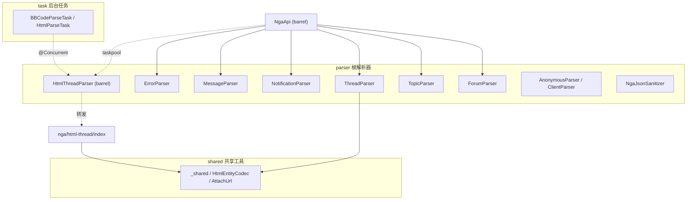
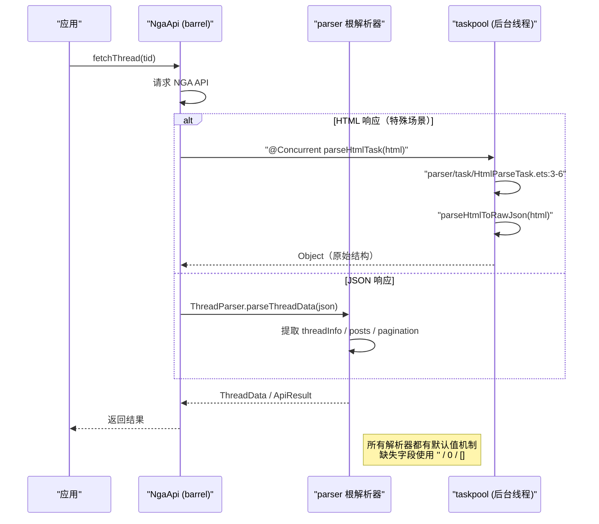
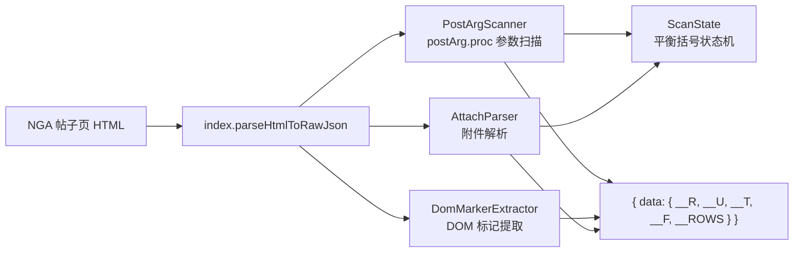
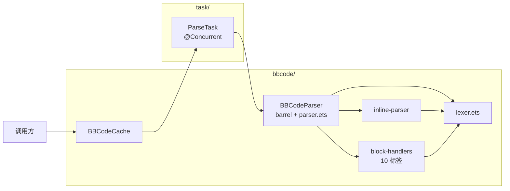

# 数据解析器

## 概述

`parser/` 目录负责将 NGA 接口返回的 JSON/HTML 数据转换为客户端模型对象。解析器在 `NgaApi`（现为 barrel re-export，聚合 7 个业务域 Api）中调用，通过 taskpool 支持后台并发解析。

重构后 `parser/` 已从「单层平铺」演化为「按职责分层」：

- 根目录：10 个业务域解析器（Forum / Topic / Thread / HtmlThread / Notification / Message / Error / Anonymous / Client）+ JSON 净化器（`NgaJsonSanitizer`）。
- `_shared/`：跨解析器共享的纯函数工具（HTML 实体解码、附件 URL 解析）。
- `bbcode/`：BBCode 富文本解析子系统（barrel + lexer + parser + inline-parser + 10 个 block handler + 缓存）。
- `task/`：两个 `@Concurrent` 后台任务（`BBCodeParseTask` / `HtmlParseTask`）。
- `nga/html-thread/`：HTML 帖子页解析子模块（顶层装配 + 状态机 + 参数扫描 + DOM 标记提取 + 附件解析）。



> 说明：图中 `HtmlThreadParser` 现为 barrel，真正实现在 `nga/html-thread/`；`bbcode/` 子系统因节点较多，单独见后文「BBCode 解析子系统」架构图。

### 调用时序



## 各解析器职责

| 解析器 | 文件 | 输入 | 输出 |
|--------|------|------|------|
| `ForumParser` | `parser/ForumParser.ets` | JSON | `Category[]` |
| `TopicParser` | `parser/TopicParser.ets` | JSON | `TopicListInfo` |
| `ThreadParser` | `parser/ThreadParser.ets` | JSON | `ThreadData` |
| `HtmlThreadParser` | `parser/HtmlThreadParser.ets`（barrel） | HTML | `Object`（原始 JSON 结构） |
| `NotificationParser` | `parser/NotificationParser.ets` | JSON | `NgaNotification[]` |
| `MessageParser` | `parser/MessageParser.ets` | JSON | `MessageListInfo`, `MessageDetailInfo` |
| `ErrorParser` | `parser/ErrorParser.ets` | JSON | `ApiResult`（错误消息提取） |
| `AnonymousParser` | `parser/AnonymousParser.ets` | JSON | 匿名标识转换 |
| `ClientParser` | `parser/ClientParser.ets` | JSON | 客户端设备信息 |
| `NgaJsonSanitizer` | `parser/NgaJsonSanitizer.ets` | 原始 JSON | 净化后可被 `JSON.parse` 接受的字符串 |
| `BBCodeParser` | `parser/bbcode/BBCodeParser.ets`（barrel） | BBCode 文本 | `BBNode[]` |
| `BBCodeCache` | `parser/bbcode/BBCodeCache.ets` | BBCode 文本 | `BBNode[]`（带 LRU 缓存） |
| `HtmlEntityCodec` | `parser/_shared/HtmlEntityCodec.ets` | 含 HTML 实体的文本 | 解码后文本 |
| `AttachUrl` | `parser/_shared/AttachUrl.ets` | 附件相对路径 | 完整 CDN URL |
| `BBCodeParseTask` | `parser/task/BBCodeParseTask.ets` | BBCode 文本 | JSON 字符串（`@Concurrent`） |
| `HtmlParseTask` | `parser/task/HtmlParseTask.ets` | HTML | `Object`（`@Concurrent`） |
| `html-thread/*` | `parser/nga/html-thread/`（5 文件） | HTML | 见下文「HtmlThreadParser」章节 |

### ForumParser — 板块分类解析

解析 NGA 板块层级结构为 `Category[]`，支持父子嵌套：

```typescript
// ForumParser.ets — 输入 → Category[] 
// Category: { fid: number, name: string, children: Category[] }
```

### HtmlThreadParser — HTML 帖子解析（P2-1 拆分）

整个项目中唯一使用 `@Concurrent` 的解析路径，在 taskpool 后台线程执行。原 `HtmlThreadParser.ets`（669 行）已在 P2-1 拆分为 barrel + 5 个职责单一的子模块，barrel 仅保留导出，使唯一调用方 `parser/task/HtmlParseTask.ets` 的 import 路径零改动（参见 `HtmlThreadParser.ets:1-13`）：

```typescript
// parser/task/HtmlParseTask.ets:3-6 — 后台并发解析入口
@Concurrent
function parseHtmlTask(html: string): Object {
  return parseHtmlToRawJson(html) as Object
}
```

HTML 解析子系统结构（`parser/nga/html-thread/`）：

| 文件 | 职责 |
|------|------|
| `index.ets` | 顶层装配 `parseHtmlToRawJson`，组装 `__R/__U/__T/__F/__ROWS` 结构（`index.ets:42-166`） |
| `ScanState.ets` | 平衡扫描状态机：`extractBalancedBraces`（JSON 对象字面量专用）+ `scanBalanced`（通用 `()`/`[]` 扫描）（`ScanState.ets:37-144`） |
| `PostArgScanner.ets` | `commonui.postArg.proc` / `setAll` / `setDefault` 调用参数扫描，按 lou 聚合楼层元数据（`PostArgScanner.ets:96-151`） |
| `DomMarkerExtractor.ets` | DOM 标记内容提取：楼层正文 / 标题 / 时间 / 作者 / 版块名 / 主题标题（`DomMarkerExtractor.ets:19-145`） |
| `AttachParser.ets` | `ubbcode.attach.load()` 调用中的附件元信息解析（`AttachParser.ets:21-96`） |

HTML 解析流程：

1. `PostArgScanner.parseAllPostArgs` 扫描所有 `commonui.postArg.proc(...)` 调用，按楼层号提取 pid / type / authorid / 时间戳 / 客户端等参数。
2. `DomMarkerExtractor.extractPostContent / extractPostSubject / extractPostDate` 按 DOM 标记提取正文、标题、时间。
3. `AttachParser.tryParseAttachLoad` 解析 `ubbcode.attach.load()` 中的附件数组。
4. `index.parseHtmlToRawJson` 将上述结果组装为与 `__output=8` JSON API 同形的 `{ data: { __R, __U, __T, __F, __ROWS, __R__ROWS_PAGE, __PAGE } }` 结构，可直接喂给 `ThreadParser.parseThreadData`。
5. 解析 `<!--msginfostart-->` 错误标记由上层完成。



### NgaJsonSanitizer — JSON 净化器

NGA 的 JSON 响应非标准，`JSON.parse` 前需修复。`preprocessJson`（`NgaJsonSanitizer.ets:14-56`）处理：

- 去除 `window.script_muti_get_var_store=` 前缀；
- 去除 `/*$js$*/` / `/*error fill content*/` 非法注释；
- 修复 `"content":+123` / `"subject":+123` 形式的数字字面量为字符串；
- 修复 `"content"` / `"subject"` / `"author"` 字段中前导零数字为字符串；
- 转义字符串字面量内的控制字符（`< 0x20`）。

### _shared 共享工具

P1-1 将项目内多份重复实现合并为单一来源，集中到 `parser/_shared/`：

| 工具 | 文件 | 说明 |
|------|------|------|
| `unescapeHtml` | `_shared/HtmlEntityCodec.ets:32-47` | 纯文本字段（用户名 / 标题 / 签名）反转 HTML 实体，不触碰标签与换行 |
| `decodeHtmlEntities` | `_shared/HtmlEntityCodec.ets:56-72` | BBCode 正文反转实体 + `<br>` 转换行 + 剥离残余 HTML 标签 |
| `resolveAttachUrl` | `_shared/AttachUrl.ets:23-28` | 解析附件对象 `attachurl` 字段（相对路径拼 CDN） |
| `resolveImgUrl` | `_shared/AttachUrl.ets:36-44` | 解析 `[img]` 标签图片地址，支持 http / `./mon_` / `/mon_` 相对路径 |

> `decodeHtmlEntities` 合并自 4 份重复实现；`resolveAttachUrl` 合并自多份附件 URL 解析。两者语义不同故保留独立导出。

## BBCode 解析子系统

P1-1 将 `BBCodeParser` / `BBCodeCache` / `BBCodeParseTask` / `HtmlParseTask` 从 `service/` 迁入 `parser/`，删除无人引用的 `ContentParser`；P1-6 进一步将 `BBCodeParser` 按解析阶段拆分。



`parseBBCode`（`parser/bbcode/parser.ets:31-38`）是公共入口，预处理后从顶层解析块级节点：

```typescript
// parser/bbcode/parser.ets:31-38
function parseBBCode(content: string): BBNode[] {
  if (!content) return []
  const state = new ParseState()
  state.content = preprocessContent(content)
  state.pos = 0
  state.len = state.content.length
  return parseBlockNodes(state, null)
}
```

`block-handlers/` 下 10 个 handler 文件按 `tryMatchBlock` 原 if 顺序依次被调用（见 `parser.ets:5-23` 的 import）：

| 文件 | 处理标签 | 职责 |
|------|----------|------|
| `block-handlers/handlePostBy.ets` | `[postby]` | 引用回复标记 |
| `block-handlers/handleQuote.ets` | `[quote]` | 引用块 |
| `block-handlers/handleCollapse.ets` | `[collapse]` | 折叠区域 |
| `block-handlers/handleCode.ets` | `[code]` | 代码块 |
| `block-handlers/handleList.ets` | `[list]` / `[*]` | 有序 / 无序列表 |
| `block-handlers/handleNuke.ets` | `[nuke]` | Nuke 块（含相册 `handleAlbum` 子处理） |
| `block-handlers/handleFlash.ets` | `[flash]` | Flash / 视频嵌入 |
| `block-handlers/handleImg.ets` | `[img]` | 图片 |
| `block-handlers/handleTable.ets` | `[table]` | 表格 |
| `block-handlers/handleFormat.ets` | 格式类聚合 | 含 `handleDice` / `handleFloatLeft` / `handleFloatRight` / `handleAlign` / `handleStyle` / `handleHip` / `handleComment` / `handleRandomBlock` 等子处理 |

`bbcode/inline-parser.ets` 负责行内节点（加粗、斜体、链接、颜色等内联标签）解析，被块级 handler 与顶层 `parseBlockNodes` 共用，依赖 `bbcode/lexer.ets` 的词法输出。

`BBCodeCache`（`parser/bbcode/BBCodeCache.ets`）使用 `LruCache<BBNode[]>`（容量 150）缓存已解析结果，并通过 `pendingSet` 去重并发请求；后台解析走 `@Concurrent` 的 `parseBBCodeTask`（`parser/task/BBCodeParseTask.ets:23-31`）。

## 解析错误处理

`ErrorParser.ets` 从 API 响应中提取错误消息：

```typescript
// ErrorParser.ets — 从 JSON 中提取 '0' 字段作为错误描述
// 兼容 NGA 返回格式：{ "0": "错误描述" }
```

## 调用流程

以加载帖子详情为例（业务入口在 `ThreadApi`，由 `NgaApi` barrel re-export）：

1. `fetchThread(tid)` 调用 `NgaClient.ngaGet`
2. 返回的 JSON 传递给 `ThreadParser.parseThreadData(json)`
3. `ThreadParser` 提取 `threadInfo`、`forumName`、`pagination`、`posts`
4. 对每 `PostInfo` 的 `content` 字段再通过 `BBCodeCache`（`parser/bbcode/BBCodeCache.ets`）解析为 `BBNode[]`
5. 返回 `ThreadData` 对象

> HTML 响应分支：`fetchThread` 内调用 `@Concurrent` 的 `parseHtmlTask`（`parser/task/HtmlParseTask.ets`），其转发到 `parser/nga/html-thread/index.parseHtmlToRawJson`，产物结构与 JSON API 同形，再交给 `ThreadParser.parseThreadData`。

## 重构演进记录

| 重构项 | 说明 |
|--------|------|
| P1-1 迁移与合并 | `BBCodeParser` / `BBCodeCache` / `BBCodeParseTask` / `HtmlParseTask` 从 `service/` 迁入 `parser/`；删除无人引用的 `ContentParser`；`decodeHtmlEntities` 4 份合并为 `_shared/HtmlEntityCodec`；`resolveAttachUrl` 多份合并为 `_shared/AttachUrl`；`JsonUtil` 改名 `NgaJsonSanitizer` |
| P1-6 BBCode 拆分 | `BBCodeParser` 按解析阶段拆为 `lexer`（ParseState / 文本预处理）/ `parser`（编排）/ `inline-parser`（行内格式）/ `block-handlers/`（10 个块级 handler） |
| P2-1 HtmlThreadParser 拆分 | 原 669 行 `HtmlThreadParser.ets` 拆为 barrel + `nga/html-thread/`（index 装配 + ScanState 状态机 + PostArgScanner 参数扫描 + DomMarkerExtractor DOM 标记提取 + AttachParser 附件解析），调用方 import 路径零改动 |

## 边缘情况

1. **不完整 JSON**：NGA 接口有时返回空对象或缺少关键字段，解析器需防御性默认值。
2. **多重嵌套**：回复列表的 comments 字段可能形成深层嵌套，有限递归防止栈溢出。
3. **空列表**：通知 / 私信为空时，解析器应返回空数组而非异常。
4. **特殊 HTML 实体**：`&#91;`、`&#93;` 等转义在解析后需转换回原始字符（统一走 `_shared/HtmlEntityCodec`）。
5. **编码不匹配**：JSON 解析前内容已统一为 UTF-8；HTML 解析需单独处理 GB18030 混合编码（在 `NgaClient` 层完成 GBK→UTF-8 解码后传入）。
6. **平衡括号扫描差异**：JSON 对象字面量（仅 `"` 为字符串引号）与通用 JS 调用（`'` 与 `"` 均为引号）语义不同，`ScanState` 中 `extractBalancedBraces` 与 `scanBalanced` 分别独立实现，**不可统一**（见 `ScanState.ets:1-12` 注释）。

## 常见问题

**Q: 解析结果数据不符合预期（字段缺失 / 类型不符）？**
A: NGA 接口的某些字段在特定场景下会缺失（如匿名帖子无 authorid）。解析器的默认值机制（所有 field 初始化 = 0 / ''）可以保证解析不崩溃，但业务层需做空值判断。

**Q: 解析性能瓶颈在哪里？**
A: HTML 解析（`HtmlThreadParser`）与 BBCode 解析（`BBCodeParseTask`）均在 taskpool 后台线程执行，BBCode 结果由 `BBCodeCache` 做 LRU 缓存（容量 150）+ 并发去重。其余 JSON 解析在主线程，数据量不大（单个帖子 JSON 一般在几百 KB 内），不会造成明显卡顿。

**Q: 新增一个 API 接口后，解析步骤走哪一条路？**
A: 如果接口返回 JSON → 在 `parser/` 下新增对应解析器，或复用已有解析器，并在对应业务域 Api（如 `ThreadApi`）中调用，最后通过 `NgaApi` barrel re-export。如果接口返回 HTML → 通过 `NgaClient.ngaGetHtmlText` 获取文本 → 使用 `HtmlThreadParser` 或新增解析器（如需扩展可参考 `nga/html-thread/` 子模块拆分方式）。解析结果封装为显式 Class 返回。

**Q: 为什么 `HtmlThreadParser.ets` 是个 barrel？**
A: P2-1 将原 669 行单文件按职责拆为 5 个子模块（顶层装配 / 状态机 / 参数扫描 / DOM 提取 / 附件解析），barrel 保留导出使唯一调用方 `parser/task/HtmlParseTask.ets` 的 import 路径零改动（详见 ADR 003）。

## 关联文档

- [欢迎阅读](../欢迎阅读.md)
- [服务层/API 通信](../服务层/API通信.md)
- [服务层/BBCode 解析与渲染](../服务层/BBCode解析与渲染.md)
- [数据模型概述](../数据模型/数据模型概述.md)
- [ADR 001 单一 Module 与 @Observed 状态管理](../架构决策/001-单一Module与@Observed状态管理.md)
- [ADR 002 NgaClient 双层架构设计](../架构决策/002-NgaClient双层架构设计.md)
- [ADR 003 barrel re-export 模式](../架构决策/003-barrel-re-export模式.md)
