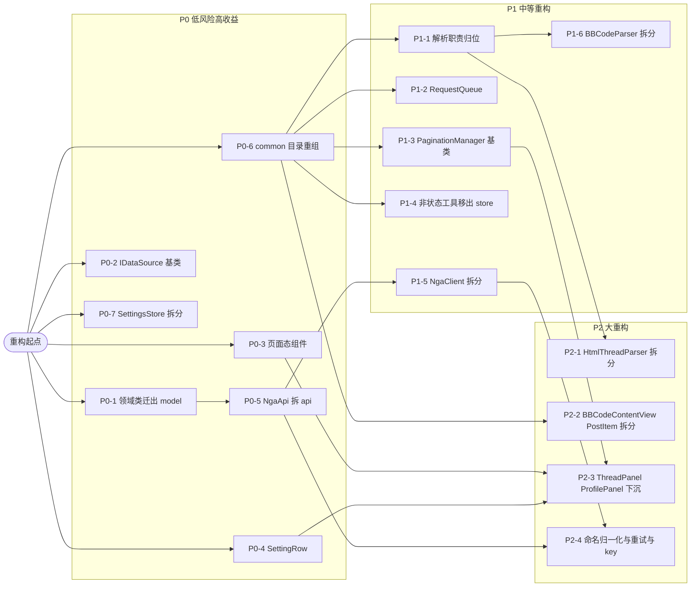

# 模块可维护性重构计划

> **For agentic workers:** 本计划按 P0 → P1 → P2 分阶段执行，每项重构独立成 commit。步骤用 checkbox（`- [ ]`）跟踪。重构是**行为保持**的，验证以「DevEco 编译通过 + 关键页面手动回归」为准，不写新单测（项目当前无测试基建）。可使用 superpowers:executing-plans 或 superpowers:subagent-driven-development 分 session 执行。

**Goal:** 在不引入 npm 依赖、不破坏现有行为、不改 ArkTS 语义约束的前提下，消除分层倒置与系统性重复，使最大文件从 1564 行降至各文件 100–250 行。

**当前状态:** 项目共 21261 行 ArkTS，架构大方向健康（AppStore Facade 模式、依赖图为无循环 DAG、状态范式统一 `@Observed`），但积累三类技术债：分层倒置、系统性重复、目录组织失序。

**Tech Stack:** HarmonyOS ArkUI / ArkTS（API 6.1.0），单 entry 模块，DevEco Studio 工具链，无第三方 npm 依赖（`oh-package.json5` dependencies 为空）。

**构建验证命令（每项重构后执行）:**
```bash
export DEVECO_SDK_HOME="C:/Program Files/Huawei/DevEco Studio/sdk"
"/c/Program Files/Huawei/DevEco Studio/tools/hvigor/bin/hvigorw.bat" \
  assembleHap --mode module -p module=entry@default -p buildMode=debug --no-daemon
```

---

## 一、健康度评估

| 模块 | 评分(1-5) | 规模 | 关键问题 |
|------|:---:|------|----------|
| `service/` | 1.5 🔴 | 8 文件 3777 行 | 债务核心区。`NgaApi`(1564)+`BBCodeParser`(921) 占 66%；`loginPassword` 绕过统一通道；解析逻辑放错目录 |
| `common/` | 2.0 🔴 | 31 文件 6682 行 | 职责最混杂，无子目录平铺；12 份 IDataSource、媒体尺寸工具、分页管理器系统性重复 |
| `model/` | 2.0 🔴 | 12 文件 560 行 | 沦为壳：28 个核心领域类埋在 `service/NgaApi.ets`；`model/Api.ets` 是死代码 |
| `pages/` | 2.5 🟠 | 24 文件 6879 行 | 状态管理健康，但 5 个超大文件 + 7 处加载态/设置行逐字复制 |
| `parser/` | 3.0 🟡 | 10 文件 1221 行 | 本身清晰，被跨目录放错的解析逻辑拖累；`HtmlThreadParser`(669) 混杂 5 类抽象 |
| `store/` | 3.5 🟢 | 14 文件 2000 行 | 最好。仅 `SettingsStore`(471) 混杂、混入 4 个非状态工具 |

---

## 二、三大核心债务

**1. 分层倒置** —— `NgaApi.ets` 把 28 个领域数据类（`PostInfo`/`UserInfo`/`ThreadResult` 等）内联在网络层，导致 `common/` 5 处 `import {PostInfo} from '../service/NgaApi'`（底层反依赖上层）。`model/Api.ets`(28 行) 反而是无人引用的死代码。

**2. 系统性重复** —— 12 份几乎复制的 `IDataSource` 实现；3 套并存并发控制（`ImageSizeUtil`/`VideoSizeUtil` 各自的 `scheduleRequest` + 已存在却没被复用的 `Throttler`）；2 个分页管理器约 70% 骨架重复；`decodeHtmlEntities` **4 份副本**；加载/错误/重试三件套在 7 个 Panel 逐字复制。

**3. 目录组织失序** —— 解析逻辑分裂在 `service/` 和 `parser/` 两目录；`common/` 31 文件无子目录；`store/` 混入 `SerialQueue`/`FilterListManager`/`ToastManager` 等非状态工具；`Utils.ets`/`Constants.ets` 退化为「万能桶」。

---

## 三、依赖关系总览

箭头 `A --> B` 表示 **B 依赖 A 先完成**。P0 项大多无依赖可并行启动；P1 普遍依赖 P0-6（common 目录重组）；P2 依赖更深。



---

## 四、横切主题对照

| 横切问题 | 涉及文件 | 对应重构项 |
|----------|----------|-----------|
| 分页抽象分散（无统一基类） | `ThreadPaginationManager`/`TopicPaginationManager`/`ThreadPanel`/`TopicListPanel` | P1-3 |
| 解析职责跨 service/parser 两目录 | `BBCodeParser`/`ContentParser`/`BBCodeCache`/`HtmlThreadParser`/`ThreadParser` | P1-1 |
| 并发控制 3 套并行实现 | `ImageSizeUtil`/`VideoSizeUtil`/`Throttle` | P1-2 |
| 核心模型分层倒置 | `NgaApi.ets`(领域类)/`model/Api.ets`(死代码)/`LazyDataSource`/`PostItem` | P0-1 |
| 万能桶 Utils 与 Constants | `Utils.ets`(294)/`Constants.ets`(212) | P0-6 + P2-4 |
| HTML 实体解码/附件 URL 多处复制 | `HtmlThreadParser`/`BBCodeParser`/`ContentParser`/`Utils` | P1-1 |
| 目录归属错乱（工具放错层） | `Throttle`/`BBCodeParser`/`FilterListManager`/`SerialQueue`/`ToastManager` | P0-6 + P1-4 |
| 页面 UI 模板重复 | `ThreadPanel`/`ProfilePanel`/`SettingsPanel`/`TopicListPanel`/`MessageListPanel` | P0-3 + P0-4 |

---

## 五、P0 重构项（低风险高收益，立即可做）

### P0-1 领域数据类从 NgaApi.ets 迁出到 model/ 层

**工作量** L | **依赖** 无 | **必须最先做**

**问题:** `NgaApi.ets:32-183` 内联 28 个领域数据 class（`PostInfo`/`UserInfo`/`PostAttachInfo`/`ThreadResult` 等），导致 `common/LazyDataSource`/`PostItem`/`ReplyManager`/`ShareUtils`/`ThreadPaginationManager` 反向 `import '../service/NgaApi'` 获取类型。

**目标结构:**
```
model/
├── PostInfo.ets         (含 PostAttachInfo)
├── UserInfo.ets
├── ThreadResult.ets     (ThreadPagination/ThreadResult/PostAuthResult/PostReplyResult)
├── MessageResult.ets    (MessageListResult/MessageDetailResult/MessageSendResult)
└── NgaApiResults.ets    (其余 *Result class + ApiResult/VoteResult/CaptchaResult/LoginStep1/2Result + ForumStat/UserActivityAnalysis)
```

**影响文件:**
- Create: `model/PostInfo.ets`、`model/UserInfo.ets`、`model/ThreadResult.ets`、`model/MessageResult.ets`、`model/NgaApiResults.ets`
- Modify: `service/NgaApi.ets`（删除已迁出的 class 定义，保留业务函数 + `loginSessions` Map + `HTML_MODE_KEY` 运行态）
- Modify(import 路径): `common/LazyDataSource.ets`、`common/PostItem.ets`、`common/ReplyManager.ets`、`common/ShareUtils.ets`、`common/ThreadPaginationManager.ets` 等 22 个依赖方

**动作步骤:**
- [ ] **Step 1:** 用 `codegraph_search PostInfo` / `codegraph_callers` 列出所有从 `NgaApi` import 这些类型的文件，确认完整调用方清单
- [ ] **Step 2:** 在 `model/PostInfo.ets` 中从 `NgaApi.ets` 原样搬移 `PostInfo` 与 `PostAttachInfo` class（**不改字段类型/顺序/装饰器**，避免序列化与状态观测问题）
- [ ] **Step 3:** 同理搬移 `UserInfo`、`ThreadResult` 系列到各自文件
- [ ] **Step 4:** 在 `model/NgaApiResults.ets` 集中剩余约 20 个 `*Result` class + `ApiResult`/`VoteResult`/`CaptchaResult`/`LoginStep1Result`/`LoginStep2Result` + `ForumStat`/`UserActivityAnalysis`
- [ ] **Step 5:** 在 `NgaApi.ets` 顶部改为 `import { PostInfo, UserInfo, ... } from '../model/...'`，删除原内联 class 定义
- [ ] **Step 6:** 全量替换 22 个依赖方的类型 import 路径（函数 import 保持指向 `NgaApi`）
- [ ] **Step 7:** grep 确认 `model/Api.ets` 的 `ApiResponse`/`SessionInfo`/`LoginResult`/`LoginV2Result` 无任何引用后删除该文件（若有遗留迁入 `NgaApiResults.ets`）
- [ ] **Step 8:** 执行构建验证命令，确认编译通过
- [ ] **Step 9:** `git add -A && git commit -m "refactor(model): 领域数据类从 NgaApi.ets 迁出到 model/ 层"`

**ArkTS 风险:** 类布局编译时固定，迁移不改字段故无序列化/状态观测风险。**禁止**借机把 `Record<string,Object>` 返回类型改成 class（会触发 `Record` 索引访问 `V|undefined` 的连锁修改）。若这些类被 `PreferencesStore` 序列化持久化（如投票记录涉及 pid），反序列化按字段名匹配，不受文件位置影响——不得改变字段名/类型/顺序。

**验证:** 编译通过 + 手动打开帖子列表/详情/个人中心/通知/私信页确认数据正常加载。

---

### P0-2 提取泛型 BaseLazyDataSource 基类消除 12 份复制

**工作量** M | **依赖** 无

**问题:** `LazyDataSource.ets`(593 行) 含 12 个 DataSource 类，每个都重复实现 `totalCount`/`getData`/`registerDataChangeListener`/`unregisterDataChangeListener`/`replaceAll`/`clear`/`notifyReload`，差异仅在泛型元素类型。

**目标结构:**
```
common/datasource/
└── BaseLazyDataSource.ets   (泛型基类，封装 dataList+listeners+notify+replaceAll+clear)
```
12 个现有子类瘦身到仅声明 `dataList: T[]` 类型 + 各自特有方法（`updateAt`/`prependAll`/`indexOf` 等），保持原导出名。

**影响文件:**
- Create: `common/datasource/BaseLazyDataSource.ets`
- Modify: `common/LazyDataSource.ets`（12 个子类瘦身）
- Modify(可选): `pages/ThreadPanel`/`TopicListPanel`/`MessageListPanel`/`NotificationPanel`/`BlacklistPanel`/`NotesPanel` 等（仅当 import 路径变化）

**动作步骤:**
- [ ] **Step 1:** 定义 `class BaseLazyDataSource<T> implements IDataSource`，封装 `dataList: T[]`、`private listeners: DataChangeListener[]`、`totalCount()`、`getData(index)`、`registerDataChangeListener`/`unregisterDataChangeListener`、`replaceAll`、`clear`、`notifyReload`/`notifyDataChange`
- [ ] **Step 2:** 12 个子类改为 `class XxxDataSource extends BaseLazyDataSource<XxxInfo>`，删除重复方法，仅保留特有方法
- [ ] **Step 3:** 确认 `SidebarSection`/`SidebarBoardItem` interface 定义保留在原文件或迁 `model/`
- [ ] **Step 4:** 构建验证
- [ ] **Step 5:** `git commit -m "refactor(common): 提取 BaseLazyDataSource 基类消除 12 份重复"`

**ArkTS 风险:** ArkTS 不支持泛型方法继承+协变返回，`IDataSource.getData` 返回泛型 `T` 在子类覆盖时需保证签名完全一致；不能用 `object[]` 作通用容器（会丢失类型），每个子类显式声明 `dataList: T[]`。`DataChangeListener` 数组管理逻辑整体移入基类。

**验证:** 编译通过 + 列表滚动/下拉刷新/分页加载正常。

---

### P0-3 提取 LoadingStateView/ErrorStateView/EmptyStateView 通用页面态组件

**工作量** S | **依赖** 无

**问题:** 加载中（`LoadingProgress`+Text）、错误态（Text+重试 Button）、顶部占位（`Row().height(44+statusBarHeight)`）三段模板在 7 个 Panel 几乎逐字重复。

**目标结构:**
```
common/components/
├── PageStateView.ets   (LoadingStateView/ErrorStateView/EmptyStateView)
└── (常量 NAV_BAR_H=44 抽到 common/Constants)
```

**影响文件:**
- Create: `common/components/PageStateView.ets`
- Modify: `pages/ThreadPanel`/`ProfilePanel`/`TopicListPanel`/`MessageListPanel`/`NotificationPanel`/`MessageDetailPanel`/`CommunityTabContent`

**动作步骤:**
- [ ] **Step 1:** 定义三个 `@Component struct`：`LoadingStateView { tip?: string }`、`ErrorStateView { msg: string; onRetry: () => void }`、`EmptyStateView { msg: string }`
- [ ] **Step 2:** `onRetry` 用普通箭头属性（**非 `@Prop` 函数**），签名 `(onRetry: () => void) => void` 形式传参
- [ ] **Step 3:** 各 Panel `build()` 的 `isLoading`/`hasError` 分支替换为上述组件
- [ ] **Step 4:** 构建验证 + 触发各页面的加载态/错误态/空态确认显示一致
- [ ] **Step 5:** `git commit -m "refactor(common): 提取 LoadingStateView/ErrorStateView 通用页面态组件"`

**ArkTS 风险:** `@Component` 间传 `@Prop` 不能传函数引用，`onRetry` 用普通箭头属性。`errorMsg` 若可空用 `length>0` 判断而非可选链解构。

---

### P0-4 提取通用 SettingRow 组件统一设置项/操作行

**工作量** M | **依赖** 无

**问题:** `SettingsPanel.SettingRow`(@Builder, `SettingsPanel.ets:606-624`) 与 `ProfilePanel.ActionRow` 是同一形态（图标+标签+badge+箭头）却各自维护一份；且 `SettingsPanel` 内部还在手写同类行未复用自己的 Builder。

**目标结构:**
```
common/components/
└── SettingRow.ets   (SettingRow/SettingToggleRow/SettingPickerRow)
```

**影响文件:**
- Create: `common/components/SettingRow.ets`
- Modify: `pages/SettingsPanel.ets`、`pages/ProfilePanel.ets`、`pages/TtsSettingsPanel.ets`

**动作步骤:**
- [ ] **Step 1:** 定义 `@Component struct SettingRow { iconRes; iconColor; label; badge?; onClick }`、`SettingToggleRow { iconRes; iconColor; label; isOn; onChange }`、`SettingPickerRow { iconRes; iconColor; label; badgeText; onClick }`
- [ ] **Step 2:** 字段逐个 `@Prop` 传递（**不支持解构**）
- [ ] **Step 3:** 三个 Panel 全部改用上述 struct 替换内联 Row 与跨文件复制的 `@Builder`
- [ ] **Step 4:** 构建验证 + 设置页/个人中心操作行视觉与点击行为一致
- [ ] **Step 5:** `git commit -m "refactor(common): 提取通用 SettingRow 组件统一设置项与操作行"`

**ArkTS 风险:** 选项数组（如 `imageStrategyOptions`）必须是显式 `class`/`Record` 而非对象字面量作类型；`ActionSheetDialog` 已接受 `ActionOption[]`，复用现有类型。

---

### P0-5 NgaApi.ets 按业务域拆分为 api/ 子目录

**工作量** M | **依赖** P0-1（必须先完成领域类迁出）

**问题:** `NgaApi.ets`(1564 行) 混杂 13 个业务域，22 个文件直接 import。

**目标结构:**
```
service/api/
├── types.ets       (ApiResult 已在 model/NgaApiResults.ets，此文件仅放 API 专用的请求参数 class)
├── AuthApi.ets     (getCaptcha/loginStep1/loginStep2/extractNickName/fetchNickNameFromNga/generateLoginToken/verifyToken/logout/injectCredentials/getSession + LoginSession)
├── UserApi.ets     (getCurrentUser/getUserProfile/getUserActivityAnalysis)
├── ForumApi.ets    (getForumCategories/searchForum/createTopicListParams/extractSnippet/getTopicList)
├── ThreadApi.ets   (getForceHtmlMode/setForceHtmlMode/getThread/getThreadHtml/prefetchPostImages/fillThreadResult/getPostAuth/postReply/postComment/uploadAttachment)
├── FavoriteApi.ets (fetchForumFavorites/votePost/addFavorite/removeFavorite/checkin)
├── MessageApi.ets  (getNotifications/clearNotifications/getMessageList/getMessageDetail/sendMessage)
└── MiscApi.ets     (setDomain/getDomain 等)
```
**关键策略:** `NgaApi.ets` 保留为 barrel：`export * from './api/AuthApi'` …，**使 24 个现有 import 零改动**。

**影响文件:**
- Create: `service/api/*.ets`（8 个）
- Modify: `service/NgaApi.ets`（改为 barrel re-export）

**动作步骤:**
- [ ] **Step 1:** 按 `NgaApi.ets:185-446`(auth)/`448-578`(forum)/`580-1039`(thread)/`1041-1196`(favorite)/`1198-1316`(message)/`371-1550` 部分(user)/`1551-1564`(misc) 的行号区间，逐域剪切函数到对应子文件
- [ ] **Step 2:** 每个子文件顶部 `import { ngaRequest, ... } from '../NgaClient'` + `import { type Cookies } from '../NgaClient'`（Cookies 统一从 NgaClient 导出）
- [ ] **Step 3:** `NgaApi.ets` 改为 barrel：`export * from './api/AuthApi'` 等聚合所有子模块
- [ ] **Step 4:** grep 确认 24 个引用方 import 路径无需改动（仍从 `NgaApi` 导入）
- [ ] **Step 5:** 构建验证
- [ ] **Step 6:** `git commit -m "refactor(service): NgaApi 按业务域拆分为 api/ 子目录"`

**ArkTS 风险:** 纯物理拆分+函数搬移，签名不变。`Cookies` 接口当前从 `NgaClient` 导出又被 `NgaApi` re-export，拆分后统一从 `NgaClient` 导出，各子文件 `import { type Cookies } from '../NgaClient'`。业务函数大量返回 `Record<string,Object>` 并用 `as` 收窄，保持现状，**不要**趁机改 class。

---

### P0-6 common/ 目录按职责重组为子目录

**工作量** L | **依赖** 无（是 P1 各项的**前置目录基础**）

**问题:** `common/` 31 文件无子目录平铺，UI 组件/工具/Manager/缓存/媒体播放器全混放。

**目标结构:**
```
common/
├── index.ets              (re-export 桶，过渡用，避免一次性改 100+ import)
├── components/            (Avatar, AnonymousName, EmptyHint, NavBar, PanelNavBar, Toast, PostItem, BBCodeContentView, ImageViewer, ProfileCardPopup, ReplyDialog)
├── dialogs/               (从 Dialogs.ets 拆出的 ConfirmDialog/ActionSheet/NoteEditDialog)
├── media/                 (AudioPlayer, MutedVideo, TtsPlayer, ImageSizeUtil, VideoSizeUtil, EmotionResources)
├── managers/              (ReplyManager, ThreadPaginationManager, TopicPaginationManager, StatusBarManager, NetworkMonitor)
├── datasource/            (LazyDataSource, BaseLazyDataSource)
├── utils/                 (Utils 拆出的时间/HTML/数字/URL, NetworkUtil, ShareUtils, LinkUtils, TimeoutUtils)
├── constants/             (从 Constants.ets 拆出的 AppColors/IconColors/主题与字体选项/ImageLoadStrategy/ThreadNavMode/Breakpoint)
└── cache/                 (LruCache)
```

**影响文件:** `common/*.ets`（全部 31 文件物理移动）

**动作步骤:**
- [ ] **Step 1:** 创建上述子目录
- [ ] **Step 2:** 按职责逐文件移动（先用 `git mv` 保留历史）
- [ ] **Step 3:** 更新被移动文件的内部 import（相对路径变化）
- [ ] **Step 4:** 创建 `common/index.ets` 桶文件，re-export 所有公共符号
- [ ] **Step 5:** 批量更新项目其他位置（pages/store/service/parser）的 `import ... from '../common/Xxx'` 路径
- [ ] **Step 6:** 构建验证（这一步最易出 import 错误，重点关注）
- [ ] **Step 7:** `git commit -m "refactor(common): 按职责重组为 components/utils/managers 等子目录"`

**ArkTS 风险:** 目录重组只改 import 路径，风险低。但调用方多（`AppColors`/`ImageLoadStrategy` 等被全项目引用），建议先用 `common/index.ets` 桶过渡，避免一次性改 100+ 处 import。模块路径用相对路径（项目无 path alias 配置）。

**验证:** 编译通过 + 全应用冒烟（首页/列表/详情/设置/个人中心）。

---

### P0-7 SettingsStore 按设置域拆分

**工作量** L | **依赖** 无

**问题:** `SettingsStore.ets`(471 行) 承载 14 个不相关设置域（黑名单/收藏/主题/自动签到/字号/域名/握持/SmartGrip/签名/TTS/图片策略/视频静音/翻页模式/预加载/便签/关键词屏蔽），`SettingsState` 是 24 字段扁平巨型类，每新增字段需改 state 声明 + load 加载 + setter 三处。

**目标结构:**
```
store/settings/
├── SettingsStore.ets        (门面：持 init/reset/loadUserSettings/persistSettings，约 120 行)
├── SettingsState.ets        (持久化根状态类，24 字段)
└── domain/
    ├── ThemeSettings.ets        (theme + applyCurrentTheme，含 setColorMode/状态栏)
    ├── DisplaySettings.ets      (fontSize/domainIndex/holdingHand/smartGrip/showSignature)
    ├── MediaSettings.ets        (imageLoadStrategy/enableImageSizePrefetch/videoMuted/tts*)
    ├── ReadingSettings.ets      (threadNavMode/prefetchPageCount)
    ├── SocialListSettings.ets   (blacklist/favorites，依赖 FilterListManager)
    ├── FilterKeywordSettings.ets(filterKeywords + getEnabledKeywords)
    ├── NoteSettings.ets         (notes + getNoteMap)
    └── CheckinSettings.ets      (autoCheckin + autoCheckinIfNeeded)
```

**影响文件:**
- Create: `store/settings/*.ets`
- Modify: `store/SettingsStore.ets`（改为门面）、`store/AppStore.ets`、`pages/SettingsPanel.ets`、`pages/BlacklistPanel.ets`、`pages/CommunityTabContent.ets`、`pages/ThreadPanel.ets`、`pages/TopicListPanel.ets`

**动作步骤:**
- [ ] **Step 1:** 抽出 `SettingsState`（24 字段持久化类）到独立文件
- [ ] **Step 2:** 按域逐个抽出 `domain/` 子类，每个持有对 `SettingsState` 的引用 + 自己的 setter + `load(saved)` 分片
- [ ] **Step 3:** `SettingsStore` 改为门面，持 `init`/`reset`/`loadUserSettings`/`persistSettings` + 各子设置类的 readonly 字段
- [ ] **Step 4:** `AppStore.clearAuth` 编排保持不变（仍通过门面 reset）
- [ ] **Step 5:** 构建验证 + 设置页各项读写正常 + 主题切换/字号/TTS/视频静音等生效
- [ ] **Step 6:** `git commit -m "refactor(store): SettingsStore 按设置域拆分为门面与域子 store"`

**ArkTS 风险:** ArkTS 禁止映射/条件/索引类型，不能用 `Record<DomainKey, DomainStore>` 动态分发，每个子 store 必须是 `AppStore` 的显式 `readonly` 字段。`loadUserSettings` 改成各子 store 自负责 `load(saved)` 后，`JSON.parse` 返回普通对象，子 store 字段读取仍需判 `undefined`。

---

## 六、P1 重构项（中等重构）

### P1-1 解析职责归位：BBCodeParser/ContentParser 从 service/ 迁入 parser/

**工作量** M | **依赖** P0-6

**问题:** `BBCodeParser`(921)/`ContentParser`(228) 是纯文本解析却放 `service/`（CLAUDE.md 定义 service 为网络/外部服务），与 `parser/` 形成「找解析逻辑需搜两目录」。`ContentParser` 中 `parseNgaContent`/`extractContentImages`/`stripBbCode` 全项目零调用（约 200 行死代码）；`decodeHtmlEntities` 有 4 份副本；`resolveAttachUrl` 有 2 份且 CDN host 写法不一致。

**目标结构:**
```
parser/
├── bbcode/
│   ├── BBCodeParser.ets    (从 service/ 迁入)
│   └── BBCodeCache.ets     (从 service/ 迁入)
├── task/
│   ├── BBCodeParseTask.ets (从 service/ 迁入)
│   └── HtmlParseTask.ets   (从 service/ 迁入)
└── _shared/
    ├── HtmlEntityCodec.ets (合并 4 处 decodeHtmlEntities)
    └── AttachUrl.ets       (合并 resolveAttachUrl/resolveImgUrl)
```
`JsonUtil.ets` 改名 `NgaJsonSanitizer.ets`（明示 NGA 专用 JSON 清洗）。

**影响文件:**
- Move: `service/BBCodeParser`→`parser/bbcode/`、`service/ContentParser`→`parser/bbcode/`、`service/BBCodeCache`→`parser/bbcode/`、`service/BBCodeParseTask`+`service/HtmlParseTask`→`parser/task/`
- Create: `parser/_shared/HtmlEntityCodec.ets`、`parser/_shared/AttachUrl.ets`
- Modify(import): `common/PostItem`(filterBBTags)、`pages/ProfilePanel`、`pages/ThreadPanel`、`service/NgaApi`(resolveAttachUrl)、`service/NgaClient`(preprocessJson)、`parser/HtmlThreadParser`、`common/Utils`(unescapeHtml 删除)

**动作步骤:**
- [ ] **Step 1:** `git mv` 4 个文件到 `parser/bbcode/` 与 `parser/task/`
- [ ] **Step 2:** 更新 `@Concurrent` taskpool 函数的 import 路径（`BBCodeParseTask`/`HtmlParseTask`），确认 taskpool 跨 Worker 序列化仍正常（目录变更不影响编译期符号引用）
- [ ] **Step 3:** 创建 `parser/_shared/HtmlEntityCodec.ets`，以 `BBCodeParser:45`（最完整版，支持十六进制 `&#x`/`<br>`/`&#91;`）为准合并 4 份，删除 `HtmlThreadParser:14`/`ContentParser`/`Utils.unescapeHtml` 三份
- [ ] **Step 4:** 创建 `parser/_shared/AttachUrl.ets`，合并 `BBCodeParser:32` + `ContentParser:10`，统一 CDN host 列表为单一常量数组（以 `ContentParser` 的多 host 兜底为准）
- [ ] **Step 5:** 删除 `ContentParser` 中 `parseNgaContent`/`extractContentImages`/`stripBbCode` 死代码，仅保留 `resolveAttachUrl`（已迁入 `AttachUrl`，此文件可删）
- [ ] **Step 6:** `JsonUtil.ets` 改名 `NgaJsonSanitizer.ets`
- [ ] **Step 7:** 批量更新所有 import 路径
- [ ] **Step 8:** 构建验证 + **重点回归 BBCode 渲染**（表情/图片/引用/代码块/表格/附件链接）
- [ ] **Step 9:** `git commit -m "refactor(parser): BBCode 解析从 service 归位 parser，合并重复实体解码与附件 URL"`

**ArkTS 风险:** taskpool.Task 的函数引用是编译期符号，目录变更不影响。合并 `resolveAttachUrl` 需注意 `BBCodeParser` 私有版不判断纯数字/无斜杠返回空，统一后行为会变（多 host 兜底），**必须回归帖子附件链接显示**。

---

### P1-2 提取并发调度器 RequestQueue

**工作量** M | **依赖** P0-6

**问题:** `ImageSizeUtil.ets:12-34` 与 `VideoSizeUtil.ets:20-42` 各自实现完全相同的「`MAX_CONCURRENT`/`activeCount`/`requestQueue`/`scheduleRequest`/`onRequestDone` + `pending` Map 去重」模板，而 `Throttle.ets` 的 `Throttler`(令牌桶) 已存在却未被复用——3 套并发控制并存。

**目标结构:**
```
common/concurrency/
├── RequestQueue.ets    (泛型并发队列，MAX_CONCURRENT 可配)
└── (Throttler 从 service/ 迁入)
```

**影响文件:**
- Create: `common/concurrency/RequestQueue.ets`
- Move: `service/Throttle.ets`→`common/concurrency/Throttler.ets`
- Modify: `common/media/ImageSizeUtil.ets`、`common/media/VideoSizeUtil.ets`（删除各自约 22 行调度代码，改用 `RequestQueue`，仅保留解析核心）

**动作步骤:**
- [ ] **Step 1:** 定义 `class RequestQueue<T>`，构造接收 `maxConcurrent: number`，提供 `schedule(run: () => void)`、`done()`，内部维护 `activeCount`/`requestQueue`
- [ ] **Step 2:** `ImageSizeUtil`/`VideoSizeUtil` 改用 `RequestQueue`，删除各自 `scheduleRequest`/`onRequestDone`，保留各自的解析核心（DataView 头解析 vs `AVMetadataExtractor`）
- [ ] **Step 3:** 评估 `Throttler` 是否可作为 `RequestQueue` 的更完善替代（令牌桶 vs 固定并发），若两者职责不同则并存但统一目录
- [ ] **Step 4:** 构建验证 + 图片/视频尺寸预取正常
- [ ] **Step 5:** `git commit -m "refactor(common): 提取 RequestQueue 统一 ImageSize/VideoSize 并发调度"`

**ArkTS 风险:** `scheduleRequest` 接收的回调必须是明确命名的箭头函数类型 `(run: () => void)`，不能用函数表达式类型。不能把 `cache`/`pending` 做成共享单例（两个用途的并发上限不同），通过构造参数注入 `capacity` 与 `MAX_CONCURRENT`。

---

### P1-3 提取 PaginationManager 基类统一 Thread/Topic 分页

**工作量** M | **依赖** P0-6

**问题:** `ThreadPaginationManager`(199 行) 与 `TopicPaginationManager`(93 行) 约 70% 骨架重复：`generation` 计数器 + `nextGeneration`/`getGeneration`、`prefetchedPages` Map + `hasPrefetchedPage`/`setPrefetchedPage`/`commitPrefetchedPage`/`clearPrefetchedPages`、`reset`、`currentPage`/`totalPages`/`hasMore` 三元状态 + `replaceWith`、append 去重逻辑。

**目标结构:**
```
common/managers/
├── PaginationManager.ets        (@Observed abstract 基类，共性层)
├── ThreadPaginationManager.ets  (继承，保留 pageOfIndex/loadedLouSet/投票/反向预取)
└── TopicPaginationManager.ets   (继承，保留 tid 去重，同时把 object[] 换强类型)
```

**影响文件:**
- Create: `common/managers/PaginationManager.ets`
- Modify: `common/managers/ThreadPaginationManager.ets`、`common/managers/TopicPaginationManager.ets`、`pages/ThreadPanel.ets`、`pages/TopicListPanel.ets`

**动作步骤:**
- [ ] **Step 1:** 定义 `@Observed abstract class PaginationManager`（注意：`@Observed` 必须在最终子类上，基类用 `abstract class`），封装 `generation`/`prefetchedPages: Map<number, PrefetchedPageHolder>`/三元状态/`reset`/`replaceWith`
- [ ] **Step 2:** 定义抽象 `appendWith(list: T[]): T[]` 供子类提供去重 key 提取器
- [ ] **Step 3:** `ThreadPaginationManager` 继承，保留 `posts`/`pageOfIndex`/`loadedLouSet`/投票/反向预取
- [ ] **Step 4:** `TopicPaginationManager` 继承，实现 tid 去重，**同时把 `object[]` + `(obj as Record<string,Object>)['tid']` 弱类型访问换成强类型 `TopicInfo[]`**
- [ ] **Step 5:** 构建验证 + **重点回归帖子列表与帖子详情的翻页/预取**
- [ ] **Step 6:** `git commit -m "refactor(common): 提取 PaginationManager 基类统一分页管理器"`

**ArkTS 风险:** ArkUI 状态观测按具体类注册，**基类加 `@Observed` 对子类实例无效**，`@Observed` 必须在 `ThreadPaginationManager`/`TopicPaginationManager` 上。子类专有结构（投票/tid 去重）不能上提到基类。`prefetchedPages` 的值类型在基类用具体类 `PrefetchedPageHolder { items: object[]; totalPages: number }` 而非泛型，子类做类型转换。`@Observed` 类继承需保持观察性。

---

### P1-4 非状态工具移出 store/

**工作量** S | **依赖** P0-6

**问题:** 4 个文件不符合 `store/`「全局响应式状态存储」定义：`FilterListManager`(纯泛型集合，12 引用方)、`SerialQueue`(并发原语)、`PreferencesStore`(ArkData 数据访问层)、`ToastManager`(UI 反馈)。

**目标结构:**
```
common/
├── utils/FilterListManager.ets      (纯泛型集合工具)
├── infra/SerialQueue.ets            (并发原语)
├── infra/PreferencesStore.ets       (数据访问层)
└── feedback/ToastManager.ets        (UI 反馈)
```
`store/` 仅保留响应式状态 Store。

**影响文件:**
- Move: 4 个文件从 `store/` 迁入 `common/` 对应子目录
- Modify(import): `store/AppStore.ets`、`store/SettingsStore.ets`、及 12 个 `FilterListManager` 引用方

**动作步骤:**
- [ ] **Step 1:** `git mv` 4 个文件到 `common/` 对应子目录
- [ ] **Step 2:** 批量更新 import 路径（`store/` 内仍可 `import` 它们，ArkTS 允许 store 反向 import common）
- [ ] **Step 3:** `ToastManager` 可考虑改为 `common/feedback/` 直接 export 单例，`AppStore` 委托
- [ ] **Step 4:** 构建验证 + Toast 显示/过滤列表/持久化读写正常
- [ ] **Step 5:** `git commit -m "refactor: 非状态工具(FilterListManager/SerialQueue/PreferencesStore/ToastManager)移出 store"`

**ArkTS 风险:** `FilterListManager` 为纯泛型类、无 `@Observed`/`@Trace`、不依赖 store 任何符号，迁移纯改 import 路径，零风险。

---

### P1-5 NgaClient.ets 拆分：编解码下沉 + loginPassword 重组

**工作量** M | **依赖** P0-5

**问题:** `NgaClient.ets`(805 行) 混合 4 类职责：编解码工具（`stringToUint8Array`/`uint8ArrayToBase64`/`decodeGb18030`/`emojiToHtmlEntity`/`gbkPercentEncode`/`buildEncodedBody`/`buildMultipart`）、URL 工具、HTTP 传输、multipart 构造。`loginPassword`(:590-704) 绕过统一 `ngaRequest` 通道直接调 `http.createHttp()`，不受多域名重试/限流保护。`pages/` 4 处越层 `import ngaClient`。

**目标结构:**
```
NgaClient.ets            (仅 HTTP 传输核心：httpReq/ngaRequest/rawRequest/ngaGet*/ngaPost*/client 接口 + ngaUploadFile，约 400 行)
common/utils/CodecUtils.ets   (编解码纯函数)
common/utils/UrlUtils.ets     (extractHostname/buildUrl)
common/CookieUtils.ets        (set-cookie 解析)
service/api/AuthApi.ets       (loginPassword 业务编排，走统一通道)
```

**影响文件:**
- Create: `common/utils/CodecUtils.ets`、`common/utils/UrlUtils.ets`、`common/CookieUtils.ets`
- Modify: `service/NgaClient.ets`、`service/api/AuthApi.ets`(P0-5 已建)、`common/ShareUtils.ets`、`pages/LoginPage.ets`、`pages/ThreadPanel.ets`、`pages/WebViewPanel.ets`

**动作步骤:**
- [ ] **Step 1:** 抽出 `CodecUtils`(`NgaClient:51-172` 编解码纯函数)、`UrlUtils`(`:66-88`)、`CookieUtils`(`loginPassword:636-665` set-cookie 解析) 到 `common/`
- [ ] **Step 2:** `NgaClient` 改为 import 这些工具，降至约 400 行
- [ ] **Step 3:** `loginPassword` 业务编排（密码加密+session+cookie→uid/cid）迁入 `AuthApi.ets`，HTTP 调用改走统一 `ngaPostMultipart` 通道而非裸 `http.createHttp()`
- [ ] **Step 4:** 修复 4 处越层 import：`pages/LoginPage`/`ThreadPanel`/`WebViewPanel`/`common/ShareUtils` 改用 `NgaApi`/`AuthApi` 暴露的业务接口
- [ ] **Step 5:** 构建验证 + **重点回归登录流程**（密码登录/token 登录/cookie 持久化）
- [ ] **Step 6:** `git commit -m "refactor(service): NgaClient 拆分，编解码下沉 common，loginPassword 走统一通道"`

**ArkTS 风险:** `loginPassword` 当前用 `string[]` 作 set-cookie 容器无虞；提取 cookie 工具时保持 `string[]` 输入、显式 `class SessionCookie { uid: string; cid: string }` 输出，**不要用解构返回**。统一通道后 `ngaRequest` 的 HTML 错误页解析逻辑会被登录响应触发——需确认登录接口返回 JSON/JS（当前是），否则走 `:465-480` 的 HTML 分支。`multipart` 已有 `buildMultipart` 可复用。

---

### P1-6 BBCodeParser.ets 按解析阶段拆分

**工作量** M | **依赖** P1-1

**问题:** `BBCodeParser.ets:219-588` 的 `tryMatchBlock` 单函数约 370 行，用一长串 if/正则顺序匹配 quote/collapse/code/list/lessernuke/table/flash/img/url/pid/uid/tid/表情/格式化等十几种块级标签，每个分支自洽但被共用 `ParseState` 揉在一起。

**目标结构:**
```
parser/bbcode/
├── BBCodeParser.ets       (barrel re-export parseBBCode)
├── lexer.ets              (ParseState class/pushTextNode/preprocessContent/createBBNode/resolveImgUrl/decodeHtmlEntities/escAngle/isSafeUrl/常量)
├── block-handlers/        (每个 if 分支抽成独立箭头函数)
│   ├── handleQuote.ets
│   ├── handleCollapse.ets
│   ├── handleCode.ets
│   ├── handleList.ets
│   ├── handleNuke.ets
│   ├── handleTable.ets
│   ├── handleFlash.ets
│   ├── handleImg.ets
│   ├── handleUrl.ets
│   ├── handlePidUidTid.ets
│   └── handleFormat.ets
├── inline-parser.ets      (parseInlineInto/checkInlineFormat/parseTableContent/parseTableRowCells/parseListItems/guessMediaTypeFromExt)
└── parser.ets             (parseBBCode/parseBlockNodes 编排器)
```

**影响文件:**
- Create: 上述 `parser/bbcode/` 子文件
- Modify: `parser/bbcode/BBCodeParser.ets`(改为 barrel)、`parser/bbcode/BBCodeCache.ets`(import 不变)

**动作步骤:**
- [ ] **Step 1:** 抽 `lexer.ets`：`ParseState` class + 工具函数 + 常量（`BBCodeParser:1-137`）
- [ ] **Step 2:** `tryMatchBlock` 的每个 if 分支抽成独立箭头函数，签名统一 `(state: ParseState, result: BBNode[]): boolean`，每个 20-40 行
- [ ] **Step 3:** 抽 `inline-parser.ets`（`:590-921`，含 `checkInlineFormat`）
- [ ] **Step 4:** `parser.ets` 编排器顺序调用 block-handlers
- [ ] **Step 5:** `BBCodeParser.ets` 改为 barrel re-export `parseBBCode`
- [ ] **Step 6:** 构建验证 + **重点回归所有 BBCode 标签渲染**
- [ ] **Step 7:** `git commit -m "refactor(parser): BBCodeParser 按解析阶段拆分，tryMatchBlock 按标签族拆 handler"`

**ArkTS 风险:** handler 必须是**箭头函数**（ArkTS 不支持函数表达式/不允许对象方法重分配）；**不要**用 `Record<string, arrow>` 索引分发（ArkTS 不允许索引签名调度），保持 if 顺序但物理拆文件。`checkInlineFormat`(`:870-921`) 内部正则同样巨大，可一并拆。

---

## 七、P2 重构项（大重构，视情况）

### P2-1 拆分 HtmlThreadParser.ets（669 行）

**工作量** M | **依赖** P1-1

**问题:** `HtmlThreadParser`(669 行) 混合 5 类抽象：HTML 实体解码、手写括号/字符串状态机（`extractBalancedBraces:53`/`parseAllPostArgs:175`/`tryParseAttachLoad:446`/`extractTotalReplies:393` 重复 4 次）、DOM 标记内容提取（6 个同构 `extractPostXxx`）、attach JSON 正则解析、顶层装配。

**目标结构:**
```
parser/nga/html-thread/
├── index.ets              (parseHtmlToRawJson 装配，约 120 行)
├── ScanState.ets          (统一括号/字符串状态机，返回显式 class BraceMatchResult{value;endPos}，非元组)
├── PostArgScanner.ets     (parseAllPostArgs + PostArgData interface + extractUserInfo + extractTotalReplies)
├── DomMarkerExtractor.ets (参数化 extractTagBetween(html,marker,endMarker) + 配置表，取代 6 个同构函数)
└── AttachParser.ets       (ubbcode.attach.load JSON 解析)
```
`decodeHtmlEntities` 迁入 `parser/_shared/HtmlEntityCodec.ets`（P1-1 已建）。

**动作步骤:**
- [ ] 抽 `ScanState.ets` 统一状态机（ArkTS 不支持解构返回，需 `class BraceMatchResult`）
- [ ] 参数化 6 个 `extractPostXxx` 为 `extractTagBetween` + 配置表
- [ ] 抽 `PostArgScanner`/`AttachParser`，`index.ets` 装配
- [ ] 构建验证 + 回归 HTML 模式帖子加载
- [ ] `git commit -m "refactor(parser): 拆分 HtmlThreadParser 为职责单一子模块"`

**ArkTS 风险:** 状态机扫描器返回 `class BraceMatchResult { value: string; endPos: number }` 而非元组；`PostArgData` 保持 interface；`Map<number, PostArgData>` 跨文件传递需 `import type PostArgData`。

---

### P2-2 BBCodeContentView/PostItem 按节点类型/区块拆分

**工作量** L | **依赖** P0-6

**问题:** `BBCodeContentView`(877) 含 6 个 `@Builder` + `RenderBlockNode`(`:463-513` 有 17 个 else-if 分支)；`PostItem`(611) 混杂 PostHeader/签名折叠/附件展开/评分栏/评论列表。

**目标结构:**
```
common/components/bbcode/
├── BBCodeContentView.ets      (主组件，仅 build/状态/分发)
├── BBCodeRenderContext.ets    (RenderContext class 共享)
├── RenderQuote.ets / RenderCollapse.ets / RenderCode.ets / RenderList.ets
├── RenderTable.ets / RenderAlbum.ets / RenderImage.ets
└── RenderInlineSpan.ets       (行内：格式/链接/表情/上下标)
```

**动作步骤:**
- [ ] 优先拆体量大的块级（Quote/Collapse/Table/Album）
- [ ] `PostItem` 内 `CommentsSection`/签名折叠/附件展开/评分栏拆出子 `@Builder` 或子组件
- [ ] 构建验证 + 回归帖子详情所有块级元素渲染
- [ ] `git commit -m "refactor(common): BBCodeContentView/PostItem 按节点类型拆子组件"`

**ArkTS 风险:** `@Builder` 不能跨 struct 调用，引用块内递归渲染子节点需用 `@BuilderParam` 传入渲染回调，或 `BBCodeContentView` 整体作为子组件复用。`BBNode` 含 15+ 字段需**逐字段 `@Prop` 传递**（不能用解构）。

---

### P2-3 ThreadPanel 分页/预取引擎下沉 + ProfilePanel 数据驱动 + 清理死代码

**工作量** L | **依赖** P1-3、P0-3、P0-4

**问题:**
- `ThreadPanel`(999 行) 大半是分页/预取/投票持久化/历史等纯逻辑绑在 `@Component` 上
- `ProfilePanel:308-404` 的 8 个 `GridItem` 结构相同只是字段不同
- `ProfilePanel:116-131` 的 `handleCheckin`(async/await 版) 是死代码，实际生效是 build 内内联版

**动作步骤:**
- [ ] 抽 `store/ThreadLoadStore` 或扩展 `PaginationManager` 承载 `prefetchNext`/`prefetchPrev`/`tryLoadNext`/`tryLoadPrev`（含 generation 防竞态），`ThreadPanel` 只持 store 引用 + 触发
- [ ] 投票持久化下沉 `appStore`，`recordBrowseHistory` 下沉 `store/HistoryStore.addFromThreadResult`
- [ ] `ProfilePanel` 8 个 `GridItem` 改 `class StatItem` 数组 + `ForEach`
- [ ] 删除 `ProfilePanel.handleCheckin` 死代码
- [ ] 构建验证 + 回归帖子详情翻页/预取/投票/历史、个人中心统计与签到
- [ ] `git commit -m "refactor: ThreadPanel 逻辑下沉 store，ProfilePanel 统计数据驱动，清理死代码"`

**ArkTS 风险:** `StatItem` 必须显式 `class`（含 `iconRes: Resource`/`label: string`/`value: string`/`visible: boolean`）；`GridItem` 数量运行时可变用 `ForEach`，无需映射类型。

---

### P2-4 命名归一化 + 重试执行器 + AppStorage key 集中注册

**工作量** M | **依赖** P0-5、P1-5

**问题:**
- 页面后缀混乱：14 个 `*Panel` + 4 个 `*Page` + 4 个 `*Component` + 1 个 `CommunityTabContent`，语义无法从后缀推断
- `ngaRequest` 与 `ngaGetHtmlText` 各含一段几乎相同的「失败后遍历 DOMAINS 重试」逻辑
- `AppStorage` key 散落 6+ Store 各自 `setOrCreate`，无集中注册

**动作步骤:**
- [ ] 命名归一化：页面级统一 `Panel` 后缀；`LoginPage`/`PostSummaryPage`/`AgentAnalysisPage` 保留 `Page` 并文件头注释说明（走 `@Entry` router）；`ActivityPanelComponent`/`BoardPanelComponent`→`*Router`；`FloatingLayerComponent`/`SidebarComponent` 迁 `common/`；`CommunityTabContent`→`CommunityPanel`
- [ ] 抽 `executeWithRetry(req, path, params, method, body, cookies, extraHeaders)` 封装 `activeDomainIndex` 轮询+`ngaThrottler`+首次失败重试，`ngaRequest` 与 `ngaGetHtmlText` 改调
- [ ] 创建 `common/AppStorageKeys.ets` 集中 12 个 key 常量，各 Store import 常量替代字面量
- [ ] 构建验证 + 全应用冒烟
- [ ] `git commit -m "refactor: 页面命名归一化，抽取重试执行器，AppStorage key 集中注册"`

**ArkTS 风险:** `ActivityPanelComponent` 的 if/else 链不能换成 `Record<type, builder>` 映射（ArkTS 不允许索引签名调度），仍用 if/else。`Screen` 类是显式 class，新增 type 值是加普通 string 字段。`AppStorageKeys` 用 `export const CAT_VERSION = 'catVersion'` 等命名常量（不能用 `import * as`）。

---

## 八、关键 ArkTS 约束清单（拆分时必须遵守）

| 约束 | 对本计划的影响 |
|------|---------------|
| 不支持对象字面量作类型 | `StatItem`/`SettingDescriptor`/`PrefetchedPageHolder` 必须是显式 `class`，不能用对象字面量配置 map |
| 不允许索引签名调度 | `BBCodeParser` block-handler **保持 if 顺序**只物理拆文件；`ActivityPanelComponent` 路由保持 if/else |
| 不支持解构（赋值/声明/参数/返回） | 状态机返回 `class BraceMatchResult{value;endPos}` 非元组；`@Prop` 逐字段传递；cookie 解析返回 `class SessionCookie` |
| 不支持函数表达式 | 所有 handler 用箭头函数；`onRetry`/`onChange` 用普通箭头属性 |
| `@Observed` 按具体类注册 | `PaginationManager` 基类用 `abstract class`，`@Observed` 在最终子类上 |
| `Record<K,V>` 索引访问类型为 `V\|undefined` | 不借机把 `Record<string,Object>` 返回类型改 class（连锁修改） |
| 不支持 `import * as` | barrel 用 `export * from './api/XxxApi'`，引用方逐 named import |
| 类布局编译时固定 | 迁移领域类**不改字段类型/顺序/名称**，避免序列化与状态观测问题 |
| `@Builder` 不能跨 struct 调用 | `BBCodeContentView` 拆分用 `@BuilderParam` 传渲染回调或整体子组件复用 |

---

## 九、执行注意事项

### 分 session 策略

- 每个 P0 项可独立成一个 session（约 0.5–2 小时），互不阻塞
- P1 项普遍依赖 P0-6（common 重组），建议 P0 全部完成后再启动 P1
- P2 项依赖最深，建议最后处理，且每项单独 session 充分回归

### commit 粒度

- **每项重构 = 一个 commit**，message 用 conventional commits 中文风格（如 `refactor(model): 领域数据类从 NgaApi 迁出`）
- 大项（P0-1/P0-6/P0-7）内部可在构建通过后分 sub-commit，但最终合并为有意义的原子提交

### 回归验证矩阵（每个 P 完成后执行）

| 功能模块 | 验证点 | 重点关联重构 |
|----------|--------|-------------|
| 帖子列表 | 加载/翻页/预取/排序/握姿 | P1-3、P0-3 |
| 帖子详情 | BBCode 渲染/翻页/预取/投票/历史 | P1-1、P1-6、P2-3 |
| 登录 | 密码登录/token 登录/cookie 持久化 | P1-5 |
| 设置 | 各项读写/主题切换/字号/TTS/视频静音 | P0-7、P0-4 |
| 个人中心 | 统计/勋章/签到/威望记录 | P2-3 |
| 通知/私信 | 列表/详情/发送 | P0-1 |
| 图片/视频 | 尺寸预取/查看器/分享 | P1-2、P2-2 |
| 收藏/黑名单/关键词 | 增删/持久化 | P0-7 |

### 风险控制

- **P0-1（领域类迁出）必须最先做**——它是 P0-5 的前置，且能立即消除最严重的分层倒置
- **P0-6（common 重组）是 P1 所有项的前置**——但本身量大易出 import 错误，务必用 `common/index.ets` 桶过渡
- **P1-1/P1-3/P1-5/P1-6 涉及核心数据路径**——构建通过后必须手动回归对应功能，不能只依赖编译
- 每项重构后若构建失败，**优先检查 import 路径**（重构最常见错误源）

---

## 十、预期收益指标

| 指标 | 当前 | 目标 |
|------|------|------|
| 最大文件行数 | 1564（`NgaApi.ets`） | 各文件 100–250 行 |
| `common/` 子目录数 | 0（31 文件平铺） | 8 个职责子目录 |
| `IDataSource` 重复实现 | 12 份 | 1 个泛型基类 |
| 并发控制实现 | 3 套 | 1 套（`RequestQueue`/`Throttler`） |
| `decodeHtmlEntities` 副本 | 4 份 | 1 份 |
| common→service 反向依赖 | 5 处 | 0 |
| 解析逻辑所在目录 | 2 个（service + parser） | 1 个（parser） |
| 死代码 | `ContentParser` 约 200 行 + `model/Api.ets` 28 行 + `handleCheckin` | 全部清除 |

---

## 关联文档

- [欢迎阅读](../欢迎阅读.md) — 项目总览
- [架构决策 001 - 单一 Module 与 @Observed 状态管理](../架构决策/001-单一Module与@Observed状态管理.md)
- [架构决策 002 - NgaClient 双层架构设计](../架构决策/002-NgaClient双层架构设计.md)
- [服务层 - API 通信](../服务层/API通信.md) — P0-1/P0-5/P1-5 影响范围
- [服务层 - BBCode 解析与渲染](../服务层/BBCode解析与渲染.md) — P1-1/P1-6/P2-2 影响范围
- [状态管理层 - Store 架构](../状态管理层/Store架构.md) — P0-7/P1-4 影响范围
- [公共组件概述](../公共组件模块/公共组件概述.md) — P0-2/P0-3/P0-4/P0-6 影响范围
