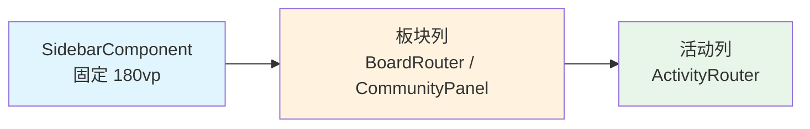
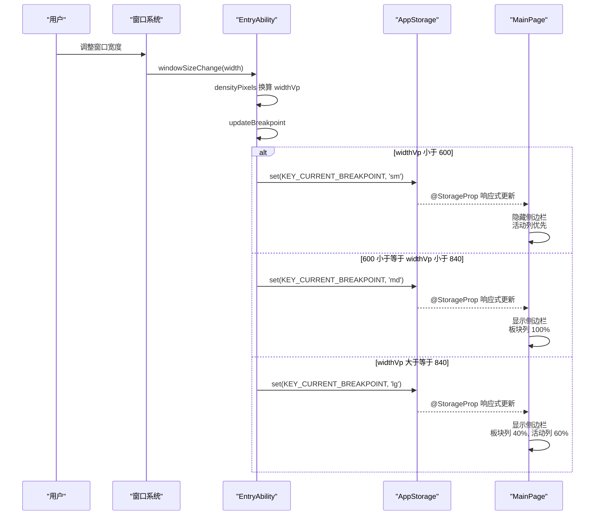

# 主页面与响应式布局

## 概述

`MainPage`（`pages/MainPage.ets`）是应用的核心主页面，采用三列 Panel 架构，通过单一布局结构配合 `.visibility()` 控制显隐，避免断点切换时组件重建导致 `@State` 丢失。

`pages/` 目录共 24 个文件（含 `pages/ai/` 子目录 2 个），分为三类：`@Entry` 路由页、`Router` 转发容器（`ActivityRouter`/`BoardRouter`，P2-4 命名归一化）、`Panel` 子页面以及 `CommunityPanel`（社区内容）。

**`pages/` 目录文件清单（共 24 个）：**

#### @Entry 路由页

| 文件 | 职责 |
|------|------|
| `pages/MainPage.ets` | 主页面三列布局容器（`@Entry`） |
| `pages/Index.ets` | 启动页，轮询 `appStore.auth.initialized` 后按认证状态跳转 |
| `pages/LoginPage.ets` | 登录页（`@Entry`） |
| `pages/ai/AiChatPage.ets` | 通用 AI 对话页（`@Entry`），统一替代原 `PostSummaryPage`（帖子 AI 摘要）和 `AgentAnalysisPage`（用户分析），支持流式输出与多轮连续对话 |
| `pages/WebViewPanel.ets` | 内嵌网页容器（`@Entry`） |

> 旧 `PostSummaryPage.ets` 与 `AgentAnalysisPage.ets` 文件仍保留但未被路由引用，功能已由 `AiChatPage` 统一接管。`AiChatPage` 通过路由参数 `initialPrompt`/`title` 兼容原调用方。`ai/` 目录下另含 `AiSettingsPanel.ets`（AI 配置管理面板，无 `@Entry`，内嵌于 `SettingsPanel`）。

#### Router 转发容器（P2-4 命名归一化）

| 文件 | 职责 |
|------|------|
| `pages/ActivityRouter.ets` | 活动列转发容器：按 `NavEntry` 转发到各 Panel（原 `ActivityPanelComponent`） |
| `pages/BoardRouter.ets` | 板块列转发容器：按 `boardSlot.type` 转发 `SearchPanel` / `TopicListPanel`（原 `BoardPanelComponent`） |

#### Panel 子页面

| 文件 | 职责 |
|------|------|
| `pages/CommunityPanel.ets` | 社区内容：板块分类列表 / 收藏网格 / 搜索入口（原 `CommunityTabContent`） |
| `pages/TopicListPanel.ets` | 主题列表面板 |
| `pages/ThreadPanel.ets` | 帖子详情面板 |
| `pages/SearchPanel.ets` | 搜索结果面板（复用 TopicList 模式） |
| `pages/ProfilePanel.ets` | 用户资料面板 |
| `pages/SettingsPanel.ets` | 设置面板 |
| `pages/NotesPanel.ets` | 用户笔记面板 |
| `pages/BlacklistPanel.ets` | 黑名单管理面板 |
| `pages/FilterKeywordsPanel.ets` | 关键词过滤面板 |
| `pages/NotificationPanel.ets` | 通知面板 |
| `pages/MessageListPanel.ets` | 私信列表面板 |
| `pages/MessageDetailPanel.ets` | 私信详情面板 |
| `pages/BrowseHistoryPanel.ets` | 浏览历史面板 |
| `pages/TtsSettingsPanel.ets` | TTS 朗读设置面板 |

> 三列布局另涉及两个 `common/components/` 容器：`SidebarComponent`（侧边栏第一列，内嵌 `CommunityPanel`）与 `FloatingLayerComponent`（浮层渲染容器）——二者非页面级（P2-4 从 `pages/` 迁入），详见 [公共组件概述](../公共组件模块/公共组件概述.md)。

> **P2-4 迁移说明**：`SidebarComponent` 与 `FloatingLayerComponent` 都不是页面级（非 `@Entry`）的纯渲染容器，故从 `pages/` 归位到 `common/components/`；`ActivityRouter`/`BoardRouter`/`CommunityPanel` 仍保留在 `pages/`（与 `MainPage` 强耦合，属页面编排层）。

## 三列布局



### 断点策略

`EntryAbility.ets:111-132` 的 `updateBreakpoint` 根据窗口宽度计算断点：

| 断点 | 窗口宽度 (vp) | 列数 | 侧边栏 | 板块列 | 活动列 |
|------|---------------|------|--------|--------|--------|
| sm | < 600 | 1 | 隐藏 | 内容区（activity 优先） | — |
| md | 600 ~ 840 | 2 | 显示 | 内容区（activity 优先） | — |
| lg | >= 840 | 3 | 显示 | 40% 宽 | 60% 宽 |

```typescript
// EntryAbility.ets:119-126 — 断点判定逻辑
let newBp: string = 'sm'
if (widthVp < 600) {
  newBp = 'sm'
} else if (widthVp < 840) {
  newBp = 'md'
} else {
  newBp = 'lg'
}
if (this.curBp !== newBp) {
  this.curBp = newBp
  AppStorage.setOrCreate(KEY_CURRENT_BREAKPOINT, newBp)
}
```

> AppStorage 的 key 已在 P2-4 集中注册为常量（`common/constants/AppStorageKeys.ets` 的 `KEY_CURRENT_BREAKPOINT` 等），`@StorageProp('currentBreakpoint')` 直接消费。

### 布局容器代码

`MainPage.ets:79-126` 的核心构建方法（`SidebarComponent()` 与 `FloatingLayerComponent()` 现从 `common/components` 导入，见 `MainPage.ets:24`、`MainPage.ets:26`）：

```typescript
// MainPage.ets:79-126 — 三列容器
build() {
  Stack() {
    Row() {
      SidebarComponent()                 // 第一列：固定 180vp
        .width(180)
        .visibility(this.currentBreakpoint === 'sm' ? Visibility.None : Visibility.Visible)

      Row() {
        Column() {                       // 第二列：sm 显示社区/板块
          if (this.currentBreakpoint === 'sm') {
            CommunityPanel({ currentBreakpoint: 'sm' })  // sm：社区网格
          }
          if (this.router.boardSlot) {
            BoardRouter({ boardSlot: this.router.boardSlot })  // 板块列
          }
          ...
        }
        .width(this.getBoardColWidth())  // lg+双内容: 40%, 其他: 100%
        .visibility(this.getBoardColVisibility())

        Column() {                       // 第三列：活动列
          ActivityRouter({ activityStack: this.router.activityStack })
        }
        .layoutWeight(1)
        .visibility(this.getActivityColVisibility())
      }
      .layoutWeight(1)
    }

    FloatingLayerComponent({ currentBreakpoint: this.currentBreakpoint })  // 顶层：浮层
    ToastComponent()                                                 // 顶部：Toast 提示
  }
}
```

宽度与可见性由三个私有方法计算：

- `getBoardColWidth()`（`MainPage.ets:132-137`）：仅当 lg 断点且同时存在 board + activity 时返回 `'40%'`，其余返回 `'100%'`。
- `getBoardColVisibility()`（`MainPage.ets:125-130`）：lg 下有 board 或无 activity 时显示；sm/md 下无 activity 时显示（即 activity 优先时板块列隐藏）。
- `getActivityColVisibility()`（`MainPage.ets:139-141`）：仅当 `topActivity` 存在时显示。

### 返回键处理

`MainPage.ets:51-74` 的 `onBackPress()` 处理系统返回键，优先级依次为：

1. **浮层关闭**（`floating.size > 0`）：回复框触发 `notifyReplyCloseRequested()`（弹「放弃编辑」二次确认）、确认框触发 `hideConfirm()`、其他浮层 `pop()`（`MainPage.ets:52-61`）。
2. **活动栈回退**（`activityStack.length > 0`）：调用 `router.back()`（`MainPage.ets:62-65`）。
3. **板块回退**（`router.boardSlot` 存在）：sm 断点或搜索模式下调 `router.back()`，否则保留板块列（`MainPage.ets:66-72`）。
4. **默认**：返回 `false` 交由系统处理（`MainPage.ets:76`）。

### 断点切换时序



> 时序图消息文本中的数值比较已改用中文描述（"小于"/"大于等于"），避免裸 `--`/`<` 等字符触发 Mermaid 解析告警。

## Index 启动页

`pages/Index.ets` 作为应用入口页面，通过 **轮询** 等待 `AppStore` 初始化完成后，按认证状态跳转（`Index.ets:23-39`）：

```typescript
// Index.ets:23-39 — 轮询 initialized 后路由
private async waitAndRoute(): Promise<void> {
  if (appStore.auth.initialized) {
    if (appStore.auth.isAuthenticated) {
      const valid = await verifyToken(appStore.auth.token)
      // valid → MainPage；invalid → clearAuth + LoginPage
    } else {
      // 未认证 → LoginPage
    }
  } else {
    setTimeout(() => this.waitAndRoute(), 50)  // 每 50ms 重试
  }
}
```

> **与旧文档差异**：等待的标志是 `appStore.auth.initialized`（`Index.ets:24`），并非某个 AppStorage key。`verifyToken` 失败会 `clearAuth()` 后跳登录页（`Index.ets:30-31`）。

## 侧边栏 SidebarComponent

`common/components/SidebarComponent.ets`（P2-4 从 `pages/` 迁入）渲染第一列，结构为（`SidebarComponent.ets:14-63`）：

- **头部**：头像 + 昵称，点击跳转当前用户 `ProfilePanel`（`SidebarComponent.ets:17-38`）。
- **搜索框**：点击触发 `routerStore.navigateSearch()`（`SidebarComponent.ets:40-52`）。
- **内容区**：内嵌 `CommunityPanel`（`SidebarComponent.ets:54-56`）。

> **与旧文档差异**：`SidebarComponent` 不再提供「社区/我的」两个 Tab 切换的 UI；`RouterStore` 中仍保留 `sidebarTab` 字段与 `setSidebarTab()`（`RouterStore.ets:210`、`RouterStore.ets:216`），但当前已无 UI 调用方，仅由 `reset()` 在登出时复位（`RouterStore.ets:267-268`）。Tab 化的板块浏览逻辑已下沉到 `CommunityPanel` 自有的 `selectedSectionId`（`CommunityPanel.ets:15`）。

## 浮层系统 FloatingLayerComponent

`common/components/FloatingLayerComponent.ets`（P2-4 从 `pages/` 迁入，原因：非页面级、纯渲染容器，归位 `common/components`）渲染顶层浮层，按 `floatingLayerStore.top` 分支渲染（`FloatingLayerComponent.ets:17-99`）：

| FloatingPage | 渲染内容 | 关闭回调 |
|--------------|----------|----------|
| `IMAGE_VIEWER` | `ImageViewer` 图片查看器 | `remove(IMAGE_VIEWER)` |
| `PROFILE_CARD` | 遮罩 + `ProfileCardPopup`（按 `profileCardX/Y` 定位） | `remove(PROFILE_CARD)` |
| `REPLY_DIALOG` | 遮罩 + `ReplyDialog`，点击遮罩触发 `notifyReplyCloseRequested()` | `registerReplyCloseHandler(null)` + `remove` |
| `CONFIRM_DIALOG` | 遮罩 + 确认框（取消/确认，支持 `confirmDestructive` 红色按钮） | `hideConfirm()` |
| `replyConfirmActive` | 二次确认「放弃编辑」（继续编辑/放弃） | `hideReplyConfirm()` / `confirmAbandon()` |

浮层数据由 `FloatingLayerStore` 管理，支持堆叠、去重、关闭拦截（见 [状态管理层/Store 架构](../状态管理层/Store架构.md)）。`hitTestBehavior`（`FloatingLayerComponent.ets:136-142`）确保无浮层时该层不拦截触摸事件。

## 错误处理

### 认证降级

`MainPage.ets:143-165` 的 `checkAuth()` 在 `aboutToAppear` 时执行（`MainPage.ets:39-41`）：

```typescript
// MainPage.ets:143-165 — 认证检查与降级
private async checkAuth(): Promise<void> {
  if (!appStore.auth.isAuthenticated) {
    try { this.getUIContext().getRouter().replaceUrl({ url: 'pages/LoginPage' }) } catch (e) { ... }
    return
  }
  const valid = await verifyToken(appStore.auth.token)
  if (!valid) {
    appStore.clearAuth()
    try { this.getUIContext().getRouter().replaceUrl({ url: 'pages/LoginPage' }) } catch (e) { ... }
    return
  }
  // token 有效：恢复缓存资料 + 预取 profile/favorites + 按需签到
  appStore.ensureProfile(appStore.auth.uid)
  appStore.ensureFavorites()
  appStore.autoCheckinIfNeeded()
}
```

> **与旧文档差异**：token 有效路径不止"恢复"，还会触发 `ensureProfile`/`ensureFavorites`/`autoCheckinIfNeeded`（`MainPage.ets:165-167`）。所有 `replaceUrl` 调用均包裹 `try/catch` 防止路由异常中断（`MainPage.ets:148`、`MainPage.ets:155`）。

### 布局避让区计算失败

`EntryAbility.ets:78-83` 在 `onWindowStageCreate` 内读取系统避让区并换算为 `statusBarHeight`/`navBarHeight`（vp）写入 AppStorage：

```typescript
// EntryAbility.ets:78-83 — 避让区换算
const avoidArea = mainWindow.getWindowAvoidArea(window.AvoidAreaType.TYPE_SYSTEM)
const density = display.getDefaultDisplaySync().densityPixels
AppStorage.setOrCreate(KEY_STATUS_BAR_HEIGHT, avoidArea.topRect.height / density)
AppStorage.setOrCreate(KEY_NAV_BAR_HEIGHT, avoidArea.bottomRect.height / density)
```

整段沉浸式模式初始化（`EntryAbility.ets:69-91`）被 `try/catch` 包裹：若 `getMainWindowSync`/`getWindowAvoidArea` 抛异常（如窗口尚未就绪），仅记录日志（`EntryAbility.ets:90`），不会阻塞页面加载；此时 `statusBarHeight`/`navBarHeight` 保持默认值 0，页面顶部可能出现轻微偏移（侧边栏头部 `padding: top 14 + statusBarHeight`）。`updateBreakpoint` 内部对 `getDefaultDisplaySync` 也有独立 `try/catch`（`EntryAbility.ets:112-117`），density 获取失败时回退为 1。

## 常见问题

**Q: sm 模式下看不到侧边栏？**
A: 这是正常行为。sm 断点（< 600vp）隐藏侧边栏以最大化内容区域（`MainPage.ets:85`）。切换到 md/lg 断点或旋转设备可恢复。

**Q: 断点切换时布局闪烁？**
A: `windowSizeChange` 在拖动窗口时会高频触发。`updateBreakpoint` 通过 `this.curBp !== newBp` 过滤不必要的更新（`EntryAbility.ets:127`），不会在每次像素变化时都写 AppStorage / 触发布局重排。

**Q: Index 页面卡住不跳转？**
A: `Index.ets` 每 50ms 轮询 `appStore.auth.initialized`（`Index.ets:37`）。如果 `AppStore.init` 失败（日志 `AppStore init failed`，`EntryAbility.ets:38`），`auth.initialized` 永远不会被置为 `true`，`Index` 会一直停留在等待状态（当前无超时回退逻辑，需要重启应用或在 `Index.ets:23` 添加超时处理）。

**Q: `SidebarComponent`/`FloatingLayerComponent` 为什么不在 `pages/` 下了？**
A: P2-4 命名归一化重构将非页面级（非 `@Entry`）的纯渲染容器从 `pages/` 迁到 `common/components/`，与 `Avatar`/`Toast` 等复用组件同级；`pages/` 只保留 `@Entry` 路由页与和 `MainPage` 强耦合的 `Router`/`Panel` 编排层。

## 关联文档

- [主题列表与帖子详情](./主题列表与帖子详情.md)
- [状态管理层/Store 架构](../状态管理层/Store架构.md)（`RouterStore` / `FloatingLayerStore` / `AppStore`）
- [架构决策 001 — 单一 Module 与 @Observed 状态管理](../架构决策/001-单一Module与@Observed状态管理.md)
- [架构决策 003 — barrel re-export 模式](../架构决策/003-barrel-re-export模式.md)
- [架构决策 004 — facade 转发模式](../架构决策/004-facade转发模式.md)
