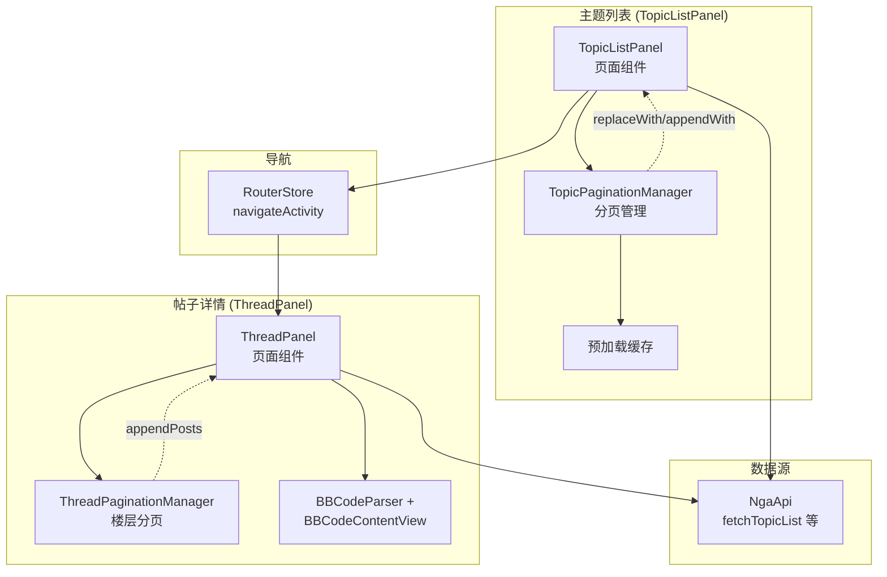
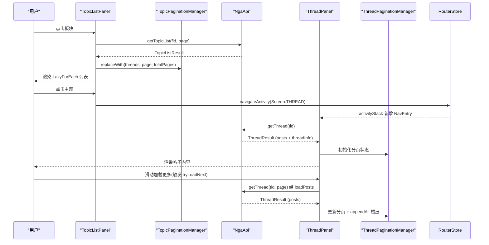

# 主题列表与帖子详情

## 概述

主题列表（`TopicListPanel`）和帖子详情（`ThreadPanel`）是用户阅读内容的核心路径。主题列表显示指定板块下的帖子标题列表，点击后进入帖子详情查看楼层内容。





## TopicListPanel 主题列表

`pages/TopicListPanel.ets` 负责论坛主题列表的展示与交互。

### 分页管理

使用 `TopicPaginationManager`（`common/TopicPaginationManager.ets`）管理分页状态：

| 状态 | 类型 | 默认值 | 说明 |
|------|------|--------|------|
| `threads` | `object[]` | `[]` | 当前已加载的主题列表 |
| `currentPage` | `number` | `1` | 当前页码 |
| `totalPages` | `number` | `0` | 总页数 |
| `hasMore` | `boolean` | `true` | 是否还有更多数据 |

### 去重追加

`TopicPaginationManager.ets:43-67` 追加翻页时自动去重，防止重复 tid：

```typescript
// TopicPaginationManager.ets:43-67 — 翻页去重逻辑
appendWith(list: object[], page: number, totalPages: number): object[] {
  const existingTids: Set<number> = new Set()
  for (let i = 0; i < this.threads.length; i++) {
    const t = Number((this.threads[i] as Record<string, Object>)['tid'] ?? 0)
    if (t) existingTids.add(t)
  }
  // 只添加不存在的 tid
  for (let i = 0; i < list.length; i++) {
    const t = Number((list[i] as Record<string, Object>)['tid'] ?? 0)
    if (!existingTids.has(t)) { deduped.push(list[i]) }
  }
}
```

### 加载触发机制

主题列表的分页加载由 `List.onScrollIndex` 监听驱动（`TopicListPanel.ets:500-504`），当滚动索引末尾 `end` 距列表总数不足 3 项（`end >= total - 3`）时调用 `tryLoadNext()`（`TopicListPanel.ets:317-328`）。该机制替代了早期的 `onReachEnd` 回调，避免触及列表边界时系统回弹动画干扰加载时机。

`tryLoadNext` 的加载策略：若下一页已预加载就绪则直接提交缓存（`commitPrefetchedPage`），否则发起网络请求（`loadTopics`）。

### 预加载

`TopicPaginationManager` 支持多页预加载，使用 `Map<number, PrefetchedPageData>` 存储预拉数据，在用户翻页时直接从缓存提交。预加载范围受全局设置 `prefetchPageCount`（`SettingsState`）控制：

| 配置 | 取值 | 行为 |
|------|------|------|
| `prefetchPageCount = 0` | 关闭 | 不发起任何预加载，仅按需加载 |
| `prefetchPageCount = N` | 1~5 | 向后预加载 N 页 |

预加载入口 `triggerPrefetch`（`TopicListPanel.ets:334-350`）带 `PREFETCH_COOLDOWN_MS = 400ms` 冷却（`TopicListPanel.ets:332`），并受 `mgr.prefetchInProgress` 标志保护，避免快速滑动时短时间内重复发起请求。

为防止多页并发预加载请求互相污染分页状态，`startPrefetch`（`TopicListPanel.ets:352-386`）引入临时结果收集类 `PrefetchPageResult`（`TopicListPanel.ets:28-33`）暂存各页响应，待 `Promise.all` 全部完成且 generation 校验通过后，再统一调用 `setPrefetchedPage` 写入缓存。

## ThreadPanel 帖子详情

`pages/ThreadPanel.ets` 展示帖子所有楼层内容，支持无缝滚动加载和传统翻页两种模式。

### 楼层导航模式

用户在设置中选择导航模式，枚举 `ThreadNavMode` 定义于 `Constants.ets`，设置字段为 `SettingsState.threadNavMode`：

| 模式 | 枚举值 | 行为 |
|------|--------|------|
| 无缝加载 | `SCROLL` | 滚动到底部自动请求下一页，保持阅读连续性 |
| 传统翻页 | `PAGE` | 显示分页器，手动跳转页面 |

### 滚动跳转

`ThreadPanel` 支持跳转到指定楼层（如回复后跳转），通过楼层 lou 号定位：

- 缓存已加载的楼层位置
- 跳转后调整滚动偏移量
- 优化缓存数量控制内存占用

### 楼层预加载

无缝加载模式下，`ThreadPanel` 通过 `triggerPrefetches`（`ThreadPanel.ets:333-338`）同时发起向前、向后预加载，范围同样受 `prefetchPageCount` 控制：`prefetchPageCount <= 0` 时直接跳过（`ThreadPanel.ets:334-335`）。

| 预加载方向 | 方法 | 范围 | 说明 |
|-----------|------|------|------|
| 向后（加载更多） | `prefetchNext`（`ThreadPanel.ets:344`） | `currentPage + 1` ~ `currentPage + prefetchPageCount` | `prefetchNextInProgress` 标志防重入 |
| 向前（回看历史） | `prefetchPrev`（`ThreadPanel.ets:397`） | `loadedPageStart - 1` | 带独立冷却 `lastPrefetchPrevTime` |

两个方向均带 `PREFETCH_COOLDOWN_MS = 400ms` 冷却（`ThreadPanel.ets:342`）。传统翻页模式（`PAGE`）下 `triggerPrefetches` 直接返回，不触发预加载。

### 帖子内容解析

每层楼的内容通过 `BBCodeParser` 解析为 AST，再通过 `BBCodeContentView` 渲染：

| 渲染内容 | 处理方式 |
|----------|----------|
| 正文 BBCode | `BBCodeParser` → `BBCodeContentView` |
| 附件图片 | `ImageSizeUtil` 预获取尺寸 |  
| 附件视频 | `MutedVideo` 渲染（读取全局 `videoMuted` 静音状态） |
| 附件音频 | `AudioPlayer` 内嵌播放器 |
| 表情 | `EmotionResources` 映射 URL |
| 签名 | 控制是否显示（`ThreadPanel.ets` 设置） |
| 用户认证信息 | `ProfileCardPopup` 悬停弹窗 |
| 黑名单/笔记 | 标记特殊样式或隐藏 |
| 匿名发帖 | `AnonymousName.ets` 匿名标识 |

## TopicPaginationManager 分页管理器

`common/TopicPaginationManager.ets` 封装了独立的分页状态逻辑：

| 方法/字段 | 说明 |
|------|------|
| `prefetchInProgress` | 预加载进行中标志，防止重复触发 |
| `nextGeneration()` | 递增并返回代次，标记新一轮请求 |
| `getGeneration()` | 读取当前代次，用于响应回来时校验是否过期 |
| `reset()` | 重置所有状态（含 generation） |
| `replaceWith(list, page, totalPages)` | 替换全部数据（新加载） |
| `appendWith(list, page, totalPages)` | 去重追加（翻页） |
| `setPrefetchedPage(page, threads, totalPages)` | 缓存预加载页 |
| `commitPrefetchedPage(page)` | 提交并消费预加载页 |
| `hasPrefetchedPage(page)` | 检查预加载是否就绪 |
| `clearPrefetchedPages()` | 清空所有预加载缓存 |

## 关联页面

| 页面 | 文件 | 说明 |
|------|------|------|
| `SearchPanel` | `pages/SearchPanel.ets` | 搜索结果展示（复用 TopicList 模式） |
| `PostSummaryPage` | `pages/PostSummaryPage.ets` | 帖子 AI 摘要展示 |
| `ReplyDialog` | `common/ReplyDialog.ets` | 回复输入框浮层 |
| `ProfilePanel` | `pages/ProfilePanel.ets` | 用户资料查阅 |
| `NotesPanel` | `pages/NotesPanel.ets` | 用户笔记管理 |
| `BlacklistPanel` | `pages/BlacklistPanel.ets` | 黑名单管理 |
| `FilterKeywordsPanel` | `pages/FilterKeywordsPanel.ets` | 关键词过滤管理 |

## 边缘情况

1. **大帖子多楼层**：数千楼的帖子需要控制初始加载量，分页加载防止滚动性能下降
2. **图片加载失败**：图片 URL 无效时显示占位符，不影响文字内容阅读
3. **匿名帖子**：匿名发帖者显示统一匿名标识（`AnonymousName.ets`），其用户信息不可点击
4. **黑名单拦截**：被屏蔽用户的帖子内容隐藏或折叠显示
5. **搜索状态保持**：搜索关键词在返回主题列表后仍保留

## 错误处理

### 帖子加载失败

`fetchThread` 返回 `ok = false` 时，`ThreadPanel` 显示错误提示，用户可点击重试。网络恢复后自动重新加载。

### 分页竞态

快速翻页或板块切换时，前一页的异步请求可能在当前页请求之后到达。两个分页管理器均通过 `generation` 计数器标记过期请求：每次加载在重置状态**之后**调用 `nextGeneration()` 递增（`ThreadPanel.ets:248`、`ThreadPaginationManager.ets:25-28`），响应回来后若 `getGeneration()` 不匹配则直接丢弃（`ThreadPanel.ets:259,311`）。

关键增强：

- **生成时机后移**：`loadPosts` 将 `nextGeneration()` 移至 `reset()` 之后（`ThreadPanel.ets:248`），避免重置前发出的无效请求覆盖新数据；`ThreadPaginationManager.reset()` 同步重置 `generation = 0`（`ThreadPaginationManager.ets:34-46`）。
- **多页并发保护**：板块切换时的多页并发请求（如 24 小时榜一次拉取 5 页）记录当前 generation，全部返回后统一校验，generation 不匹配则整体丢弃。
- **预加载结果收集**：多页并发预加载通过 `PrefetchPageResult` 先收集再统一提交（见上文预加载章节），避免半数请求返回时部分写入导致状态不一致。

### 回复后跳转

回复成功后需要通过 `lou` 号定位目标楼层。如果该楼层尚未加载（异步分页模式下），先加载所在页再滚动到目标位置。

## 常见问题

**Q: 翻页后重复加载了相同帖子？**
A: `TopicPaginationManager.appendWith` 会基于 `tid` 去重（`TopicPaginationManager.ets:44-55`），不会重复添加。如果仍然出现，检查 `fetchTopicList` 返回的数据中是否包含重复 tid。

**Q: 无缝滚动加载模式下载入新楼层后页面跳动？**
A: 无缝加载追加楼层时，`LazyDataSource.appendAll` 会逐项通知。如果列表中正在播放音频或 GIF，跳动感可能更明显。可切换到传统翻页模式避免此问题。

**Q: 帖子楼层号不连续？**
A: NGA 接口返回的 `lou` 字段表示数据库中的楼层号，可能存在删帖或审核导致的空缺。分页加载时 low 号不会重排。
