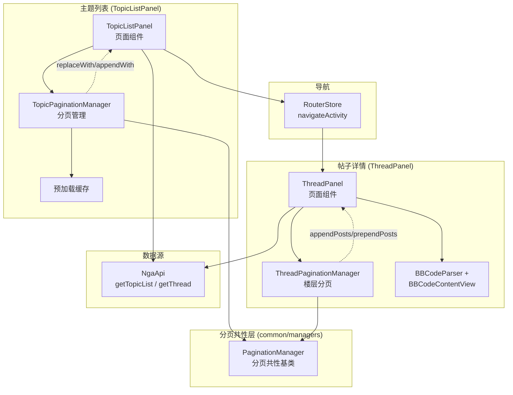
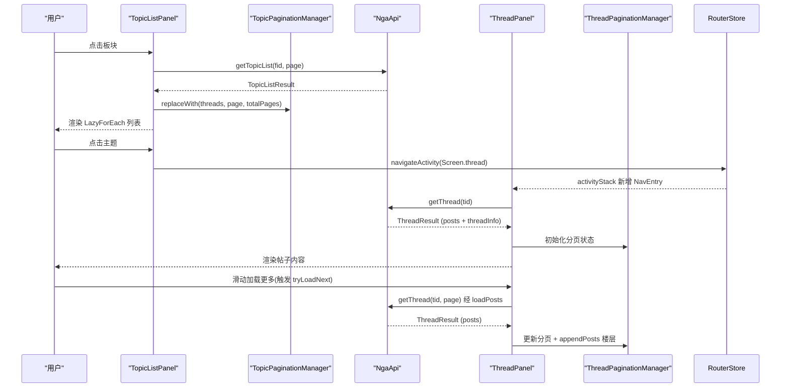

# 主题列表与帖子详情

## 概述

主题列表（`TopicListPanel`）和帖子详情（`ThreadPanel`）是用户阅读内容的核心路径。主题列表显示指定板块下的帖子标题列表，点击后进入帖子详情查看楼层内容。



> 两个分页管理器均继承自共性基类 `PaginationManager`（`common/managers/PaginationManager.ets`），其 `@Observed` 装饰器落在最终子类上（见 [ADR 005 @Observed 继承](../架构决策/005-@Observed继承位置.md)）。



## TopicListPanel 主题列表

`pages/TopicListPanel.ets` 负责论坛主题列表的展示与交互。

### 分页管理

使用 `TopicPaginationManager`（`common/managers/TopicPaginationManager.ets`）管理分页状态，继承自 `PaginationManager`：

| 状态 | 类型 | 默认值 | 说明 |
|------|------|--------|------|
| `threads` | `object[]` | `[]` | 当前已加载的主题列表（按 tid 去重） |
| `currentPage` | `number` | `1` | 当前页码（基类 `PaginationManager`） |
| `totalPages` | `number` | `0` | 总页数（基类） |
| `hasMore` | `boolean` | `true` | 是否还有更多数据（基类） |
| `prefetchInProgress` | `boolean` | `false` | 预取进行中标志，防止重复发起 |

### 去重追加

`common/managers/TopicPaginationManager.ets:53-75` 追加翻页时自动按 `tid` 去重，防止重复主题：

```typescript
// common/managers/TopicPaginationManager.ets:53-75 — 翻页去重逻辑
appendWith(list: object[], page: number, totalPages: number): object[] {
  const existingTids: Set<number> = new Set()
  for (let i: number = 0; i < this.threads.length; i++) {
    const t: number = Number((this.threads[i] as Record<string, Object>)['tid'] ?? 0)
    if (t) existingTids.add(t)
  }
  const deduped: object[] = []
  for (let i: number = 0; i < list.length; i++) {
    const t: number = Number((list[i] as Record<string, Object>)['tid'] ?? 0)
    if (!existingTids.has(t)) {
      deduped.push(list[i])
      existingTids.add(t)   // 同批重复也丢弃
    }
  }
  if (deduped.length > 0) { /* 追加进 this.threads */ }
  this.applyState(page, totalPages)  // 基类统一收口三元状态
  return deduped
}
```

> `applyState` 定义在共性基类 `PaginationManager.applyState`（`common/managers/PaginationManager.ets:51-55`），统一刷新 `currentPage / totalPages / hasMore`。

### 加载触发机制

主题列表的分页加载由 `List.onScrollIndex` 监听驱动（`pages/TopicListPanel.ets:502-507`），当滚动索引末尾 `end` 距列表总数不足 3 项（`end >= total - 3`）时调用 `tryLoadNext()`（`pages/TopicListPanel.ets:323-335`）。该机制替代了早期的 `onReachEnd` 回调，避免触及列表边界时系统回弹动画干扰加载时机。

`tryLoadNext` 的加载策略：若下一页已预加载就绪则直接提交缓存（`commitPrefetchedPage`），否则发起网络请求（`loadTopics`）。

### 预加载

`TopicPaginationManager` 支持多页预加载，使用基类维护的 `Map<number, PrefetchedPageHolder>` 存储预拉数据，在用户翻页时直接从缓存提交。预加载范围受全局设置 `prefetchPageCount`（`store/settings/SettingsState.ets:39`，默认 `3`）控制：

| 配置 | 取值 | 行为 |
|------|------|------|
| `prefetchPageCount = 0` | 关闭 | 不发起任何预加载，仅按需加载 |
| `prefetchPageCount = N` | 1~5 | 向后预加载 N 页 |

预加载入口 `triggerPrefetch`（`pages/TopicListPanel.ets:340-356`）带 `PREFETCH_COOLDOWN_MS = 400ms` 冷却（`pages/TopicListPanel.ets:338`），并受 `mgr.prefetchInProgress` 标志保护，避免快速滑动时短时间内重复发起请求。

为防止多页并发预加载请求互相污染分页状态，`startPrefetch`（`pages/TopicListPanel.ets:358-397`）引入临时结果收集类 `PrefetchPageResult`（`pages/TopicListPanel.ets:34-39`）暂存各页响应，待 `Promise.all` 全部完成且 generation 校验通过后，再统一调用 `setPrefetchedPage` 写入缓存。

## ThreadPanel 帖子详情

`pages/ThreadPanel.ets` 展示帖子所有楼层内容，支持无缝滚动加载和传统翻页两种模式。

### 楼层导航模式

用户在设置中选择导航模式，模式常量 `ThreadNavMode` 定义于 `common/constants/Constants.ets:126-131`（用 class 模拟枚举以规避 ArkTS 限制），设置字段为 `store/settings/SettingsState.ets:37` 的 `threadNavMode`（默认 `SEAMLESS`）：

| 模式 | 常量 | 值 | 行为 |
|------|------|----|------|
| 无缝加载 | `ThreadNavMode.SEAMLESS` | `'0'` | 滚动到底部自动请求下一页，保持阅读连续性 |
| 传统翻页 | `ThreadNavMode.PAGE` | `'1'` | 显示分页器，手动跳转页面 |

### 滚动跳转

`ThreadPanel` 支持跳转到指定楼层（如回复后跳转），通过楼层 `pid` 定位（`onScrollToPid`，`pages/ThreadPanel.ets:186-194`）：

- 通过 `mgr.findPostIndex(pid)` 查找目标楼层索引
- 跳转后 `scrollToIndex(idx + 1, true, ScrollAlign.CENTER)` 居中
- `LazyForEach` 的 `maintainVisibleContentPosition(true)`（`pages/ThreadPanel.ets:695`）保证前后预取追加时视图稳定

### 楼层预加载

无缝加载模式下，`ThreadPanel` 通过 `triggerPrefetches`（`pages/ThreadPanel.ets:316-321`）同时发起向前、向后预加载，范围同样受 `prefetchPageCount` 控制：`threadNavMode === PAGE` 或 `prefetchPageCount <= 0` 时直接返回（`pages/ThreadPanel.ets:317-318`）。

| 预加载方向 | 方法 | 范围 | 说明 |
|-----------|------|------|------|
| 向后（加载更多） | `prefetchNext`（`pages/ThreadPanel.ets:327-378`） | `currentPage + 1` ~ `currentPage + prefetchPageCount` | `prefetchNextInProgress` 标志防重入 |
| 向前（回看历史） | `prefetchPrev`（`pages/ThreadPanel.ets:380-426`） | `loadedPageStart - 1` | 带独立冷却 `lastPrefetchPrevTime`（`pages/ThreadPanel.ets:324`） |

两个方向均带 `PREFETCH_COOLDOWN_MS = 400ms` 冷却（`pages/ThreadPanel.ets:325`）。传统翻页模式（`PAGE`）下 `triggerPrefetches` 直接返回，不触发预加载。

> **P2-3 逻辑下沉说明**：`ThreadPanel` 历史版本中的帖子预热逻辑已外迁至 `common/utils/PostWarmup`（`preWarmPosts` 在 `pages/ThreadPanel.ets:14` 导入，于 `:245 / :370 / :410` 三处调用，分别对应首次加载、向后预取、向前预取）；帖子浏览历史记录（原 `recordBrowseHistory`）已下沉至 `store/HistoryStore.addFromThreadResult`，`ThreadPanel` 经 AppStore 门面 `addBrowseHistoryFromThread`（`pages/ThreadPanel.ets:262`，门面实现见 `store/AppStore.ets:216-218`）转发。预取机制本身仍在 `ThreadPanel` 内，未变动。

### 帖子内容解析

每层楼的内容通过 `BBCodeParser` 解析为 AST，再通过 `BBCodeContentView` 渲染：

| 渲染内容 | 处理方式 |
|----------|----------|
| 正文 BBCode | `BBCodeParser` → `BBCodeContentView` |
| 附件图片 | `ImageSizeUtil` 预获取尺寸 |
| 附件视频 | `MutedVideo` 渲染（读取全局 `videoMuted` 静音状态；首帧送显随图片加载策略联动） |
| 附件音频 | `AudioPlayer` 内嵌播放器 |
| 表情 | `EmotionResources` 映射 URL |
| 签名 | 控制是否显示（`showSignature` 设置） |
| 用户认证信息 | `ProfileCardPopup` 悬停弹窗 |
| 黑名单/笔记 | 标记特殊样式或隐藏 |
| 匿名发帖 | `AnonymousName.ets` 匿名标识 |

## 分页管理器（common/managers）

`common/managers/` 下三个文件构成分页管理子系统：

| 文件 | 职责 |
|------|------|
| `PaginationManager.ets` | 抽象共性基类（P1-3 抽取）：`generation` 计数器、`prefetchedPages` 预取缓存、`currentPage/totalPages/hasMore` 三元状态、`applyState/resetGeneration` 收口方法 |
| `TopicPaginationManager.ets` | 主题列表分页（按 tid 去重） |
| `ThreadPaginationManager.ets` | 帖子详情分页（按 lou 去重，额外维护 `pageOfIndex`、反向预取） |

### PaginationManager 共性基类

`PaginationManager`（`common/managers/PaginationManager.ets`）不加 `@Observed`——ArkUI 状态观测按具体类注册，`@Observed` 必须装饰在最终子类（`TopicPaginationManager` / `ThreadPaginationManager`）上，否则分页 UI 不响应式更新。基类暴露的共性原语：

| 方法/字段 | 说明 | 行号 |
|-----------|------|------|
| `nextGeneration()` | 递增并返回代次，标记新一轮请求 | `:32-35` |
| `getGeneration()` | 读取当前代次，响应回来时校验是否过期 | `:41-43` |
| `applyState(page, totalPages)` | 统一刷新三元状态（子类 replaceWith/append 调用） | `:51-55` |
| `resetGeneration()` | 重置代次为 0（子类 reset 调用） | `:60-62` |
| `hasPrefetchedPage(page)` | 判断指定页是否已有预取缓存 | `:69-71` |
| `setPrefetchedRaw / getPrefetchedRaw / deletePrefetched` | 预取缓存读写原语（protected，供子类复用） | `:80-105` |
| `clearPrefetchedPages()` | 清空所有预取缓存 | `:110-112` |

> 预取缓存以 `PrefetchedPageHolder`（`common/managers/PaginationManager.ets:119-124`，具体 class 而非泛型，规避 ArkTS 泛型继承限制）暂存 `object[]`。子类在 `setPrefetchedPage` / `commitPrefetchedPage` 中负责强类型数组（如 `PostInfo[]`）与 `object[]` 的互转。

### TopicPaginationManager 方法表

| 方法/字段 | 说明 | 行号 |
|-----------|------|------|
| `prefetchInProgress` | 预加载进行中标志，防止重复触发 | `:16` |
| `reset()` | 重置所有状态（含 generation） | `:25-33` |
| `replaceWith(list, page, totalPages)` | 替换全部数据（新加载） | `:41-44` |
| `appendWith(list, page, totalPages)` | 去重追加（翻页），返回新增数组 | `:53-75` |
| `setPrefetchedPage(page, threads, totalPages)` | 缓存预加载页 | `:83-85` |
| `commitPrefetchedPage(page)` | 提交并消费预加载页（内部复用 appendWith 去重） | `:92-101` |

### ThreadPaginationManager 关键方法

| 方法/字段 | 说明 | 行号 |
|-----------|------|------|
| `posts / pageOfIndex / loadedLouSet / loadedPageStart` | 楼层数据、页码索引、去重集合、连续段起点 | `:14-20` |
| `prefetchedPrevPosts / prefetchedPrevPage` | 反向预取缓存 | `:23-25` |
| `reset()` | 重置（含 `resetGeneration()`） | `:34-47` |
| `replaceWith(newPosts, page, totalPages)` | 整体替换 + 重建 lou 集合与 pageOfIndex | `:47-56` |
| `appendPosts(rawPosts, page, totalPages)` | 向后追加（按 lou 去重） | `:65-97` |
| `prependPosts(rawPosts, page)` | 向前插入（反向预取） | `:105-137` |
| `commitPrefetchedPrev()` | 提交反向预取缓存 | `:186-195` |
| `getDisplayPage(centerIndex)` | 按列表中心索引计算显示页码 | `:202-207` |
| `updateVoteScore(pid, ...)` | 投票后即时更新分数 | `:230-239` |

## 关联页面

| 页面 | 文件 | 说明 |
|------|------|------|
| `SearchPanel` | `pages/SearchPanel.ets` | 搜索结果展示（复用 TopicList 模式） |
| `PostSummaryPage` | `pages/PostSummaryPage.ets` | 帖子 AI 摘要展示 |
| `ReplyDialog` | `common/components/ReplyDialog.ets` | 回复输入框浮层 |
| `ProfilePanel` | `pages/ProfilePanel.ets` | 用户资料查阅（P2-3：统计项改由 `StatItem` 数据驱动渲染 `:23-28`，清理 `handleCheckin/dispatchAction` 等死代码） |
| `NotesPanel` | `pages/NotesPanel.ets` | 用户笔记管理 |
| `BlacklistPanel` | `pages/BlacklistPanel.ets` | 黑名单管理 |
| `FilterKeywordsPanel` | `pages/FilterKeywordsPanel.ets` | 关键词过滤管理 |

## 边缘情况

1. **大帖子多楼层**：数千楼的帖子需要控制初始加载量，分页加载防止滚动性能下降
2. **图片加载失败**：图片 URL 无效时显示占位符，不影响文字内容阅读
3. **匿名帖子**：匿名发帖者显示统一匿名标识（`AnonymousName.ets`），其用户信息不可点击
4. **黑名单拦截**：被屏蔽用户的帖子内容隐藏或折叠显示
5. **搜索状态保持**：搜索关键词在返回主题列表后仍保留
6. **浏览历史上限**：`HistoryStore` 最多保留 `HISTORY_MAX_COUNT = 500` 条（`store/HistoryStore.ets:20`），超出按时间截断

## 错误处理

### 帖子加载失败

`getThread` 返回 `ok = false` 时，`ThreadPanel` 在 `loadPosts` 的 `LOAD_REPLACE` 分支显示错误提示（`pages/ThreadPanel.ets:286-291`），用户可点击重试。网络恢复后自动重新加载。

### 分页竞态

快速翻页或板块切换时，前一页的异步请求可能在当前页请求之后到达。两个分页管理器均通过基类 `generation` 计数器标记过期请求：每次加载在 `mgr.reset()` **之后**调用 `nextGeneration()` 递增（`loadPosts` 中重置在 `pages/ThreadPanel.ets:206`、递增在 `:231`），响应回来后若 `getGeneration()` 不匹配则直接丢弃（`pages/ThreadPanel.ets:242,294`）。

关键增强：

- **生成时机后移**：`loadPosts` 将 `nextGeneration()` 移至 `mgr.reset()` 之后，避免重置前发出的无效请求覆盖新数据；`ThreadPaginationManager.reset()` 同步调用基类 `resetGeneration()` 清零（`common/managers/ThreadPaginationManager.ets:34-47`，基类实现见 `PaginationManager.ets:60-62`）。
- **多页并发保护**：板块切换时的多页并发请求（如 24 小时榜一次拉取 5 页）记录当前 generation，全部返回后统一校验，generation 不匹配则整体丢弃（`pages/TopicListPanel.ets:166`）。
- **预加载结果收集**：多页并发预加载通过 `PrefetchPageResult` 先收集再统一提交（见上文预加载章节），避免半数请求返回时部分写入导致状态不一致。

### 回复后跳转

回复成功后需要通过 `pid` 定位目标楼层。如果该楼层尚未加载（异步分页模式下），先加载所在页（`handleReplySend` 在当前页为末页时 `loadPosts(1, LOAD_REPLACE)` 重载，`pages/ThreadPanel.ets:460-475`）再滚动到目标位置。

## 常见问题

**Q: 翻页后重复加载了相同帖子？**
A: `TopicPaginationManager.appendWith` 会基于 `tid` 去重（`common/managers/TopicPaginationManager.ets:53-75`，同批重复也会通过 `existingTids.add(t)` 丢弃），不会重复添加。如果仍然出现，检查 `getTopicList` 返回的数据中是否包含重复 tid。

**Q: 无缝滚动加载模式下载入新楼层后页面跳动？**
A: 无缝加载追加楼层时，`PostInfoDataSource.appendAll` 会逐项通知。`maintainVisibleContentPosition(true)`（`pages/ThreadPanel.ets:695`）会尽量保持视口稳定，但如果列表中正在播放音频或 GIF，跳动感可能更明显。可切换到传统翻页模式避免此问题。

**Q: 帖子楼层号不连续？**
A: NGA 接口返回的 `lou` 字段表示数据库中的楼层号，可能存在删帖或审核导致的空缺。分页加载时 lou 号不会重排。

**Q: 为什么 `@Observed` 不加在 `PaginationManager` 基类上？**
A: ArkUI 的状态观测按具体类注册，`@Observed` 必须装饰在最终子类（`TopicPaginationManager` / `ThreadPaginationManager`）上。加在抽象基类上会导致分页 UI 不响应式更新。详见 [ADR 005 @Observed 继承](../架构决策/005-@Observed继承位置.md)。

## 关联文档

- [公共组件概述](../公共组件模块/公共组件概述.md)
- [Store 架构](../状态管理层/Store架构.md)
- [数据模型概述](../数据模型/数据模型概述.md)
- [ADR 002 NgaClient 双层架构](../架构决策/002-NgaClient双层架构设计.md)
- [ADR 005 @Observed 继承位置](../架构决策/005-@Observed继承位置.md)（PaginationManager 基类不加 @Observed 的原因）
- [ADR 006 保守合并原则](../架构决策/006-保守合并原则.md)（recordBrowseHistory/preWarmPosts 外迁时行为保持的约束）
